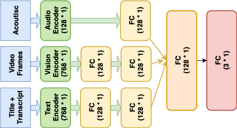

# MultiHateClip：一款专为 YouTube 与 Bilibili 平台设计的仇恨视频检测多语言基准数据集。

发布时间：2024年08月12日

`LLM应用` `社交媒体` `视频内容分析`

> MultiHateClip: A Multilingual Benchmark Dataset for Hateful Video Detection on YouTube and Bilibili

# 摘要

> 仇恨言论在当今社会影响深远，涉及线上线下。当前研究多聚焦于文本媒介，对视频等多模态内容的忽视显而易见。现有仇恨视频研究多限于西方语境下的英语内容，且仅提供简单的仇恨与否标签，缺乏深入的上下文分析。本研究推出的MultiHateClip1数据集，通过结合仇恨词典与人工标注，旨在提升YouTube和Bilibili等平台上的仇恨视频识别能力，涵盖中英双语内容。该数据集包含2,000个视频，详细标注了仇恨性、冒犯性与正常性，为性别相关的仇恨言论提供了跨文化视角。通过深入分析人工标注结果，我们揭示了中英文仇恨视频的差异，并强调了多模态分析在仇恨与冒犯视频识别中的关键作用。对VLM、GPT-4V和Qwen-VL等尖端视频分类模型在MultiHateClip上的表现评估显示，准确区分仇恨与冒犯内容仍面临挑战，凸显了开发兼具多模态与文化敏感性模型的迫切性。MultiHateClip的推出，强调了在对抗网络仇恨言论时，采用多模态和文化敏感方法的必要性，标志着在仇恨视频检测领域的重要进展。

> Hate speech is a pressing issue in modern society, with significant effects both online and offline. Recent research in hate speech detection has primarily centered on text-based media, largely overlooking multimodal content such as videos. Existing studies on hateful video datasets have predominantly focused on English content within a Western context and have been limited to binary labels (hateful or non-hateful), lacking detailed contextual information. This study presents MultiHateClip1 , an novel multilingual dataset created through hate lexicons and human annotation. It aims to enhance the detection of hateful videos on platforms such as YouTube and Bilibili, including content in both English and Chinese languages. Comprising 2,000 videos annotated for hatefulness, offensiveness, and normalcy, this dataset provides a cross-cultural perspective on gender-based hate speech. Through a detailed examination of human annotation results, we discuss the differences between Chinese and English hateful videos and underscore the importance of different modalities in hateful and offensive video analysis. Evaluations of state-of-the-art video classification models, such as VLM, GPT-4V and Qwen-VL, on MultiHateClip highlight the existing challenges in accurately distinguishing between hateful and offensive content and the urgent need for models that are both multimodally and culturally nuanced. MultiHateClip represents a foundational advance in enhancing hateful video detection by underscoring the necessity of a multimodal and culturally sensitive approach in combating online hate speech.

[Arxiv](https://arxiv.org/abs/2408.03468)