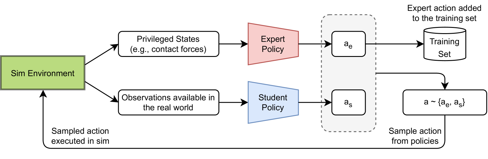
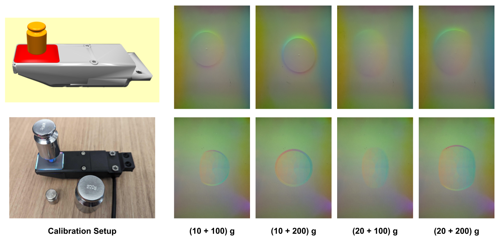
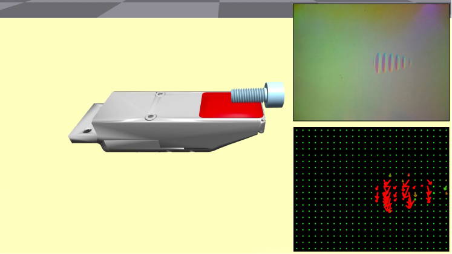

# TacSL：一款专为视觉触觉传感器模拟与学习设计的库

发布时间：2024年08月12日

`Agent` `机器人` `人工智能`

> TacSL: A Library for Visuotactile Sensor Simulation and Learning

# 摘要

> 无论是人类还是机器人，触觉感知对于执行需要频繁接触的任务至关重要。机器人触觉感应面临三大挑战：解读传感器信号、在新情境中生成信号、以及学习基于传感器的策略。视觉触觉传感器因其与视觉传感器的紧密联系，解读相对容易，但生成信号仍具挑战，因其涉及复杂的接触、变形、照明和成像过程，模拟成本高昂。为此，我们推出了**TacSL**库，专为基于GPU的视觉触觉传感器模拟与学习设计。**TacSL**能在Isaac Gym模拟器中，以比现有技术快200倍的速度生成视觉触觉图像并提取接触力分布。此外，**TacSL**还提供了一个包含多种传感器模型、接触密集型训练环境和在线/离线算法的学习工具包，助力模拟到现实的策略学习。在算法创新方面，我们引入了非对称演员-评论家蒸馏算法，旨在高效学习模拟中的触觉策略，并实现向现实世界的无缝转移。通过评估蒸馏与多模态传感在接触丰富任务中的应用，我们展示了**TacSL**库与算法的实际效能，并成功实现了模拟到现实的转移。更多详情与结果，请访问\url{https://iakinola23.github.io/tacsl/}。

> For both humans and robots, the sense of touch, known as tactile sensing, is critical for performing contact-rich manipulation tasks. Three key challenges in robotic tactile sensing are 1) interpreting sensor signals, 2) generating sensor signals in novel scenarios, and 3) learning sensor-based policies. For visuotactile sensors, interpretation has been facilitated by their close relationship with vision sensors (e.g., RGB cameras). However, generation is still difficult, as visuotactile sensors typically involve contact, deformation, illumination, and imaging, all of which are expensive to simulate; in turn, policy learning has been challenging, as simulation cannot be leveraged for large-scale data collection. We present \textbf{TacSL} (\textit{taxel}), a library for GPU-based visuotactile sensor simulation and learning. \textbf{TacSL} can be used to simulate visuotactile images and extract contact-force distributions over $200\times$ faster than the prior state-of-the-art, all within the widely-used Isaac Gym simulator. Furthermore, \textbf{TacSL} provides a learning toolkit containing multiple sensor models, contact-intensive training environments, and online/offline algorithms that can facilitate policy learning for sim-to-real applications. On the algorithmic side, we introduce a novel online reinforcement-learning algorithm called asymmetric actor-critic distillation (\sysName), designed to effectively and efficiently learn tactile-based policies in simulation that can transfer to the real world. Finally, we demonstrate the utility of our library and algorithms by evaluating the benefits of distillation and multimodal sensing for contact-rich manip ulation tasks, and most critically, performing sim-to-real transfer. Supplementary videos and results are at \url{https://iakinola23.github.io/tacsl/}.

[Arxiv](https://arxiv.org/abs/2408.06506)