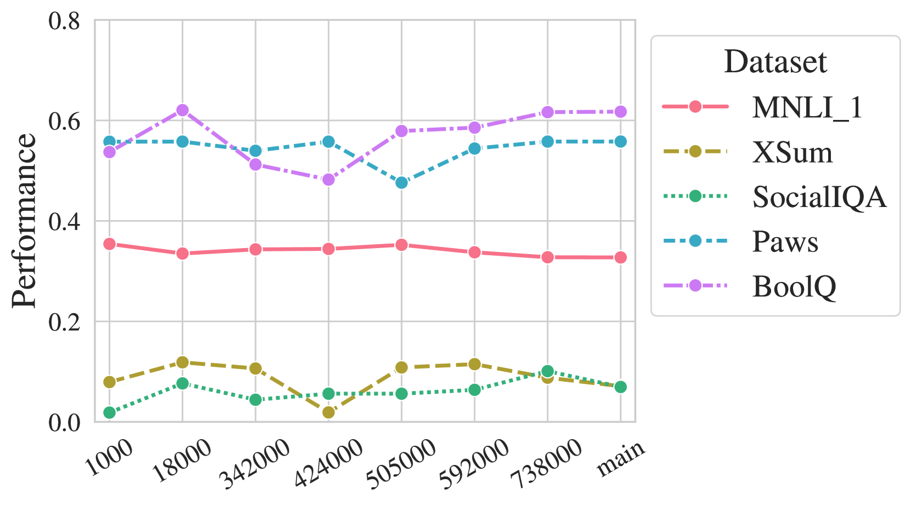
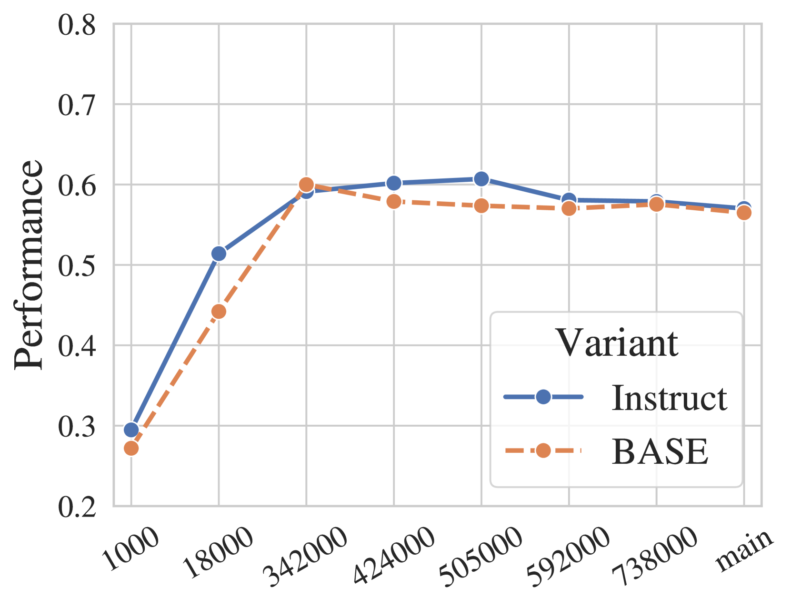
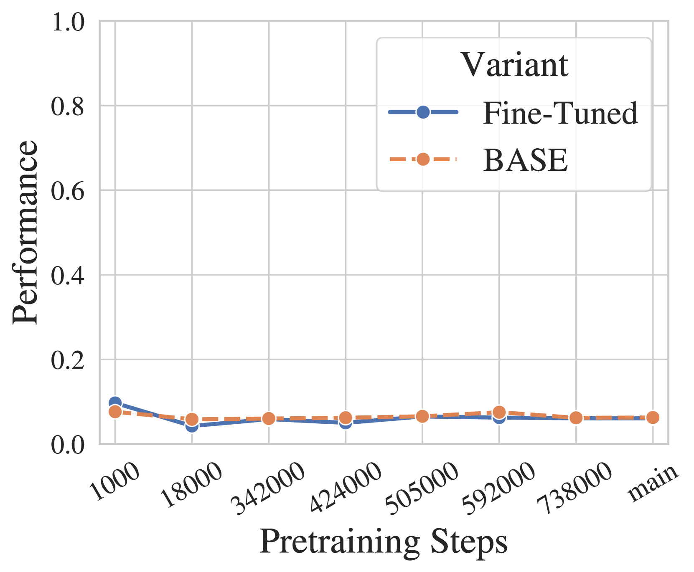

# Amuro & Char: 探讨大型语言模型预训练与微调的关联

发布时间：2024年08月13日

`LLM理论` `人工智能` `机器学习`

> Amuro & Char: Analyzing the Relationship between Pre-Training and Fine-Tuning of Large Language Models

# 摘要

> 随着大型语言模型的发展，预训练-对齐范式应运而生，即先在大规模文本上预训练模型，再通过调整使其符合人类偏好或适应特定任务。我们通过微调多个预训练阶段的模型，深入探究了预训练与微调的关联。研究涵盖18个数据集，结果显示：持续预训练虽潜移默化地提升模型，但效果在微调后才显著；额外微调使原本表现平平的数据集进步显著，超越了预训练时的佼佼者；监督微调虽大幅提升模型性能，却可能导致遗忘先前掌握的领域知识及未涉及的任务；微调后的模型对评估提示异常敏感，但这一问题可通过深化预训练得以缓解。

> The development of large language models leads to the formation of a pre-train-then-align paradigm, in which the model is typically pre-trained on a large text corpus and undergoes a tuning stage to align the model with human preference or downstream tasks. In this work, we investigate the relationship between pre-training and fine-tuning by fine-tuning multiple intermediate pre-trained model checkpoints. Our results on 18 datasets suggest that i) continual pre-training improves the model in a latent way that unveils after fine-tuning; ii) with extra fine-tuning, the datasets that the model does not demonstrate capability gain much more than those that the model performs well during the pre-training stage; iii) although model benefits significantly through supervised fine-tuning, it may forget previously known domain knowledge and the tasks that are not seen during fine-tuning; iv) the model resembles high sensitivity to evaluation prompts after supervised fine-tuning, but this sensitivity can be alleviated by more pre-training.

[Arxiv](https://arxiv.org/abs/2408.06663)