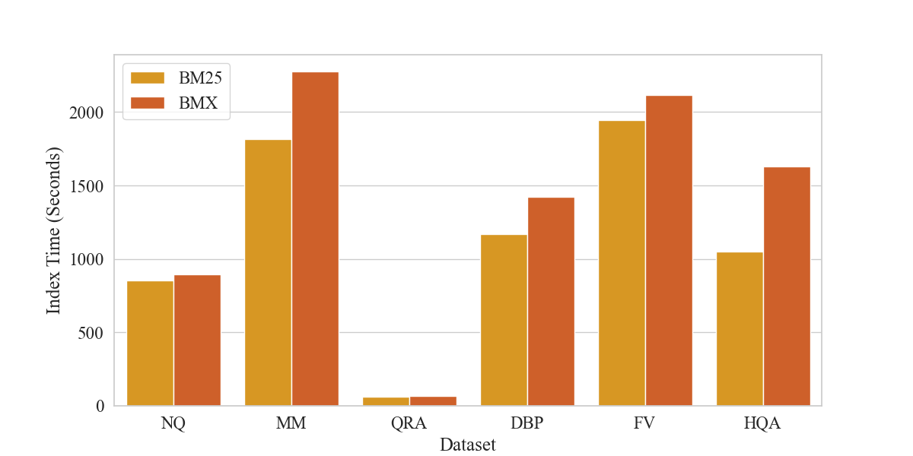
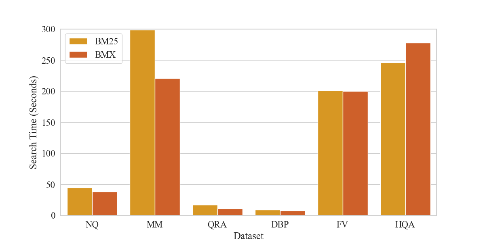

# BMX：融合熵权相似性与语义增强的词汇检索

发布时间：2024年08月13日

`LLM应用` `信息检索` `搜索引擎`

> BMX: Entropy-weighted Similarity and Semantic-enhanced Lexical Search

# 摘要

> 尽管预训练和大型语言模型（PLM/LLM）日益流行，BM25这一广泛使用的词汇搜索算法在信息检索领域仍占重要地位。但其对查询-文档相似性的忽视和语义理解的缺失限制了其性能。为此，我们推出了BMX，一种融合熵加权相似性与语义增强技术的BM25升级版。实验证明，BMX在长文本和实际检索场景中表现卓越，超越了传统BM25及基于PLM/LLM的密集检索方法。这一创新不仅弥合了经典词汇搜索与现代语义技术间的鸿沟，更为未来信息检索研究指明了新方向。BMX的实现代码已公开于Baguetter项目，详情请访问：https://github.com/mixedbread-ai/baguetter。

> BM25, a widely-used lexical search algorithm, remains crucial in information retrieval despite the rise of pre-trained and large language models (PLMs/LLMs). However, it neglects query-document similarity and lacks semantic understanding, limiting its performance. We revisit BM25 and introduce BMX, a novel extension of BM25 incorporating entropy-weighted similarity and semantic enhancement techniques. Extensive experiments demonstrate that BMX consistently outperforms traditional BM25 and surpasses PLM/LLM-based dense retrieval in long-context and real-world retrieval benchmarks. This study bridges the gap between classical lexical search and modern semantic approaches, offering a promising direction for future information retrieval research. The reference implementation of BMX can be found in Baguetter, which was created in the context of this work. The code can be found here: https://github.com/mixedbread-ai/baguetter.

[Arxiv](https://arxiv.org/abs/2408.06643)