# 利用大语言模型积累的知识，设计出对计算友好的图神经网络架构。

发布时间：2024年08月13日

`LLM应用` `人工智能` `计算机科学`

> Computation-friendly Graph Neural Network Design by Accumulating Knowledge on Large Language Models

# 摘要

> 图神经网络 (GNNs) 虽成就斐然，但其架构设计的复杂性却是一大挑战，尤其依赖于特定数据和任务。传统的设计过程充满试错，耗费大量人力优化各组件。为减轻这一负担，研究者们正探索自动化算法。然而，无论是专家还是算法，在设计 GNNs 时都面临两大难题：一是反复尝试架构所耗费的巨大计算资源，二是积累图、GNNs 与性能间复杂关系知识的漫长过程。为提升 GNN 设计的自动化，我们提出一种高效方法，赋予大型语言模型 (LLMs) 设计 GNNs 的专门知识，从而显著缩短设计周期与计算成本。我们的框架首先构建了一个理解图、GNNs 与性能相互关系的知识检索系统，将过往设计经验转化为结构化知识，快速生成初始模型提案。接着，我们采用知识驱动的搜索策略，模拟专家的探索-利用过程，在有前景的范围内迅速优化提案。实验证明，我们的框架能在瞬间为新数据集提供高质量（如 Top-5.77%）的初始模型提案，无需预训练，并在几次迭代中达到卓越的搜索效果。

> Graph Neural Networks (GNNs), like other neural networks, have shown remarkable success but are hampered by the complexity of their architecture designs, which heavily depend on specific data and tasks. Traditionally, designing proper architectures involves trial and error, which requires intensive manual effort to optimize various components. To reduce human workload, researchers try to develop automated algorithms to design GNNs. However, both experts and automated algorithms suffer from two major issues in designing GNNs: 1) the substantial computational resources expended in repeatedly trying candidate GNN architectures until a feasible design is achieved, and 2) the intricate and prolonged processes required for humans or algorithms to accumulate knowledge of the interrelationship between graphs, GNNs, and performance.
  To further enhance the automation of GNN architecture design, we propose a computation-friendly way to empower Large Language Models (LLMs) with specialized knowledge in designing GNNs, thereby drastically shortening the computational overhead and development cycle of designing GNN architectures. Our framework begins by establishing a knowledge retrieval pipeline that comprehends the intercorrelations between graphs, GNNs, and performance. This pipeline converts past model design experiences into structured knowledge for LLM reference, allowing it to quickly suggest initial model proposals. Subsequently, we introduce a knowledge-driven search strategy that emulates the exploration-exploitation process of human experts, enabling quick refinement of initial proposals within a promising scope. Extensive experiments demonstrate that our framework can efficiently deliver promising (e.g., Top-5.77%) initial model proposals for unseen datasets within seconds and without any prior training and achieve outstanding search performance in a few iterations.

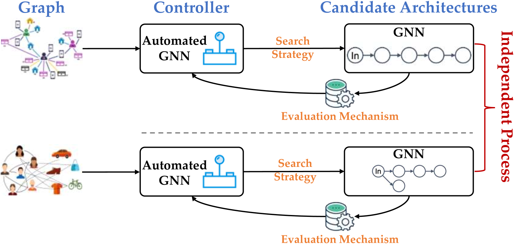

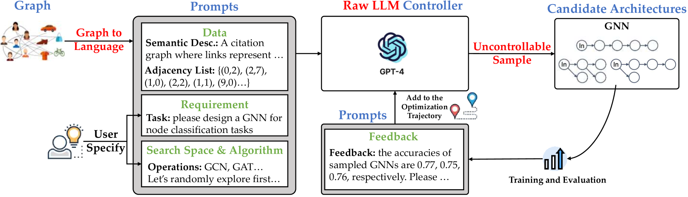

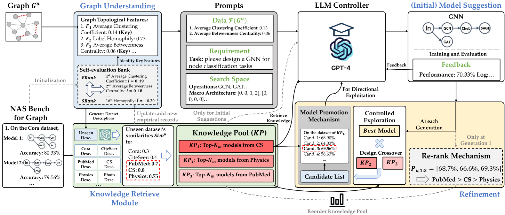

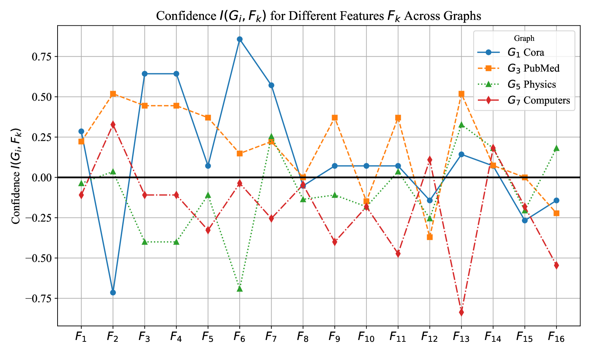

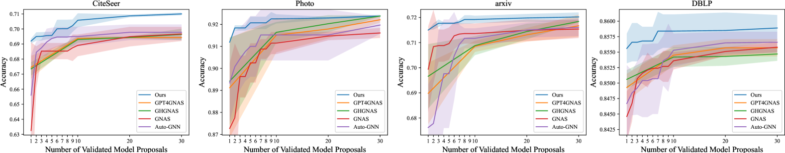

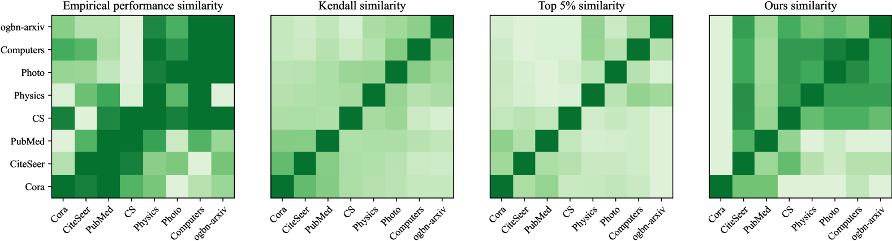

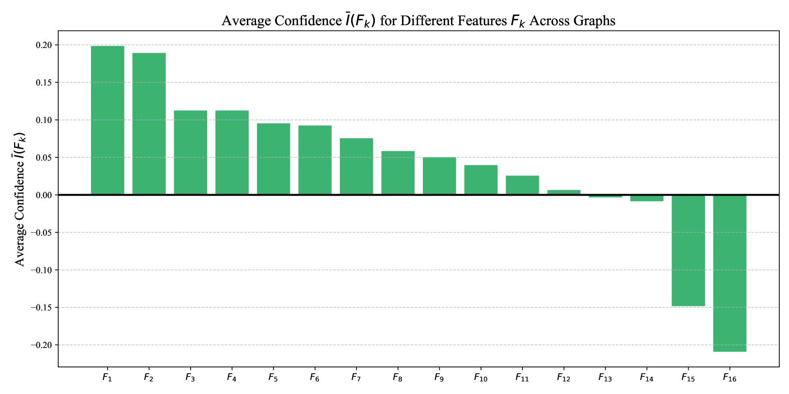

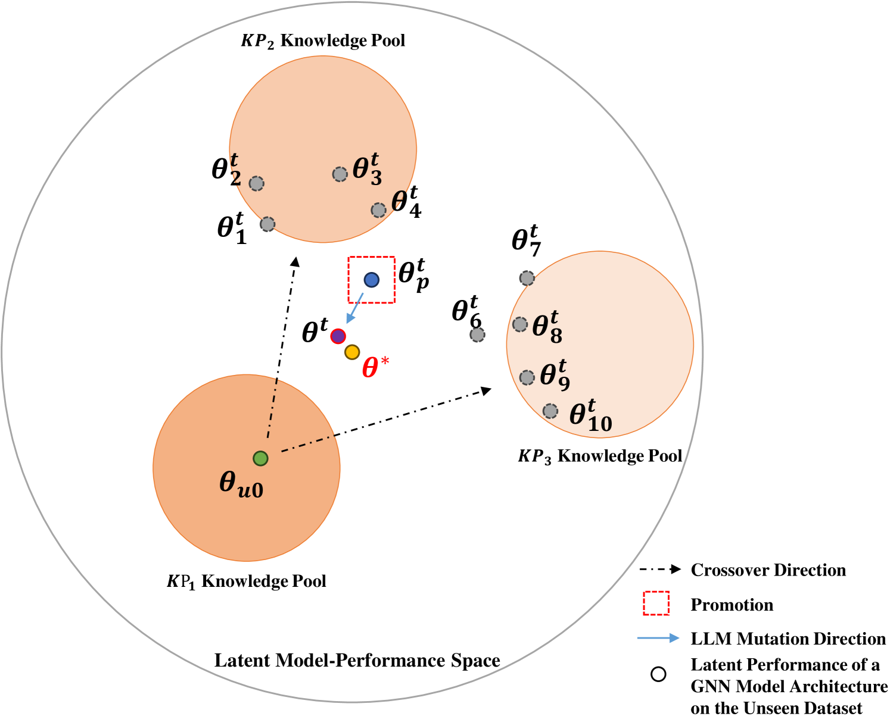

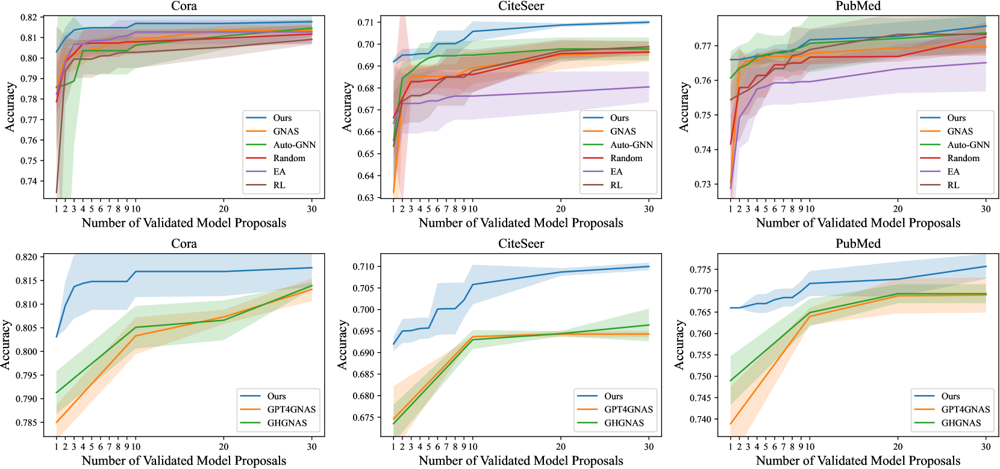

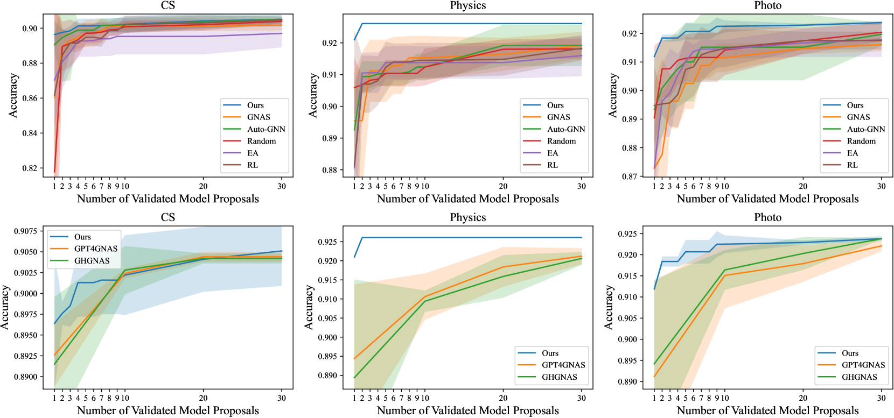

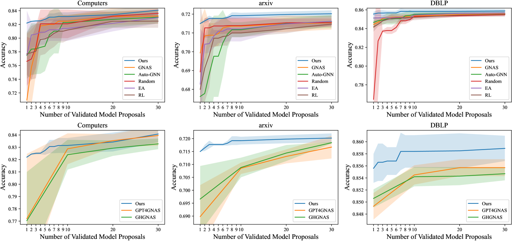

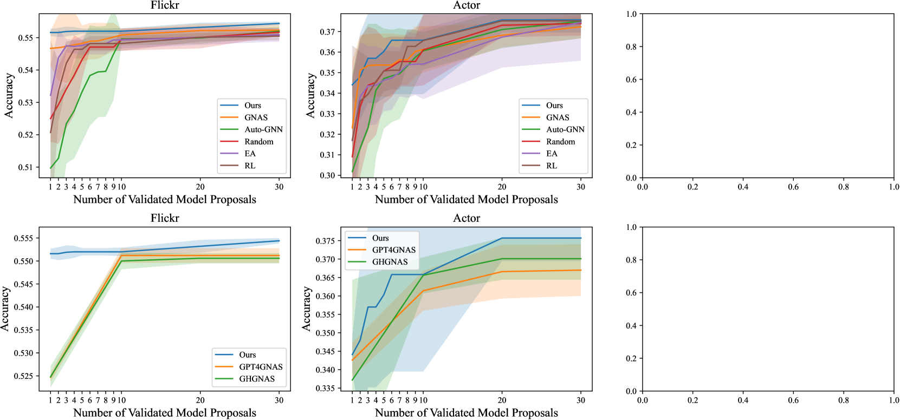

[Arxiv](https://arxiv.org/abs/2408.06717)