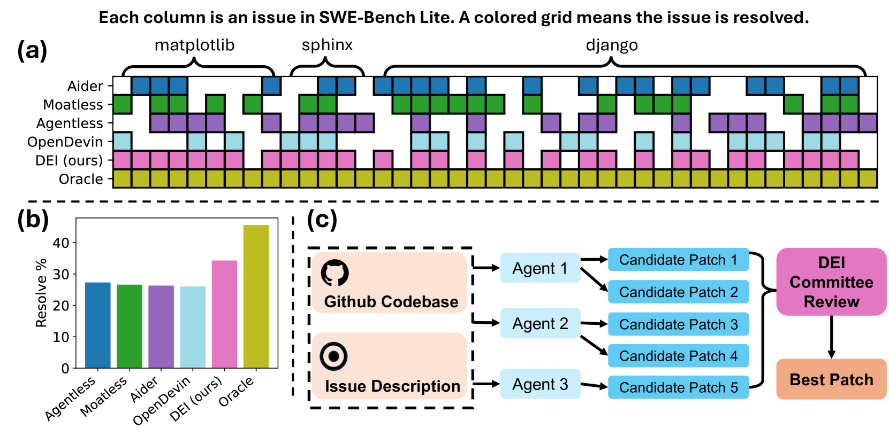
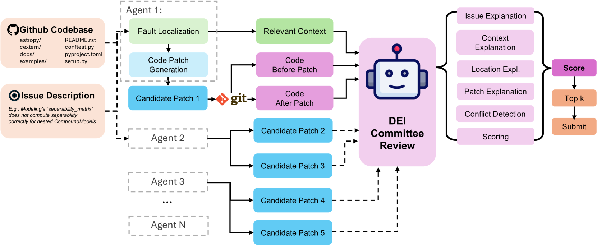
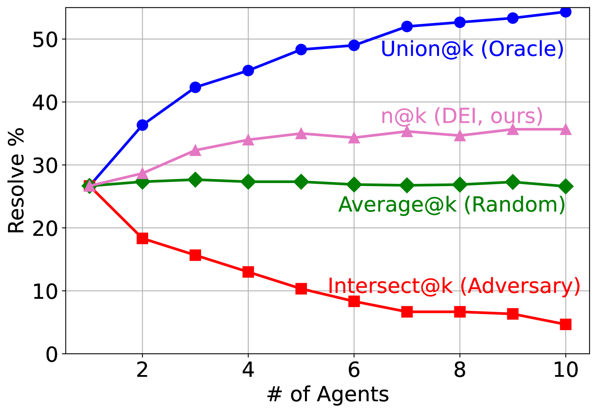
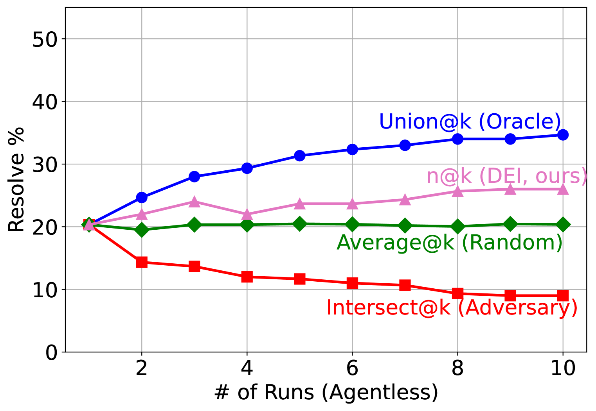
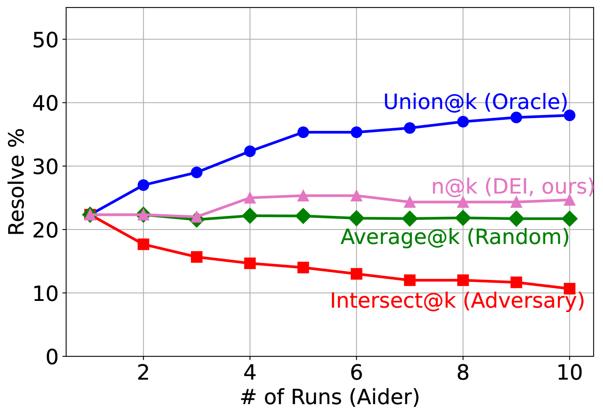
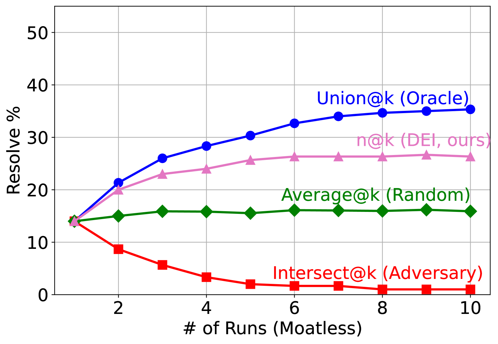
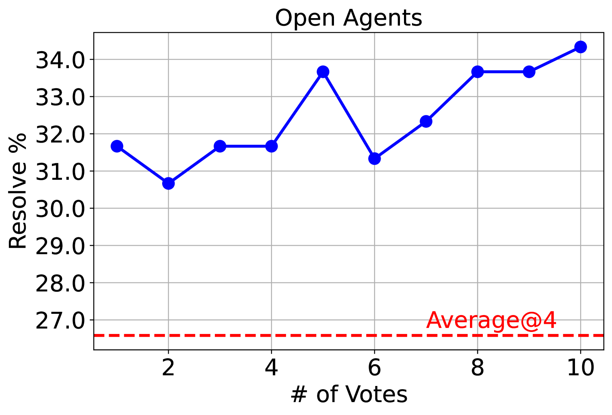
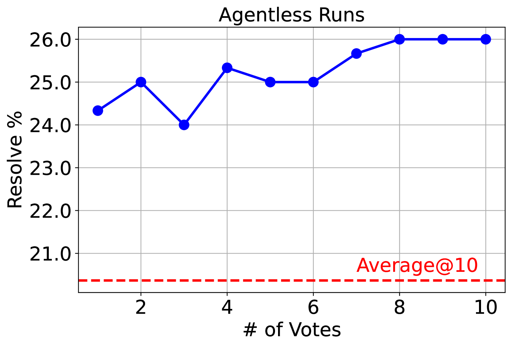
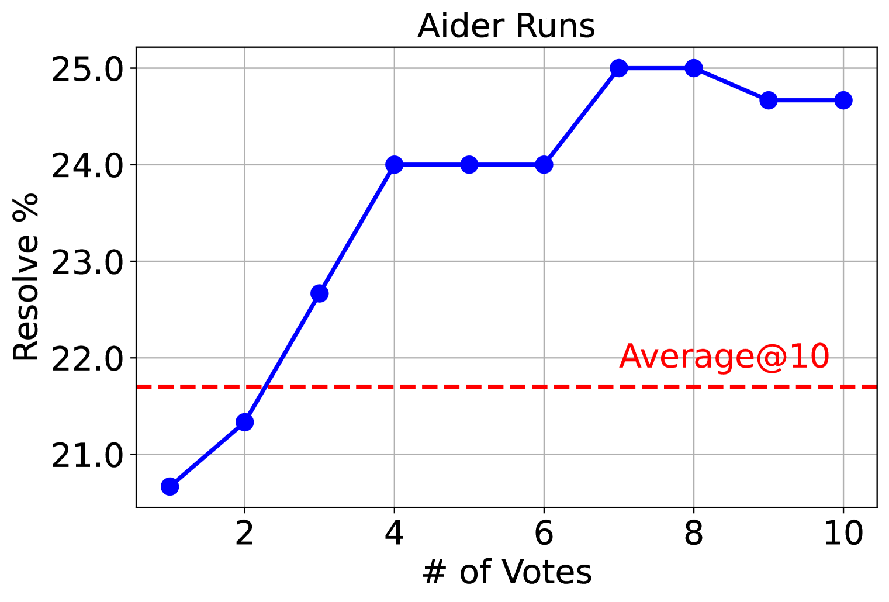
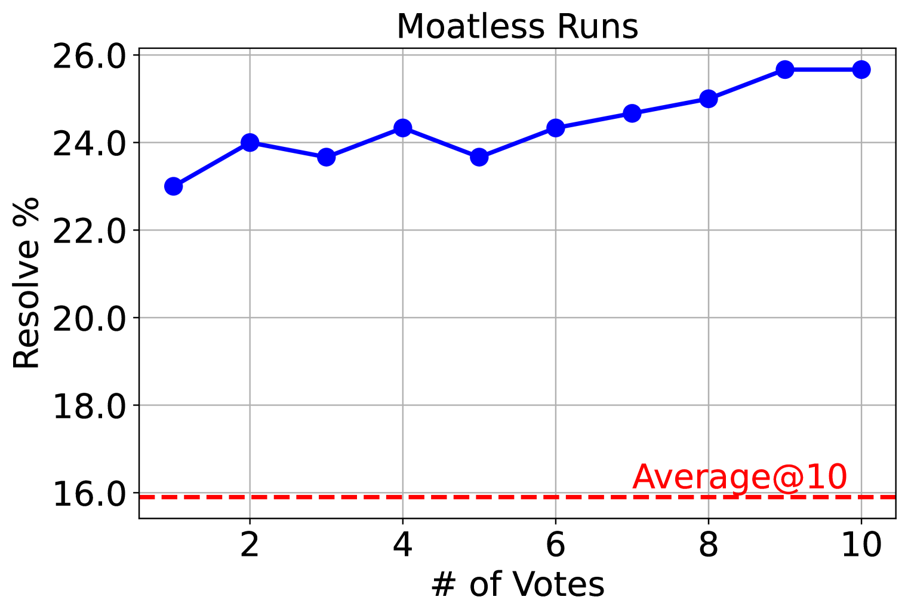

# 智能因多样性而强大：汇聚软件工程代理的专业智慧

发布时间：2024年08月13日

`Agent` `软件工程` `人工智能`

> Diversity Empowers Intelligence: Integrating Expertise of Software Engineering Agents

# 摘要

> 大型语言模型代理在解决软件工程难题方面潜力巨大。最尖端的开源代理能在SWE-Bench Lite中解决超27%的GitHub实际问题。然而，这些精密的代理框架各有千秋，某些任务中表现卓越，其他则稍逊一筹。为此，我们推出了DEI框架，旨在整合这些代理的独特专长。DEI作为现有框架的顶层元模块，通过管理代理集体来提升问题解决效率。实验表明，DEI引导下的代理团队能显著超越单一代理的性能。例如，一组开源代理在SWE-Bench Lite上的最高单个解决率为27.3%，借助DEI可提升至34.3%，增幅达25%，超越多数闭源方案。我们的顶尖团队更是以55%的解决率，在SWE-Bench Lite上拔得头筹。这些发现为协作AI系统研究及其应对复杂软件工程挑战的潜力增添了新篇章。

> Large language model (LLM) agents have shown great potential in solving real-world software engineering (SWE) problems. The most advanced open-source SWE agent can resolve over 27% of real GitHub issues in SWE-Bench Lite. However, these sophisticated agent frameworks exhibit varying strengths, excelling in certain tasks while underperforming in others. To fully harness the diversity of these agents, we propose DEI (Diversity Empowered Intelligence), a framework that leverages their unique expertise. DEI functions as a meta-module atop existing SWE agent frameworks, managing agent collectives for enhanced problem-solving. Experimental results show that a DEI-guided committee of agents is able to surpass the best individual agent's performance by a large margin. For instance, a group of open-source SWE agents, with a maximum individual resolve rate of 27.3% on SWE-Bench Lite, can achieve a 34.3% resolve rate with DEI, making a 25% improvement and beating most closed-source solutions. Our best-performing group excels with a 55% resolve rate, securing the highest ranking on SWE-Bench Lite. Our findings contribute to the growing body of research on collaborative AI systems and their potential to solve complex software engineering challenges.

[Arxiv](https://arxiv.org/abs/2408.07060)