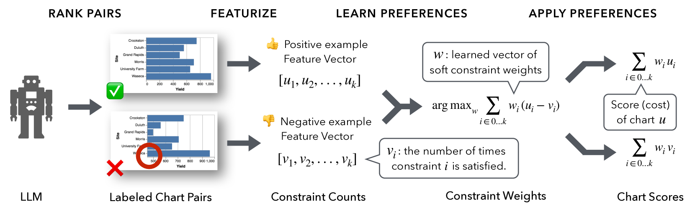
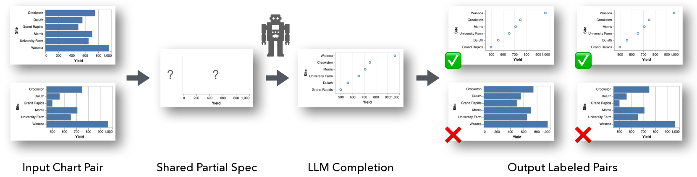
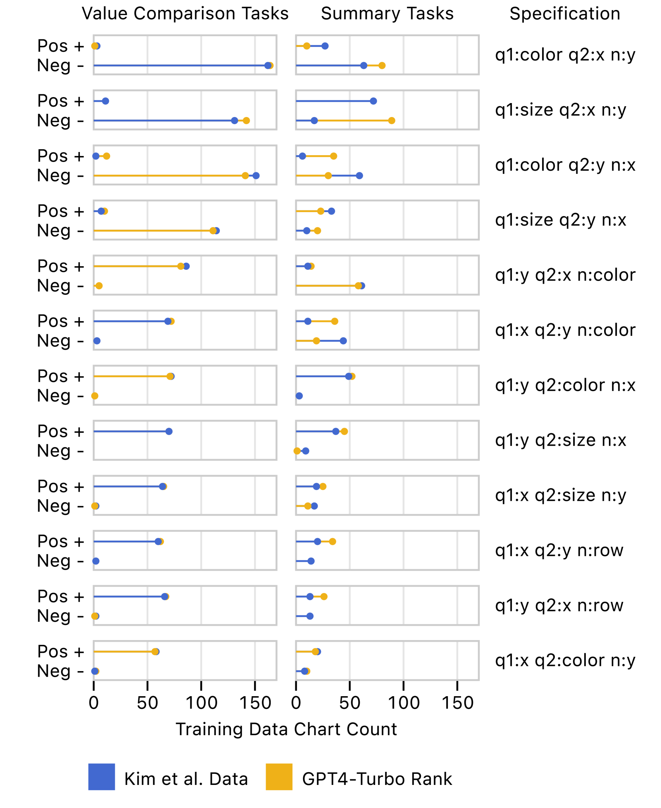
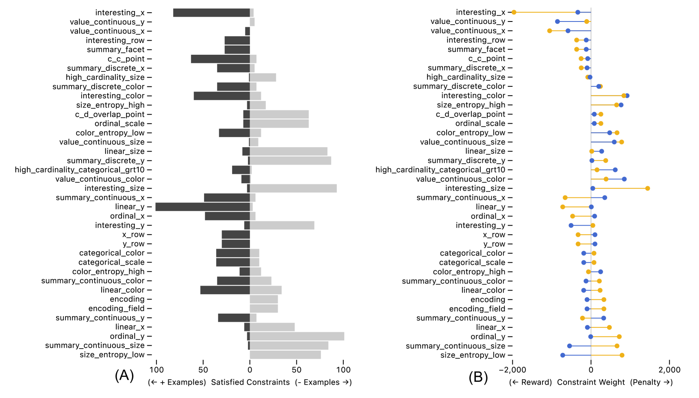
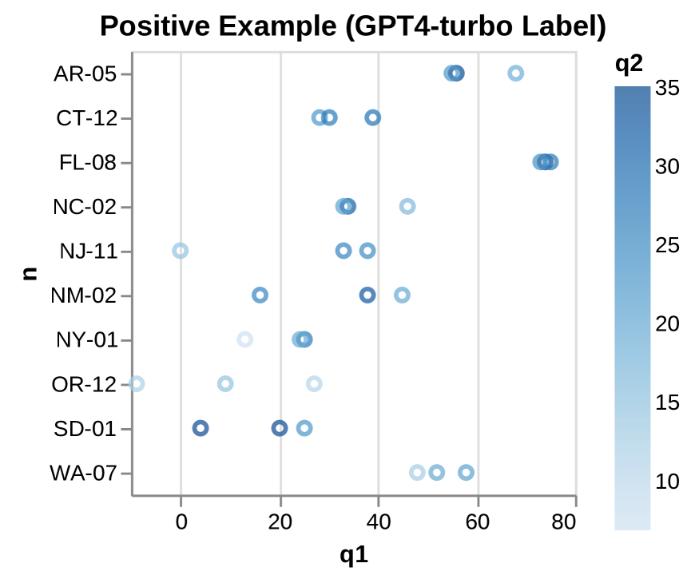
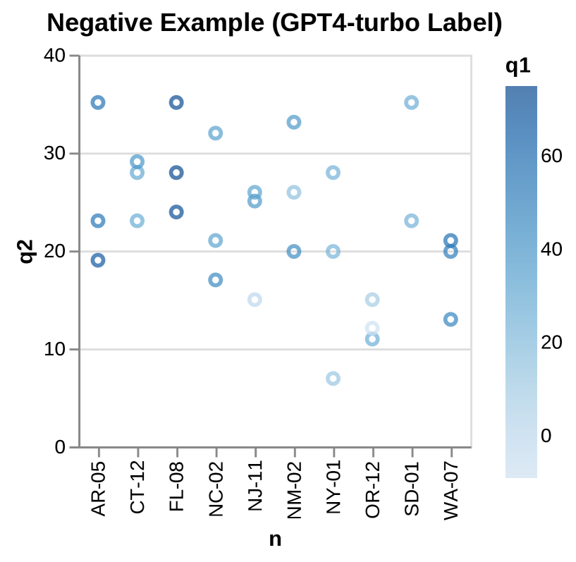
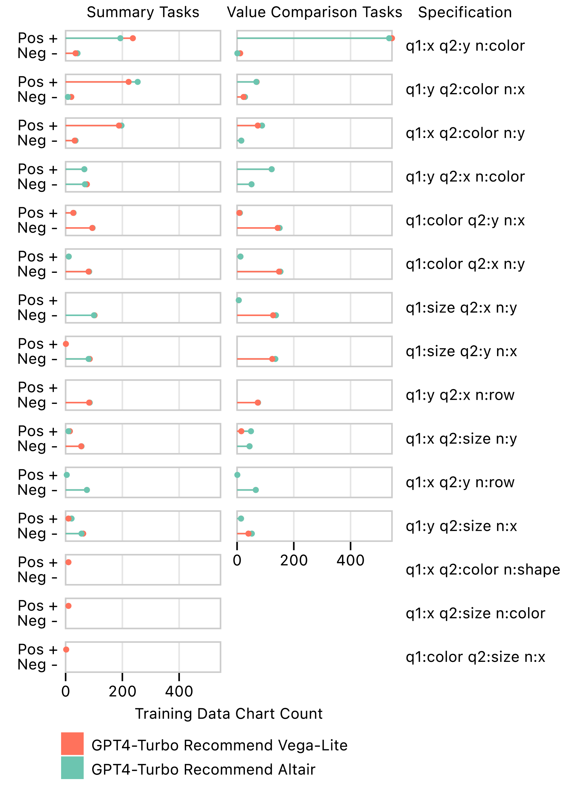
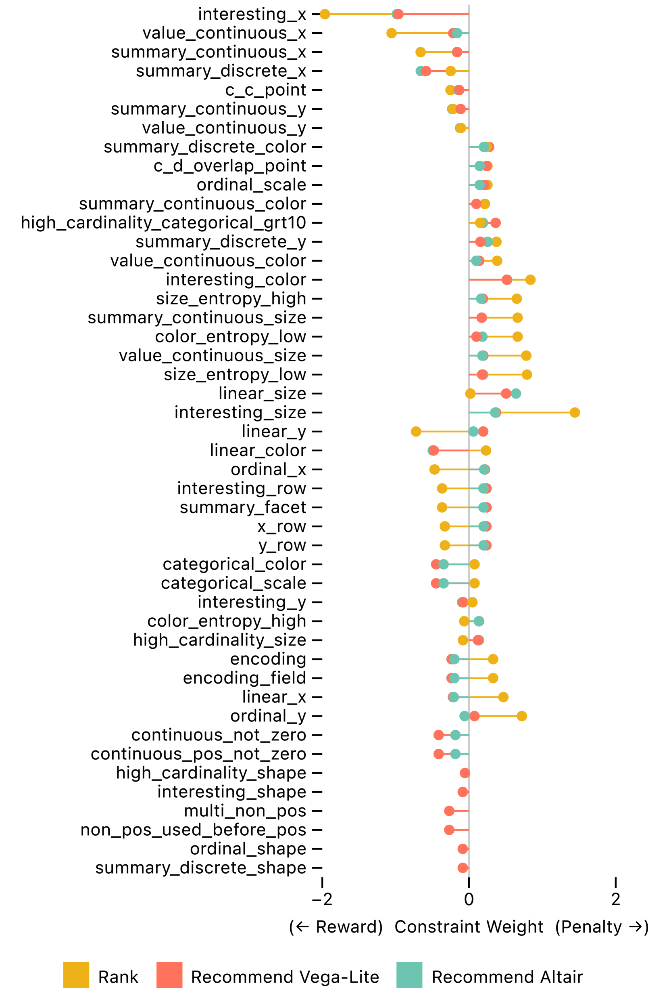
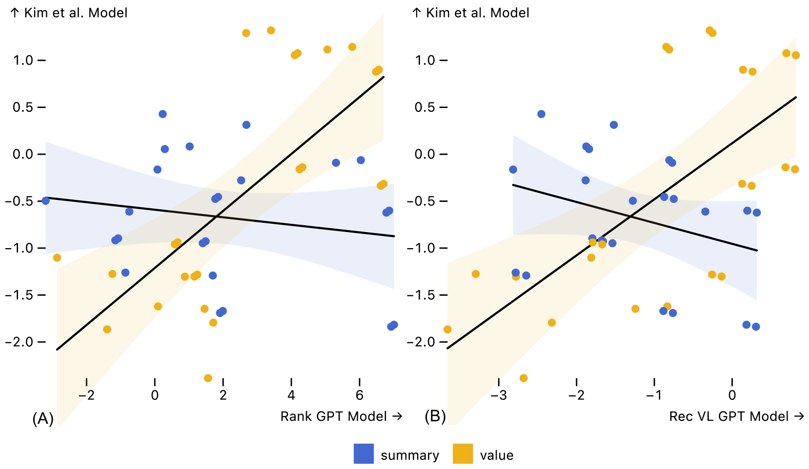
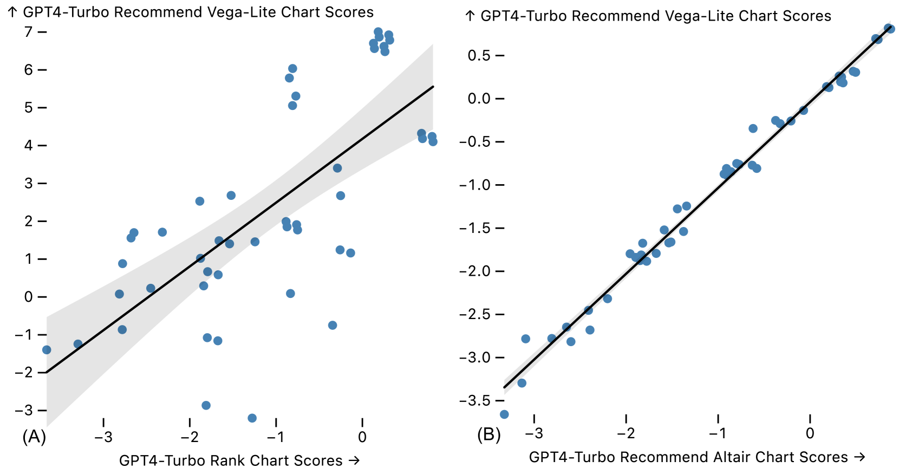

# DracoGPT：揭示大型语言模型中的可视化设计偏好

发布时间：2024年08月13日

`LLM应用` `人工智能`

> DracoGPT: Extracting Visualization Design Preferences from Large Language Models

# 摘要

> 大型语言模型（LLM）在海量语料库的训练下，具备编码可视化设计知识和最佳实践的能力。然而，一旦失效，它们提供的可视化推荐可能并不可靠。那么，LLM究竟学到了哪些可视化设计偏好呢？我们提出了DracoGPT方法，用于从LLM中提取、建模并评估这些设计偏好。为应对多样任务，我们设计了DracoGPT-Rank和DracoGPT-Recommend两条流程，分别用于建模LLM在视觉编码规范排序和推荐方面的表现。我们以Draco为共享知识库，对比LLM设计偏好与实证研究的最佳实践。实验表明，DracoGPT能精准捕捉LLM的偏好，便于在Draco设计约束框架下进行分析。尽管DracoGPT-Rank与DracoGPT-Recommend在某些方面达成共识，但它们与基于人类实验的指南存在显著差异。未来研究可借鉴我们的方法，扩展Draco知识库，以建模更丰富的偏好，并提供一个既强大又经济的LLM替代方案。

> Trained on vast corpora, Large Language Models (LLMs) have the potential to encode visualization design knowledge and best practices. However, if they fail to do so, they might provide unreliable visualization recommendations. What visualization design preferences, then, have LLMs learned? We contribute DracoGPT, a method for extracting, modeling, and assessing visualization design preferences from LLMs. To assess varied tasks, we develop two pipelines--DracoGPT-Rank and DracoGPT-Recommend--to model LLMs prompted to either rank or recommend visual encoding specifications. We use Draco as a shared knowledge base in which to represent LLM design preferences and compare them to best practices from empirical research. We demonstrate that DracoGPT can accurately model the preferences expressed by LLMs, enabling analysis in terms of Draco design constraints. Across a suite of backing LLMs, we find that DracoGPT-Rank and DracoGPT-Recommend moderately agree with each other, but both substantially diverge from guidelines drawn from human subjects experiments. Future work can build on our approach to expand Draco's knowledge base to model a richer set of preferences and to provide a robust and cost-effective stand-in for LLMs.

[Arxiv](https://arxiv.org/abs/2408.06845)