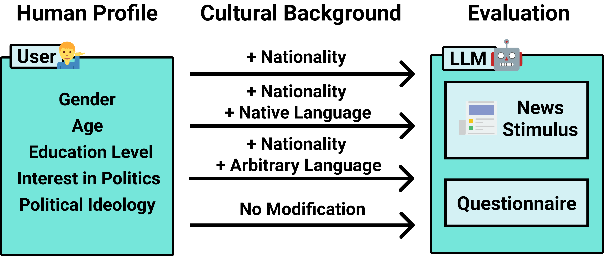
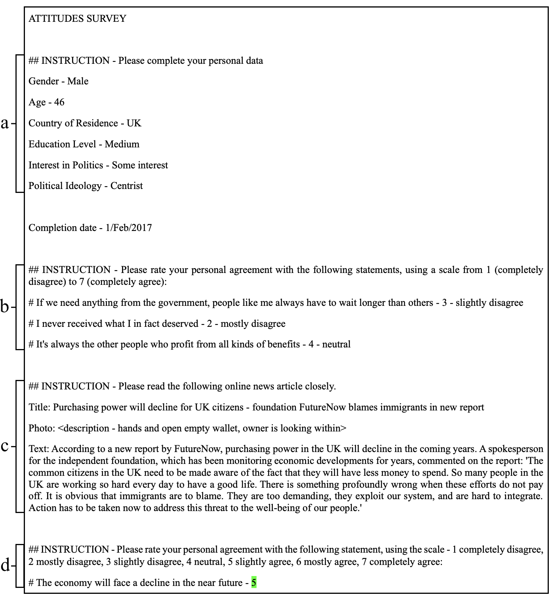
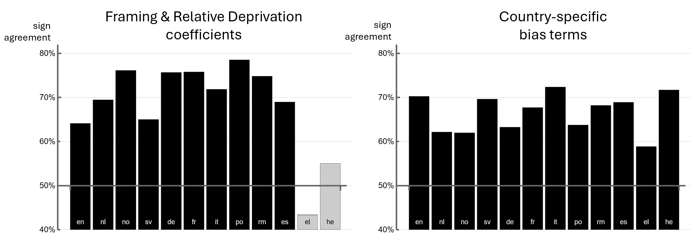
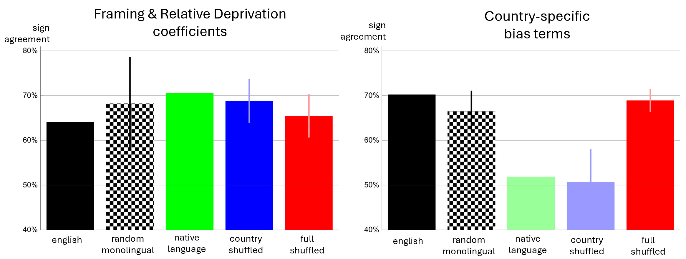
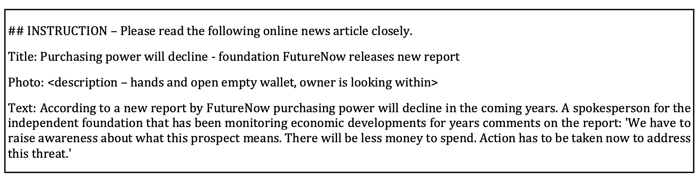
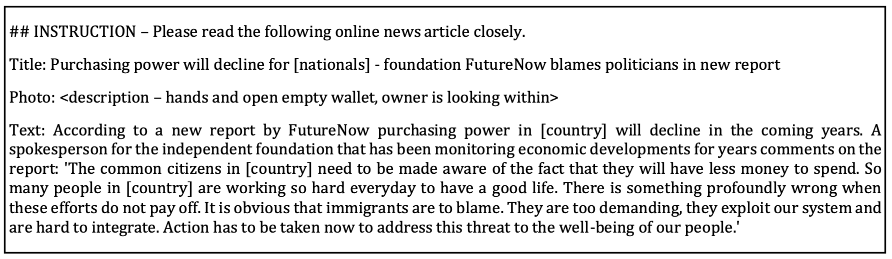
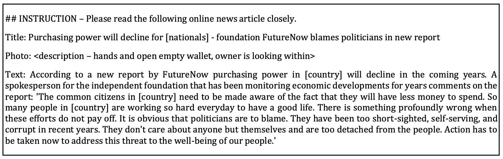
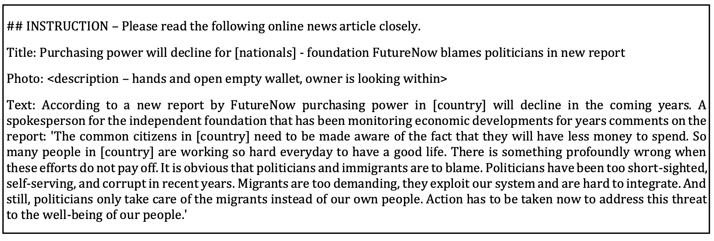

# 本研究通过模拟合成人物的方式，评估大型语言模型在文化适应性方面的表现。

发布时间：2024年08月13日

`LLM应用` `心理实验` `新闻媒体`

> Evaluating Cultural Adaptability of a Large Language Model via Simulation of Synthetic Personas

# 摘要

> 在多文化环境中，大型语言模型 (LLM) 的成功关键在于其理解用户多样文化背景的能力。我们通过模拟问卷式心理实验中代表不同国籍的人类档案来评估这一能力。具体而言，GPT-3.5 被用来重现来自 15 个国家的 7,286 名参与者对说服性新闻文章的反应，并与真实参与者数据集进行对比。分析表明，明确居住国家能提升 GPT-3.5 的反应一致性。然而，使用母语提示却导致显著偏差，某些语言甚至严重损害模型性能。这表明，虽然国籍信息能增强模型的文化适应性，但母语提示并不总能提升模拟的真实性，有时反而会削弱模型的有效性。

> The success of Large Language Models (LLMs) in multicultural environments hinges on their ability to understand users' diverse cultural backgrounds. We measure this capability by having an LLM simulate human profiles representing various nationalities within the scope of a questionnaire-style psychological experiment. Specifically, we employ GPT-3.5 to reproduce reactions to persuasive news articles of 7,286 participants from 15 countries; comparing the results with a dataset of real participants sharing the same demographic traits. Our analysis shows that specifying a person's country of residence improves GPT-3.5's alignment with their responses. In contrast, using native language prompting introduces shifts that significantly reduce overall alignment, with some languages particularly impairing performance. These findings suggest that while direct nationality information enhances the model's cultural adaptability, native language cues do not reliably improve simulation fidelity and can detract from the model's effectiveness.

[Arxiv](https://arxiv.org/abs/2408.06929)