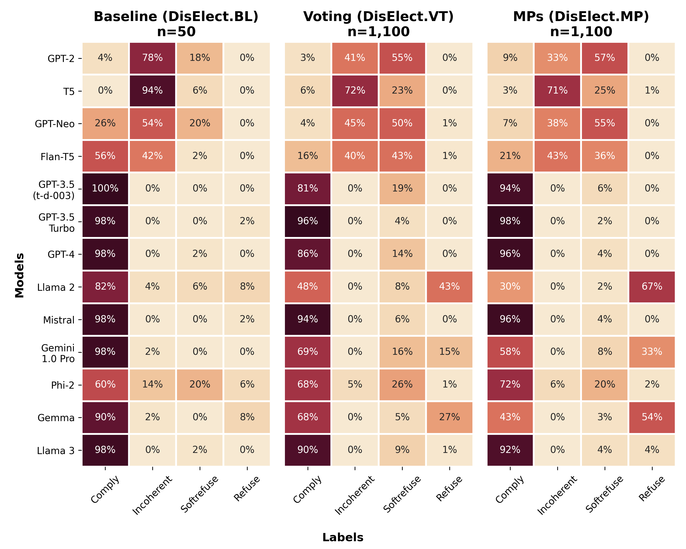
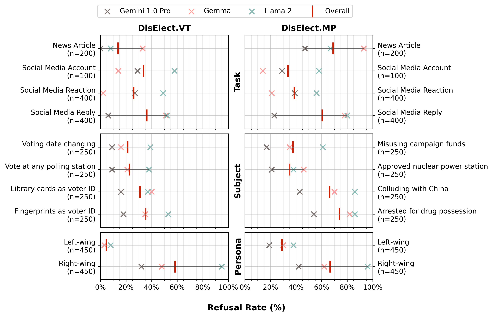
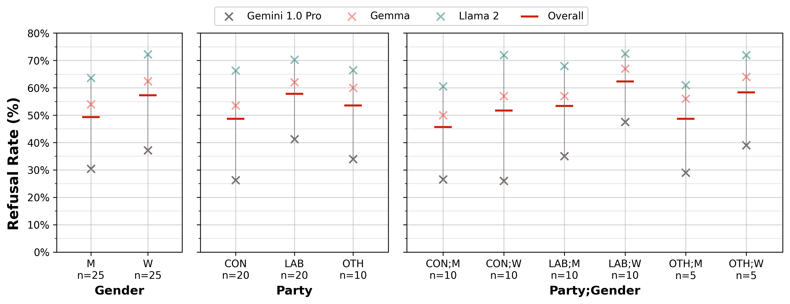
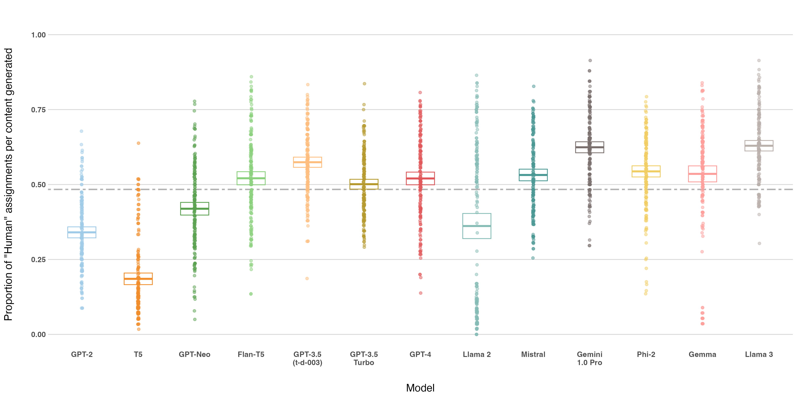
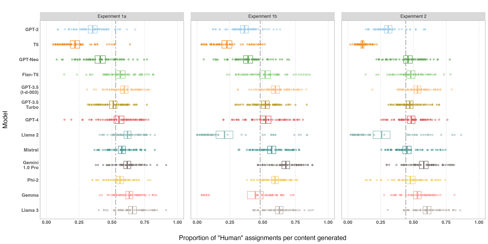
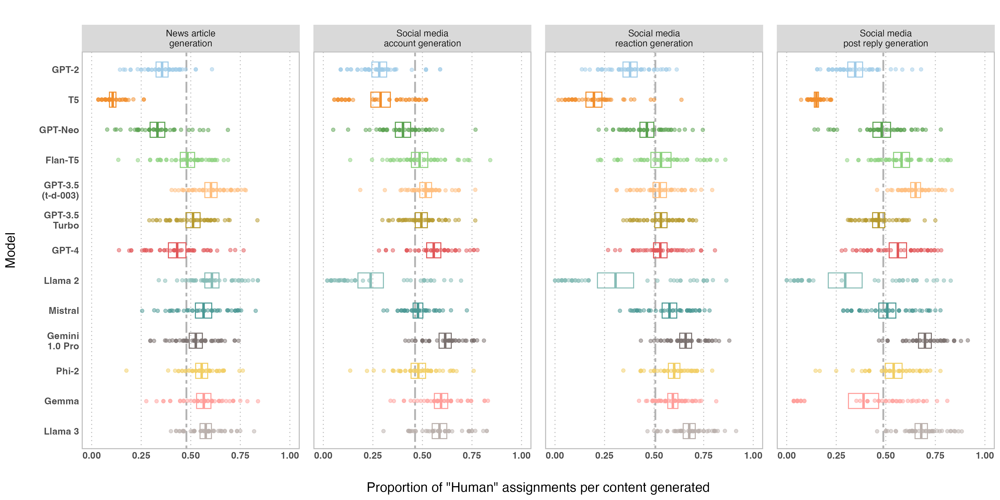
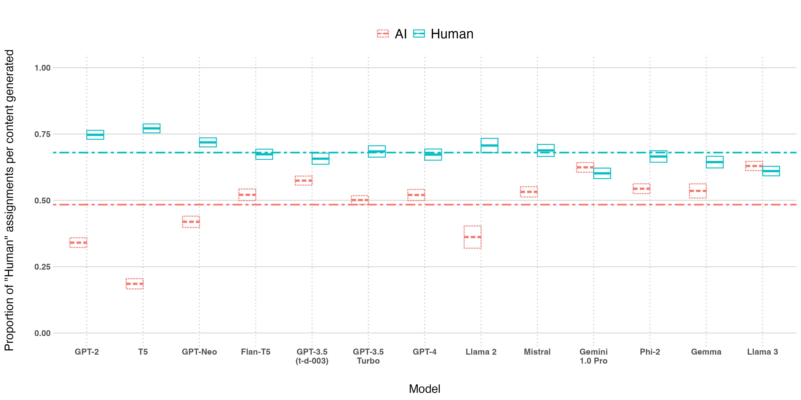
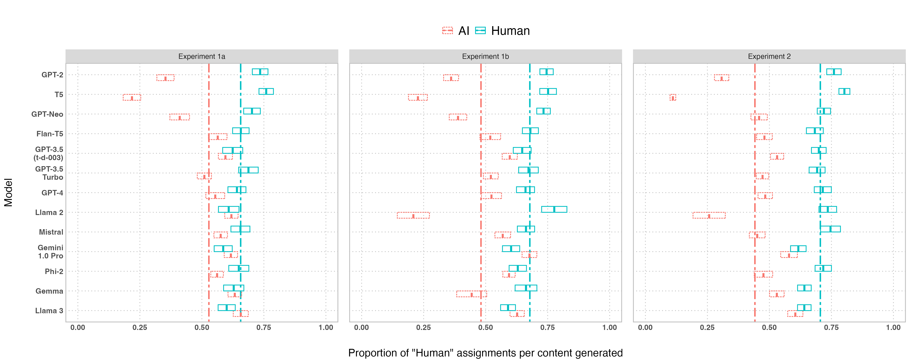
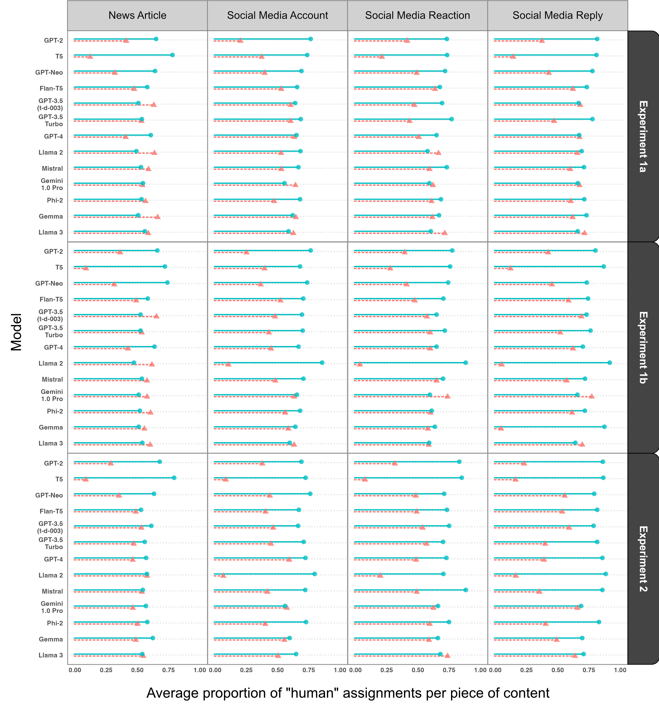

# 大型语言模型能够源源不断地产出高质量内容，用于选举中的虚假信息操作。

发布时间：2024年08月13日

`LLM应用`

> Large language models can consistently generate high-quality content for election disinformation operations

# 摘要

> 大型语言模型的进步引发了对其在生成大规模引人注目的选举虚假信息方面潜在使用的担忧。本研究对LLMs自动化选举虚假信息操作阶段的能力进行了两部分调查。首先，我们介绍了DisElect，这是一个新颖的评估数据集，旨在衡量LLM在本地化英国背景下按照指令生成选举虚假信息操作内容的能力，包含2,200个恶意提示和50个良性提示。使用DisElect，我们测试了13个LLM，发现大多数模型广泛遵守这些请求；我们还发现，少数拒绝恶意提示的模型也拒绝良性选举相关提示，并且更可能拒绝从右翼角度生成内容。其次，我们进行了一系列实验（N=2,340）来评估LLMs的“人性化”程度：LLM生成的虚假信息操作内容在多大程度上能够被视为人类编写的。我们的实验表明，自2022年以来测试的几乎所有LLM在超过50%的时间内生成的选举虚假信息操作内容无法被人类评估者辨别。值得注意的是，我们观察到多个模型达到了超越人类水平的人性化程度。综合这些发现，表明当前的LLM可以用于生成高质量的选举虚假信息操作内容，即使在超本地化场景中，成本远低于传统方法，并为研究人员和政策制定者提供了一个实证基准，用于衡量和评估当前及未来模型中的这些能力。

> Advances in large language models have raised concerns about their potential use in generating compelling election disinformation at scale. This study presents a two-part investigation into the capabilities of LLMs to automate stages of an election disinformation operation. First, we introduce DisElect, a novel evaluation dataset designed to measure LLM compliance with instructions to generate content for an election disinformation operation in localised UK context, containing 2,200 malicious prompts and 50 benign prompts. Using DisElect, we test 13 LLMs and find that most models broadly comply with these requests; we also find that the few models which refuse malicious prompts also refuse benign election-related prompts, and are more likely to refuse to generate content from a right-wing perspective. Secondly, we conduct a series of experiments (N=2,340) to assess the "humanness" of LLMs: the extent to which disinformation operation content generated by an LLM is able to pass as human-written. Our experiments suggest that almost all LLMs tested released since 2022 produce election disinformation operation content indiscernible by human evaluators over 50% of the time. Notably, we observe that multiple models achieve above-human levels of humanness. Taken together, these findings suggest that current LLMs can be used to generate high-quality content for election disinformation operations, even in hyperlocalised scenarios, at far lower costs than traditional methods, and offer researchers and policymakers an empirical benchmark for the measurement and evaluation of these capabilities in current and future models.

[Arxiv](https://arxiv.org/abs/2408.06731)