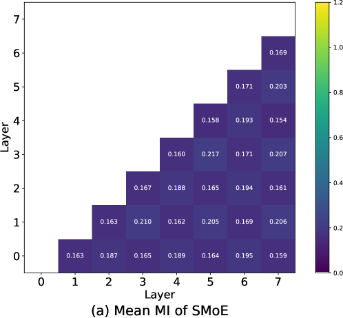
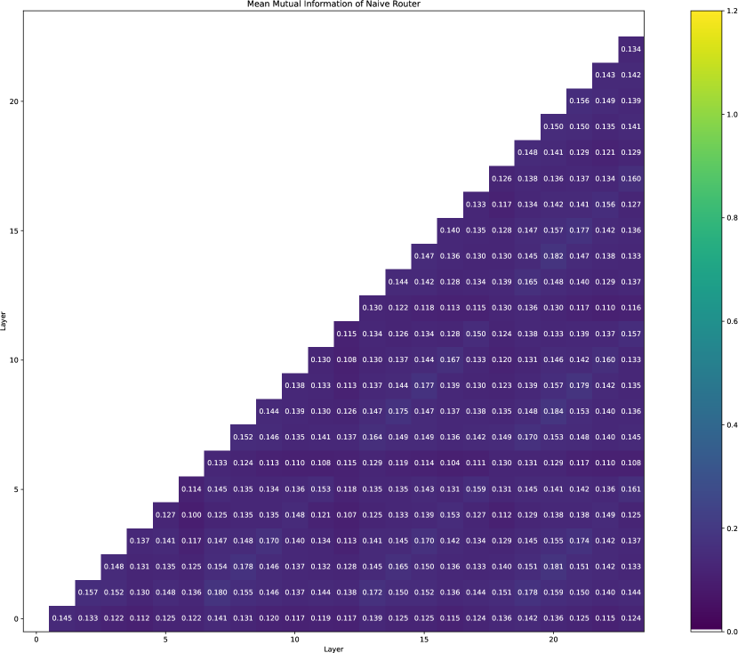
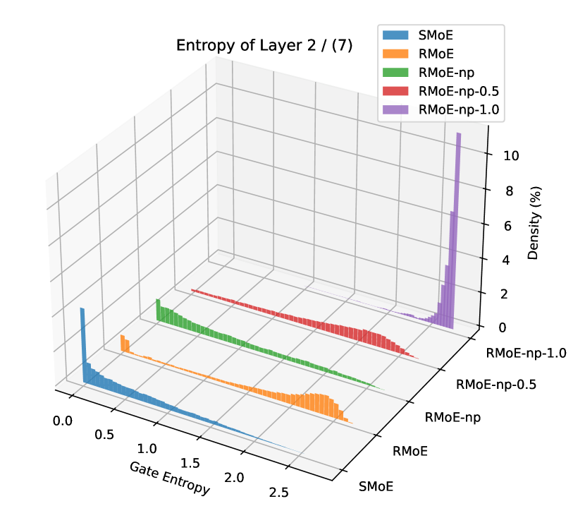
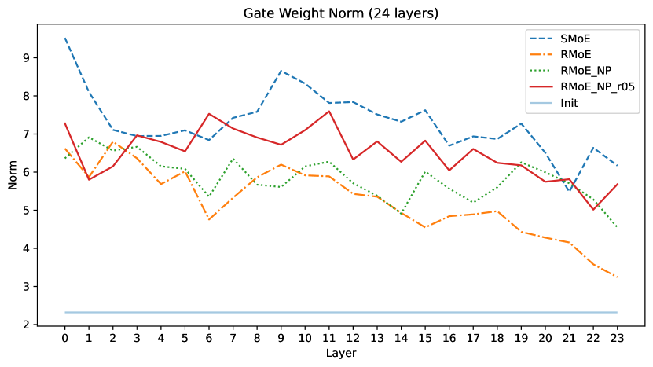

# 逐层循环路由器：专家混合的智能导航

发布时间：2024年08月13日

`LLM理论` `计算机科学` `人工智能`

> Layerwise Recurrent Router for Mixture-of-Experts

# 摘要

> 大型语言模型的规模扩展虽然提升了其在多任务中的性能，但同时也要求更高效的计算策略。Mixture-of-Experts (MoE) 架构因其能在不大幅增加训练成本的前提下扩展模型规模而备受瞩目。然而，现有的 MoE 模型往往参数效率不高，例如，一个拥有 520 亿参数的 MoE 模型可能仅与一个 67 亿参数的标准模型性能相当。当前的路由器在各层独立工作，未能利用历史路由信息，可能导致令牌与专家的非最优匹配及参数效率问题。为此，我们提出了层级循环路由器 (RMoE)，它通过门控循环单元 (GRU) 在层间建立路由决策的依赖关系，实现高效并行计算并控制成本。实证评估显示，基于 RMoE 的语言模型在多个基线模型中表现卓越。RMoE 还引入了一个与现有方法正交的新计算阶段，增强了与其它 MoE 架构的兼容性。我们的分析表明，RMoE 通过有效的跨层信息共享，提升了专家选择和多样性。代码已公开在 https://github.com/qiuzh20/RMoE。

> The scaling of large language models (LLMs) has revolutionized their capabilities in various tasks, yet this growth must be matched with efficient computational strategies. The Mixture-of-Experts (MoE) architecture stands out for its ability to scale model size without significantly increasing training costs. Despite their advantages, current MoE models often display parameter inefficiency. For instance, a pre-trained MoE-based LLM with 52 billion parameters might perform comparably to a standard model with 6.7 billion parameters. Being a crucial part of MoE, current routers in different layers independently assign tokens without leveraging historical routing information, potentially leading to suboptimal token-expert combinations and the parameter inefficiency problem. To alleviate this issue, we introduce the Layerwise Recurrent Router for Mixture-of-Experts (RMoE). RMoE leverages a Gated Recurrent Unit (GRU) to establish dependencies between routing decisions across consecutive layers. Such layerwise recurrence can be efficiently parallelly computed for input tokens and introduces negotiable costs. Our extensive empirical evaluations demonstrate that RMoE-based language models consistently outperform a spectrum of baseline models. Furthermore, RMoE integrates a novel computation stage orthogonal to existing methods, allowing seamless compatibility with other MoE architectures. Our analyses attribute RMoE's gains to its effective cross-layer information sharing, which also improves expert selection and diversity. Our code is at https://github.com/qiuzh20/RMoE

[Arxiv](https://arxiv.org/abs/2408.06793)