# MAQA：探究 LLM 在处理数据不确定性时的不确定性量化评估

发布时间：2024年08月13日

`LLM理论` `人工智能` `数据分析`

> MAQA: Evaluating Uncertainty Quantification in LLMs Regarding Data Uncertainty

# 摘要

> 大型语言模型 (LLMs) 虽能执行多样任务，但常生成看似合理实则错误的答案。为提升其可靠性，近期研究转向不确定性量化，旨在预测答案的准确性。然而，多数方法忽视了数据不确定性，仅关注模型不确定性。本文探讨了在数据不确定性存在下的不确定性量化方法，并提出新数据集 MAQA 以评估其效果。我们评估了 5 种方法，发现基于熵和一致性的方法表现良好，而其他方法则因任务而异。白盒 LLMs 的方法在推理任务中显得过于自信。我们的研究为未来在现实环境中的不确定性量化研究奠定了基础。

> Although large language models (LLMs) are capable of performing various tasks, they still suffer from producing plausible but incorrect responses. To improve the reliability of LLMs, recent research has focused on uncertainty quantification to predict whether a response is correct or not. However, most uncertainty quantification methods have been evaluated on questions requiring a single clear answer, ignoring the existence of data uncertainty that arises from irreducible randomness. Instead, these methods only consider model uncertainty, which arises from a lack of knowledge. In this paper, we investigate previous uncertainty quantification methods under the presence of data uncertainty. Our contributions are two-fold: 1) proposing a new Multi-Answer Question Answering dataset, MAQA, consisting of world knowledge, mathematical reasoning, and commonsense reasoning tasks to evaluate uncertainty quantification regarding data uncertainty, and 2) assessing 5 uncertainty quantification methods of diverse white- and black-box LLMs. Our findings show that entropy and consistency-based methods estimate the model uncertainty well even under data uncertainty, while other methods for white- and black-box LLMs struggle depending on the tasks. Additionally, methods designed for white-box LLMs suffer from overconfidence in reasoning tasks compared to simple knowledge queries. We believe our observations will pave the way for future work on uncertainty quantification in realistic setting.

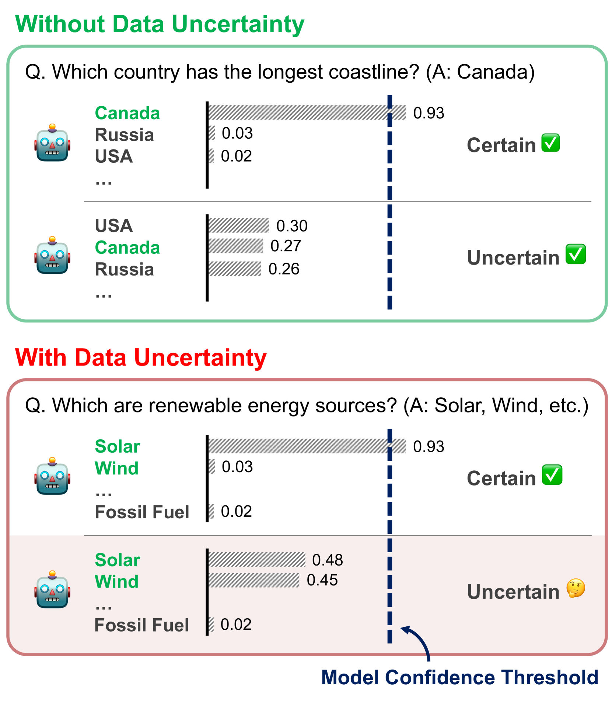

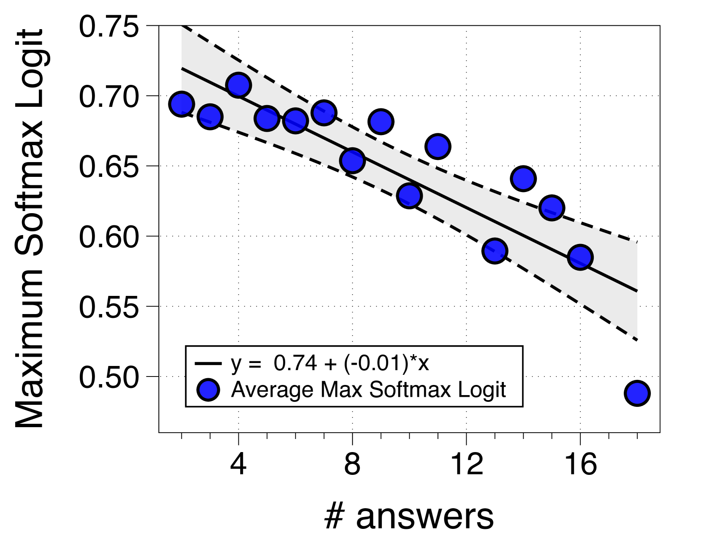

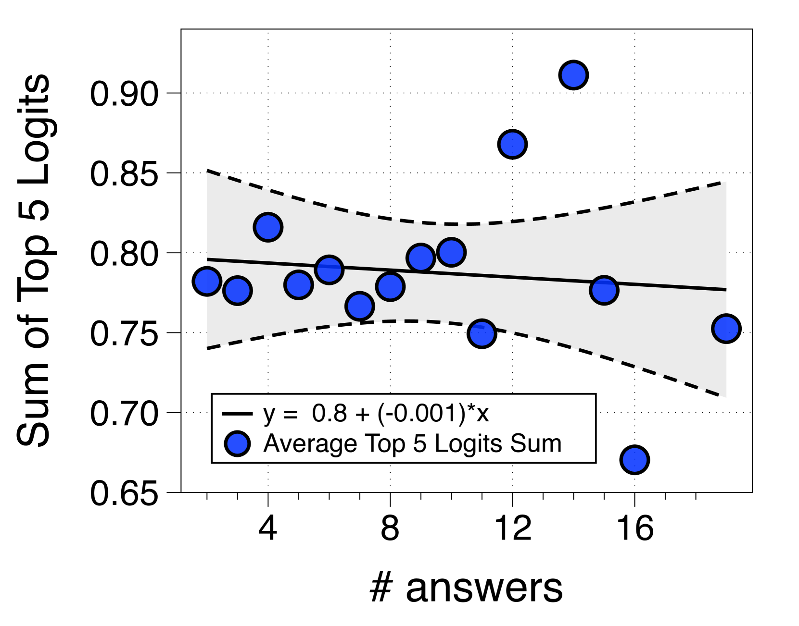

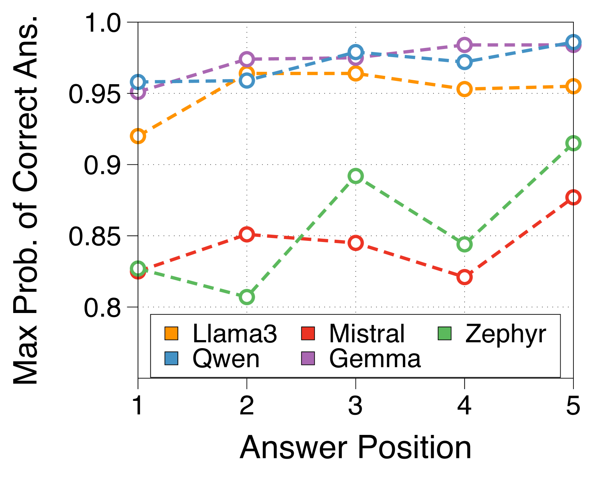

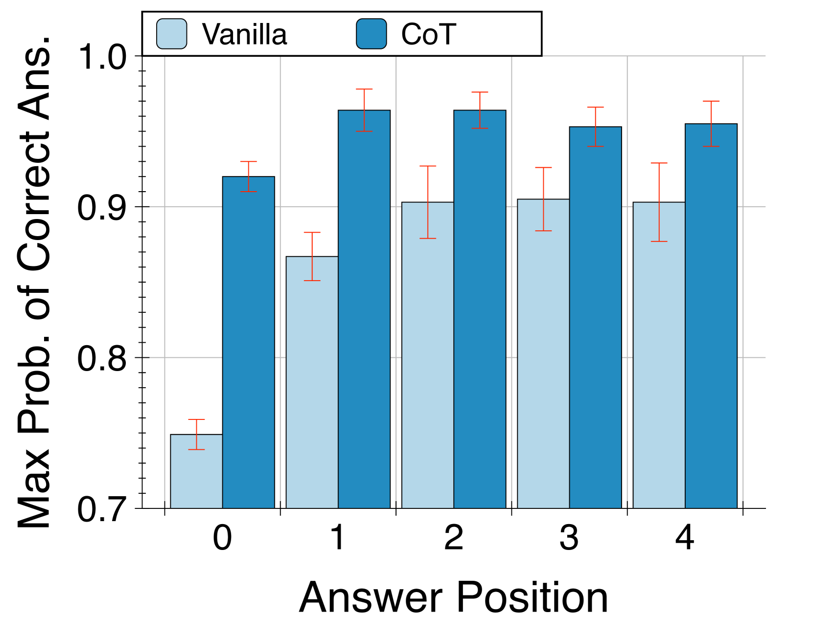

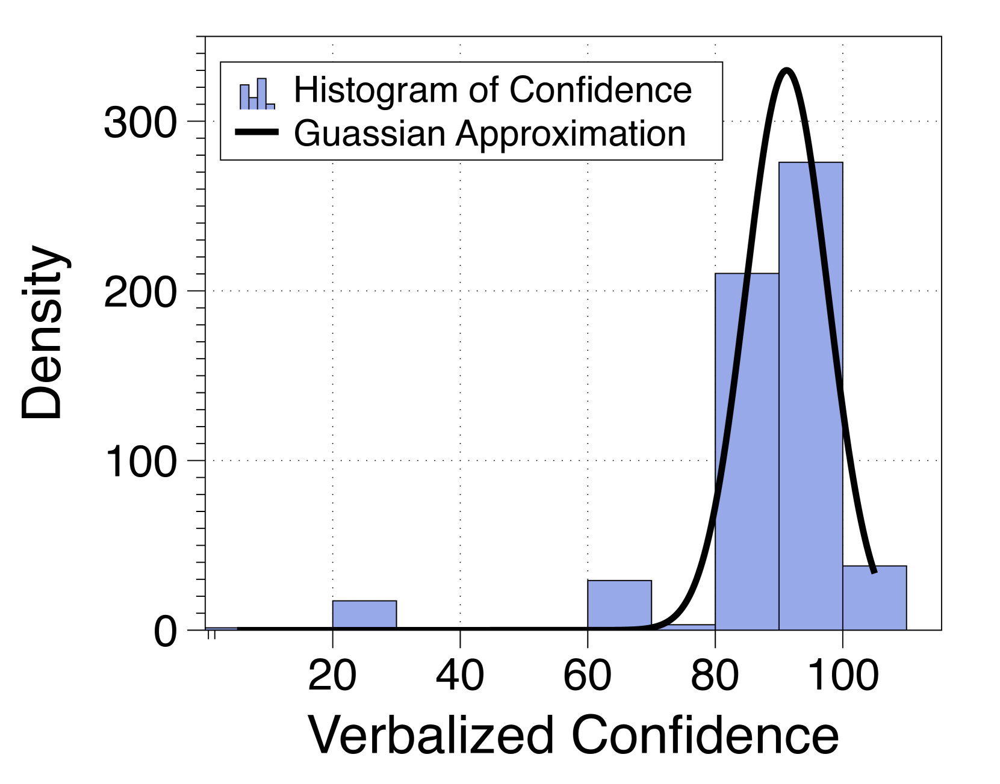

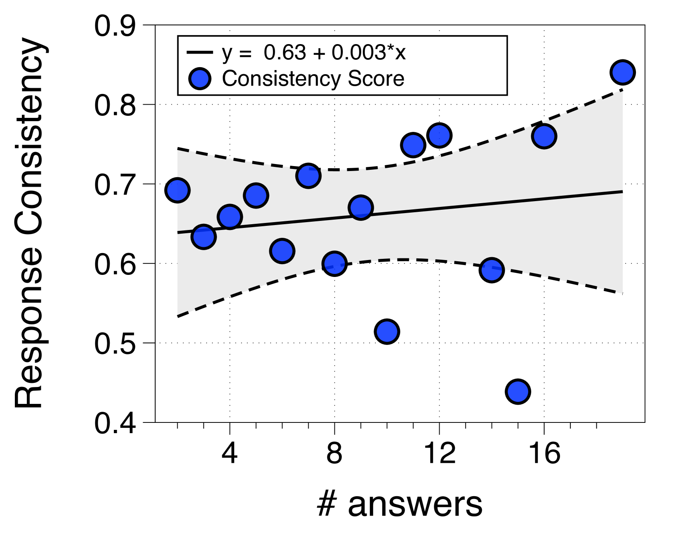

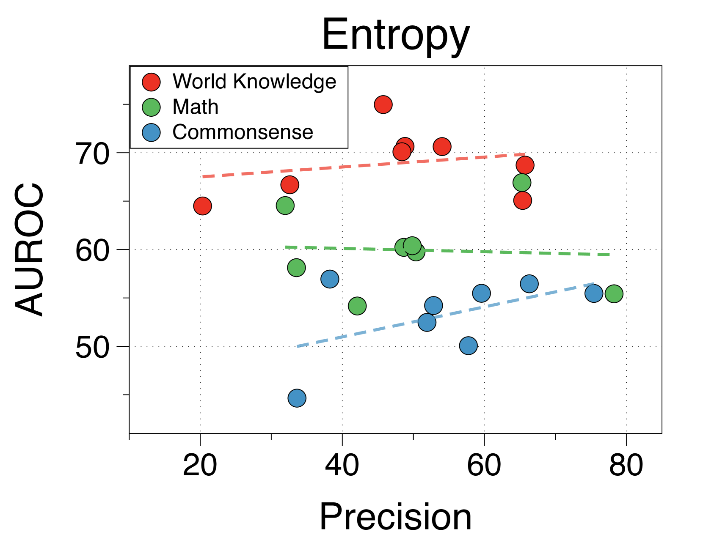

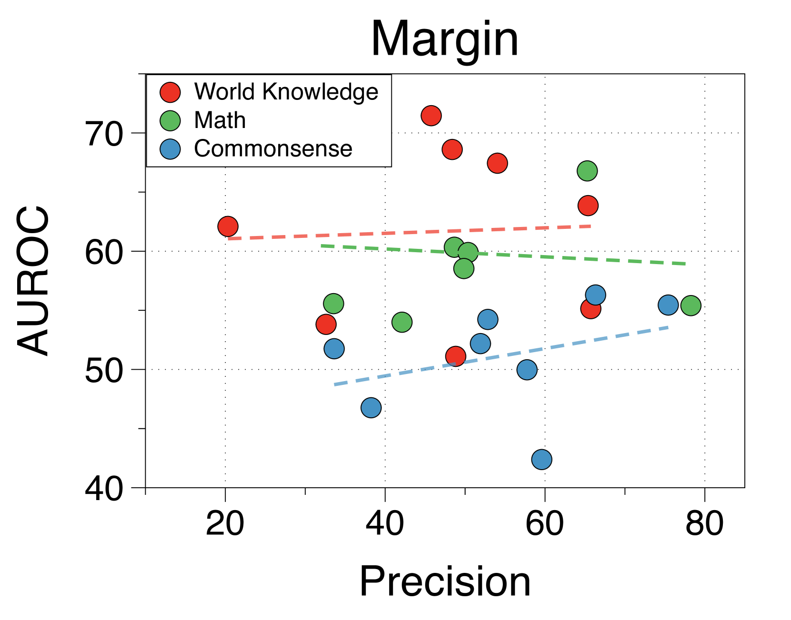

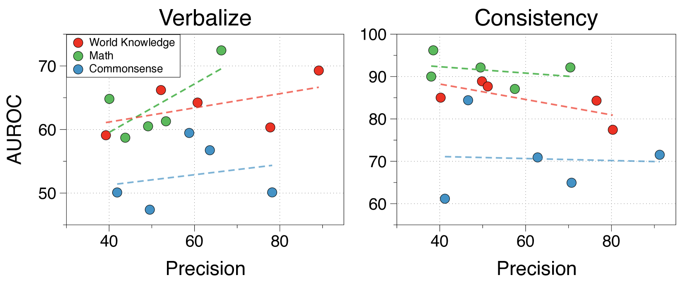

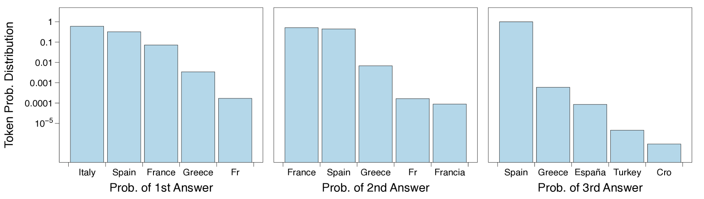

[Arxiv](https://arxiv.org/abs/2408.06816)