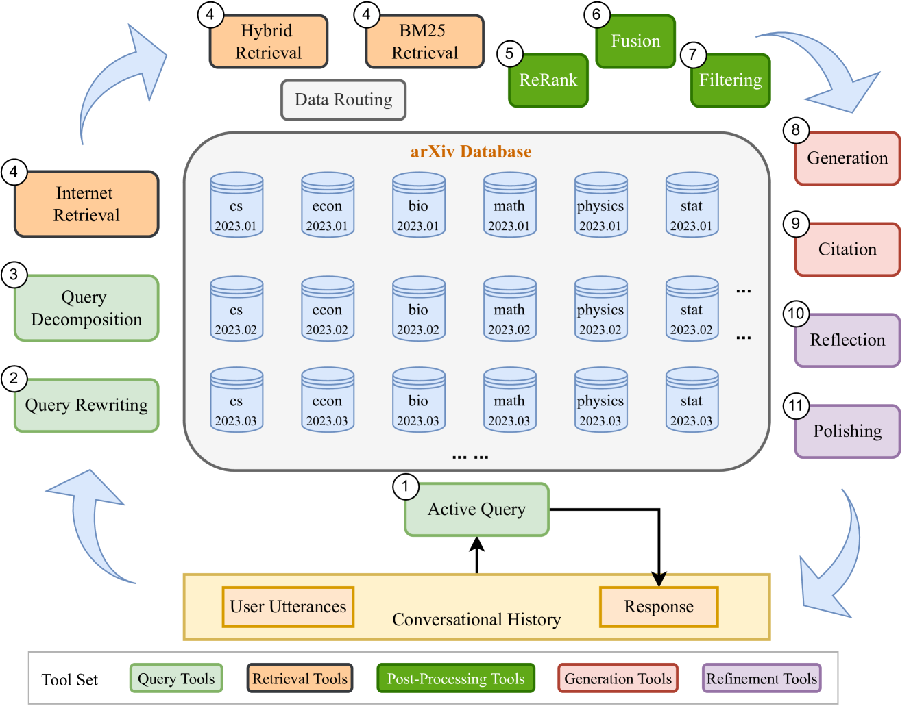
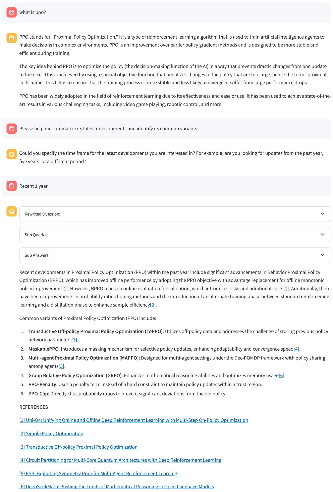
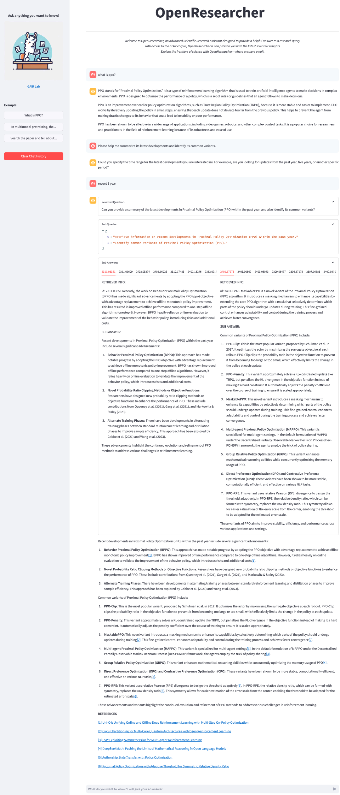

# OpenResearcher：借助 AI 之力，加速科学探索之旅

发布时间：2024年08月13日

`RAG` `人工智能`

> OpenResearcher: Unleashing AI for Accelerated Scientific Research

# 摘要

> 随着科学文献的迅猛增长，研究人员在追踪最新进展和探索新领域时面临巨大挑战。为此，我们推出了OpenResearcher平台，该平台运用AI技术，通过解答各类研究问题，助力研究进程提速。基于RAG技术，OpenResearcher将LLM与领域前沿知识无缝融合。同时，我们为其配备了多样化的工具，从理解查询、文献检索到信息筛选、精准答疑，再到答案自我优化，OpenResearcher能灵活运用这些工具，实现效率与效果的完美平衡。如此一来，研究人员得以节省宝贵时间，更有望发掘新知，引领科学突破。更多详情、演示视频及代码，请访问：https://github.com/GAIR-NLP/OpenResearcher。

> The rapid growth of scientific literature imposes significant challenges for researchers endeavoring to stay updated with the latest advancements in their fields and delve into new areas. We introduce OpenResearcher, an innovative platform that leverages Artificial Intelligence (AI) techniques to accelerate the research process by answering diverse questions from researchers. OpenResearcher is built based on Retrieval-Augmented Generation (RAG) to integrate Large Language Models (LLMs) with up-to-date, domain-specific knowledge. Moreover, we develop various tools for OpenResearcher to understand researchers' queries, search from the scientific literature, filter retrieved information, provide accurate and comprehensive answers, and self-refine these answers. OpenResearcher can flexibly use these tools to balance efficiency and effectiveness. As a result, OpenResearcher enables researchers to save time and increase their potential to discover new insights and drive scientific breakthroughs. Demo, video, and code are available at: https://github.com/GAIR-NLP/OpenResearcher.

[Arxiv](https://arxiv.org/abs/2408.06941)