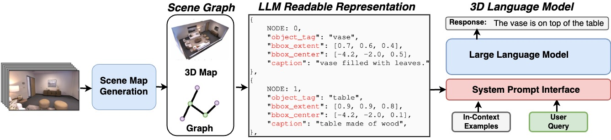
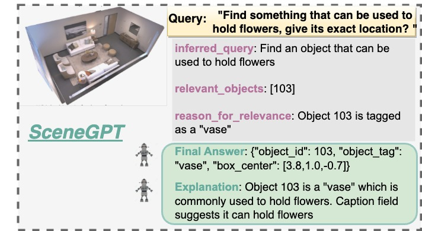
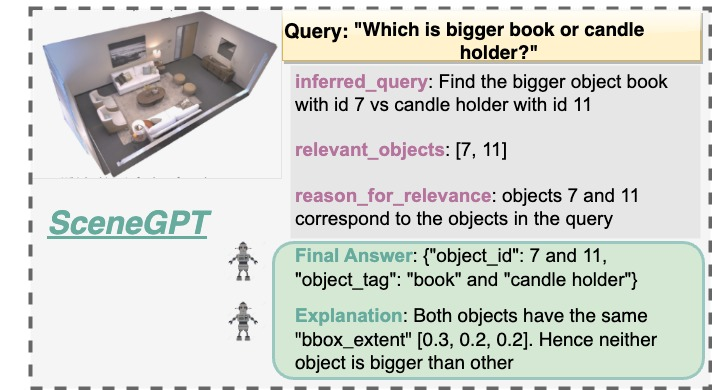
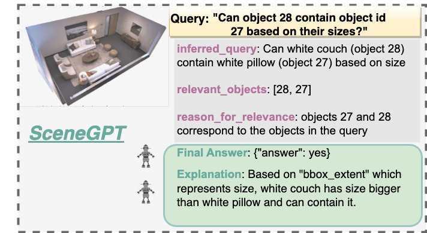
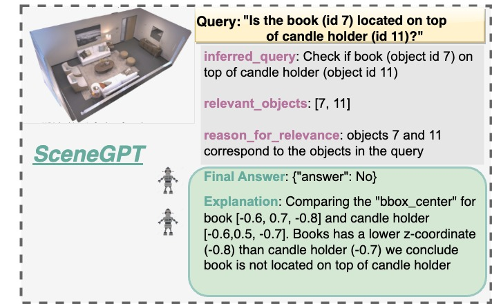
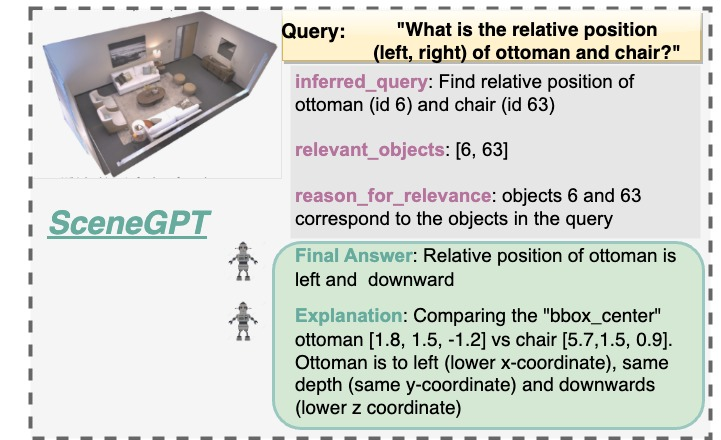

# SceneGPT：一款专为 3D 场景理解设计的语言模型

发布时间：2024年08月13日

`LLM应用` `计算机视觉` `人工智能`

> SceneGPT: A Language Model for 3D Scene Understanding

# 摘要

> 构建理解并推理3D场景的模型颇具挑战，主要因缺乏3D监督训练的数据源及大规模训练机制。本研究探讨如何在不进行3D预训练的前提下，利用预训练语言模型中的知识实现3D场景理解。我们旨在验证预训练LLM是否具备3D空间推理所需的先验知识，并探索如何引导其应用于通用空间推理及3D对象理解。为此，我们开发了SceneGPT系统，该系统基于LLM，无需训练或3D监督即可进行3D空间推理。其核心包括：1) 3D场景图，用于场景表示，编码对象及其空间关系；2) 通过上下文学习适应3D空间推理的预训练LLM。我们通过对象语义、物理属性、功能（对象级）及空间理解（场景级）等任务，对框架进行了定性评估。

> Building models that can understand and reason about 3D scenes is difficult owing to the lack of data sources for 3D supervised training and large-scale training regimes. In this work we ask - How can the knowledge in a pre-trained language model be leveraged for 3D scene understanding without any 3D pre-training. The aim of this work is to establish whether pre-trained LLMs possess priors/knowledge required for reasoning in 3D space and how can we prompt them such that they can be used for general purpose spatial reasoning and object understanding in 3D. To this end, we present SceneGPT, an LLM based scene understanding system which can perform 3D spatial reasoning without training or explicit 3D supervision. The key components of our framework are - 1) a 3D scene graph, that serves as scene representation, encoding the objects in the scene and their spatial relationships 2) a pre-trained LLM that can be adapted with in context learning for 3D spatial reasoning. We evaluate our framework qualitatively on object and scene understanding tasks including object semantics, physical properties and affordances (object-level) and spatial understanding (scene-level).

[Arxiv](https://arxiv.org/abs/2408.06926)