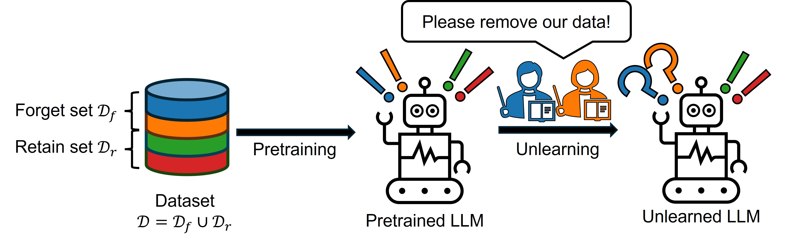
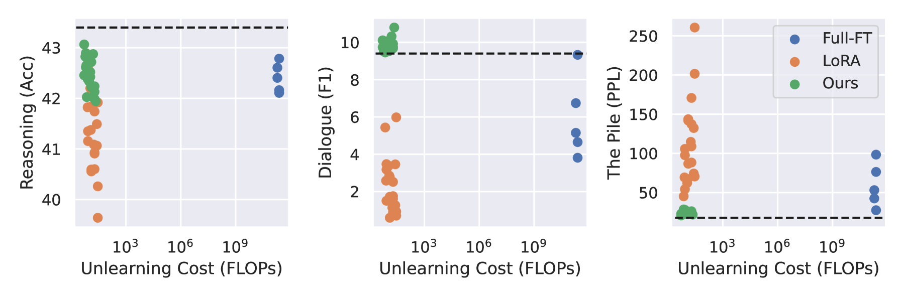
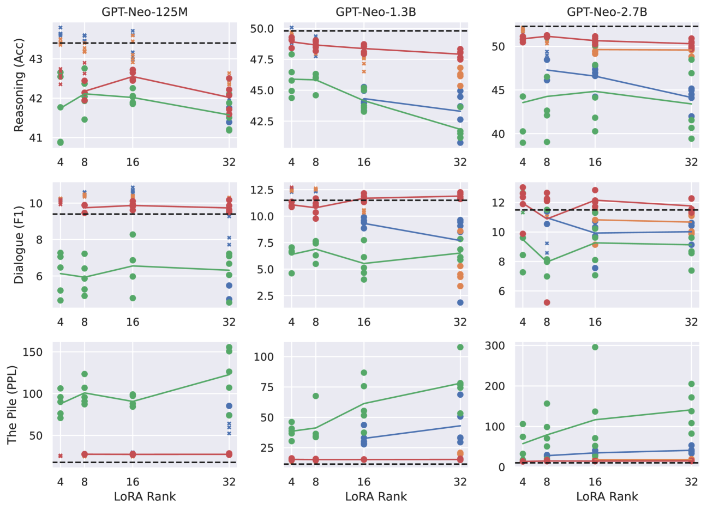
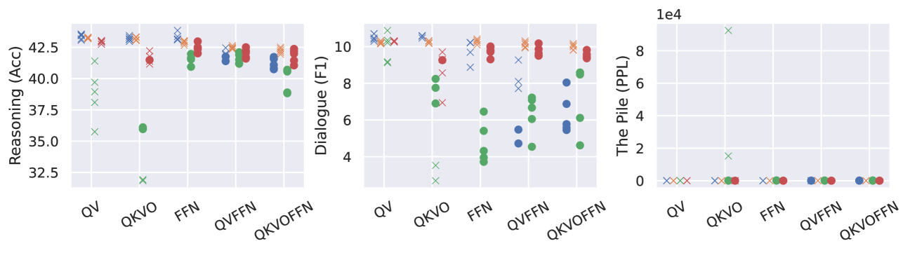

# 探索大型语言模型中稳健且经济高效的知识遗忘方法

发布时间：2024年08月13日

`LLM理论` `人工智能` `网络安全`

> Towards Robust and Cost-Efficient Knowledge Unlearning for Large Language Models

# 摘要

> 大型语言模型（LLM）通过预训练在海量文本数据上展现出卓越的推理与记忆能力。然而，基于人类编写文本的训练过程潜藏着隐私泄露与版权侵犯的重大风险，迫切需要一种高效的机器遗忘机制，以在不重头训练的前提下剔除敏感信息。尽管梯度上升（GA）常用于通过抑制不必要信息的生成来实现遗忘，但其增加交叉熵损失的无界性不仅引发优化过程的不稳定，还可能导致关键知识的灾难性遗忘。此外，我们在低秩适应下的联合应用中发现，生成性能与计算成本之间存在显著的次优平衡。针对这些局限，我们创新性地提出了两项技术，旨在实现LLM上既稳健又经济的遗忘。首先，我们设计了反向铰链损失函数，通过提升次可能令牌的概率来抑制不必要令牌，确保语言生成的流畅性与结构完整性。其次，我们建议采用基于Fisher加权的低秩近似来初始化低秩适配器权重，此举通过聚焦于关键参数更新，加速遗忘进程并优化知识保留，从而在移除特定文本数据的同时，保持模型的整体性能。

> Large Language Models (LLMs) have demonstrated strong reasoning and memorization capabilities via pretraining on massive textual corpora. However, training LLMs on human-written text entails significant risk of privacy and copyright violations, which demands an efficient machine unlearning framework to remove knowledge of sensitive data without retraining the model from scratch. While Gradient Ascent (GA) is widely used for unlearning by reducing the likelihood of generating unwanted information, the unboundedness of increasing the cross-entropy loss causes not only unstable optimization, but also catastrophic forgetting of knowledge that needs to be retained. We also discover its joint application under low-rank adaptation results in significantly suboptimal computational cost vs. generative performance trade-offs. In light of this limitation, we propose two novel techniques for robust and cost-efficient unlearning on LLMs. We first design an Inverted Hinge loss that suppresses unwanted tokens by increasing the probability of the next most likely token, thereby retaining fluency and structure in language generation. We also propose to initialize low-rank adapter weights based on Fisher-weighted low-rank approximation, which induces faster unlearning and better knowledge retention by allowing model updates to be focused on parameters that are important in generating textual data we wish to remove.

[Arxiv](https://arxiv.org/abs/2408.06621)