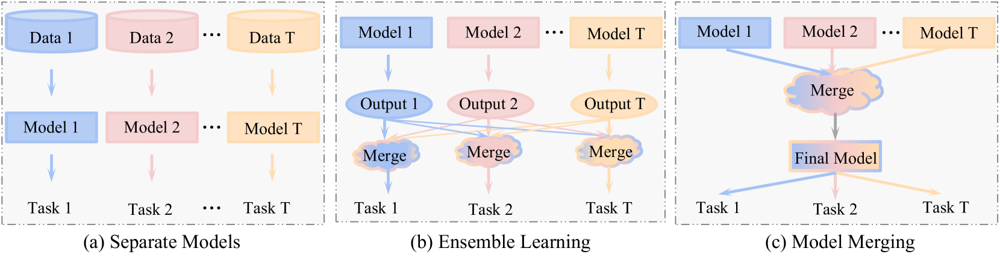
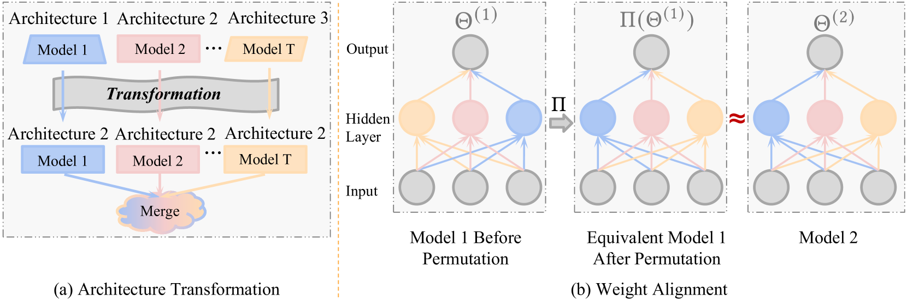
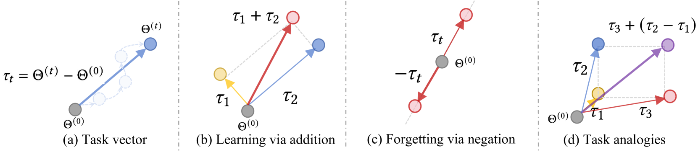
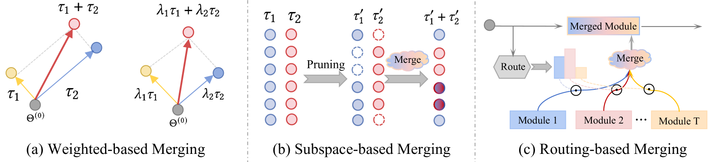

# LLM、MLLM 及其拓展领域中的模型合并：探索其方法、理论、应用及未来机遇

发布时间：2024年08月14日

`LLM理论` `机器学习` `人工智能`

> Model Merging in LLMs, MLLMs, and Beyond: Methods, Theories, Applications and Opportunities

# 摘要

> 模型合并作为一种高效的机器学习技术，无需原始数据收集和昂贵计算，正日益受到各领域青睐。然而，关于其技术的系统综述在文献中尚显不足。本调查全面梳理了模型合并的方法与理论，探讨了其在多领域、多场景的应用，并展望了未来研究方向。我们首先提出了一种详尽的分类方法，涵盖了现有模型合并技术。接着，我们深入探讨了这些技术在大规模语言模型、多模态模型及多个机器学习子领域的应用，如持续学习、多任务学习等。最后，我们指出了模型合并面临的挑战，并提出了未来研究的可能路径。完整论文列表请访问\url{https://github.com/EnnengYang/Awesome-Model-Merging-Methods-Theories-Applications}。

> Model merging is an efficient empowerment technique in the machine learning community that does not require the collection of raw training data and does not require expensive computation. As model merging becomes increasingly prevalent across various fields, it is crucial to understand the available model merging techniques comprehensively. However, there is a significant gap in the literature regarding a systematic and thorough review of these techniques. This survey provides a comprehensive overview of model merging methods and theories, their applications in various domains and settings, and future research directions. Specifically, we first propose a new taxonomic approach that exhaustively discusses existing model merging methods. Secondly, we discuss the application of model merging techniques in large language models, multimodal large language models, and 10+ machine learning subfields, including continual learning, multi-task learning, few-shot learning, etc. Finally, we highlight the remaining challenges of model merging and discuss future research directions. A comprehensive list of papers about model merging is available at \url{https://github.com/EnnengYang/Awesome-Model-Merging-Methods-Theories-Applications}.

[Arxiv](https://arxiv.org/abs/2408.07666)