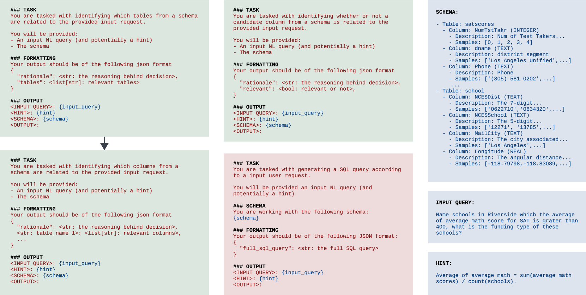
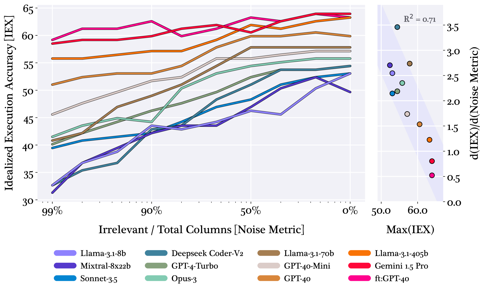
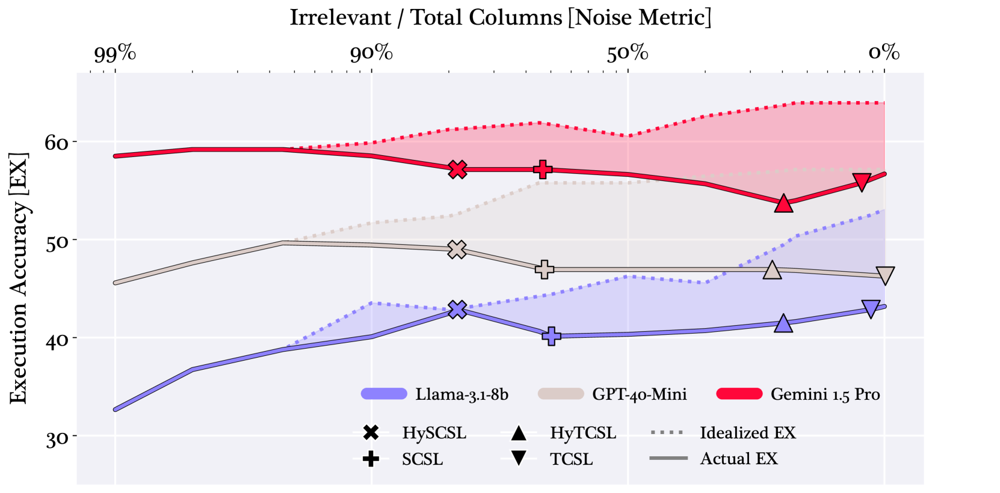
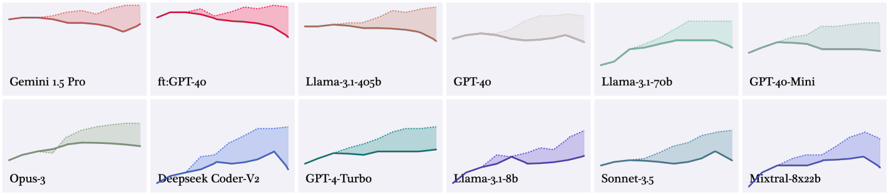

# 理性语言模型时代，文本到SQL转换是否宣告了模式链接的终结？

发布时间：2024年08月14日

`LLM应用` `数据库`

> The Death of Schema Linking? Text-to-SQL in the Age of Well-Reasoned Language Models

# 摘要

> Schema linking 在 Text-to-SQL 转换中至关重要，旨在筛选出相关表和列，同时忽略无关信息。然而，不完善的 schema linking 可能导致关键列被遗漏，影响查询准确性。我们研究发现，新一代 LLM 在生成过程中能自动识别相关 schema 元素，无需显式 schema linking。因此，Text-to-SQL 管道可直接传递完整数据库 schema 给 LLM，避免信息遗漏。我们还提出了替代 schema linking 的技术，确保在不牺牲关键 schema 信息的前提下提升转换准确性。我们的方法在 BIRD 基准测试中以 71.83% 的执行准确率领先。

> Schema linking is a crucial step in Text-to-SQL pipelines, which translate natural language queries into SQL. The goal of schema linking is to retrieve relevant tables and columns (signal) while disregarding irrelevant ones (noise). However, imperfect schema linking can often exclude essential columns needed for accurate query generation. In this work, we revisit the need for schema linking when using the latest generation of large language models (LLMs). We find empirically that newer models are adept at identifying relevant schema elements during generation, without the need for explicit schema linking. This allows Text-to-SQL pipelines to bypass schema linking entirely and instead pass the full database schema to the LLM, eliminating the risk of excluding necessary information. Furthermore, as alternatives to schema linking, we propose techniques that improve Text-to-SQL accuracy without compromising on essential schema information. Our approach achieves 71.83\% execution accuracy on the BIRD benchmark, ranking first at the time of submission.

[Arxiv](https://arxiv.org/abs/2408.07702)