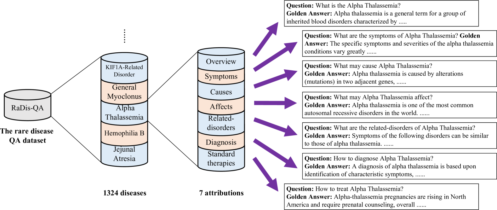

# 提升大型语言模型在罕见疾病问答领域的效能评估与强化

发布时间：2024年08月15日

`LLM应用` `数据集`

> Assessing and Enhancing Large Language Models in Rare Disease Question-answering

# 摘要

> 尽管大型语言模型 (LLM) 在一般医疗领域表现出色，但在诊断罕见疾病方面仍有待验证。为此，我们创建了罕见疾病问答 (ReDis-QA) 数据集，包含 1360 个问答对，覆盖 205 种罕见疾病，并标注了元数据，便于针对性分析。通过基准测试，我们发现 LLM 在诊断罕见疾病方面仍面临挑战。为提升诊断准确性，我们构建了罕见疾病语料库 (ReCOP)，从 NORD 数据库中提取疾病信息，按属性分类，确保信息与问题匹配。实验显示，ReCOP 能平均提升 LLM 准确性 8%，并生成可信且可追溯的答案和解释。

> Despite the impressive capabilities of Large Language Models (LLMs) in general medical domains, questions remain about their performance in diagnosing rare diseases. To answer this question, we aim to assess the diagnostic performance of LLMs in rare diseases, and explore methods to enhance their effectiveness in this area. In this work, we introduce a rare disease question-answering (ReDis-QA) dataset to evaluate the performance of LLMs in diagnosing rare diseases. Specifically, we collected 1360 high-quality question-answer pairs within the ReDis-QA dataset, covering 205 rare diseases. Additionally, we annotated meta-data for each question, facilitating the extraction of subsets specific to any given disease and its property. Based on the ReDis-QA dataset, we benchmarked several open-source LLMs, revealing that diagnosing rare diseases remains a significant challenge for these models.
  To facilitate retrieval augmentation generation for rare disease diagnosis, we collect the first rare diseases corpus (ReCOP), sourced from the National Organization for Rare Disorders (NORD) database. Specifically, we split the report of each rare disease into multiple chunks, each representing a different property of the disease, including their overview, symptoms, causes, effects, related disorders, diagnosis, and standard therapies. This structure ensures that the information within each chunk aligns consistently with a question. Experiment results demonstrate that ReCOP can effectively improve the accuracy of LLMs on the ReDis-QA dataset by an average of 8%. Moreover, it significantly guides LLMs to generate trustworthy answers and explanations that can be traced back to existing literature.

[Arxiv](https://arxiv.org/abs/2408.08422)