# CRQBench：代码推理问题的新基准

发布时间：2024年08月15日

`LLM应用` `软件工程` `人工智能`

> CRQBench: A Benchmark of Code Reasoning Questions

# 摘要

> 大型语言模型在编码任务上表现出色，但精确评估其代码推理能力仍具挑战。现有基准不切实际，且混淆了语义推理与软件工程任务表现。为此，我们推出了CRQBench，一个包含100道C++代码推理题的基准，源自上下文代码审查评论。通过LLM助手与人工检查结合，我们有效减少了人工投入。在CRQBench上评估GPT-4时，发现其对65%的问题能给出基于上下文的正确答案。

> Large Language Models have demonstrated exceptional proficiency on coding tasks, but it is challenging to precisely evaluate their code reasoning ability. Existing benchmarks are insufficient as they are unrealistic and conflate semantic reasoning ability with performance on software engineering tasks. We introduce CRQBench, a benchmark of 100 C++ code reasoning questions and answers derived from contextualized code review comments. To curate CRQBench, we use an LLM assistant alongside human inspection, reducing manual effort. We conduct an evaluation of GPT-4 on CRQBench and find that it produces correct responses grounded in the given context for 65 of the 100 questions.

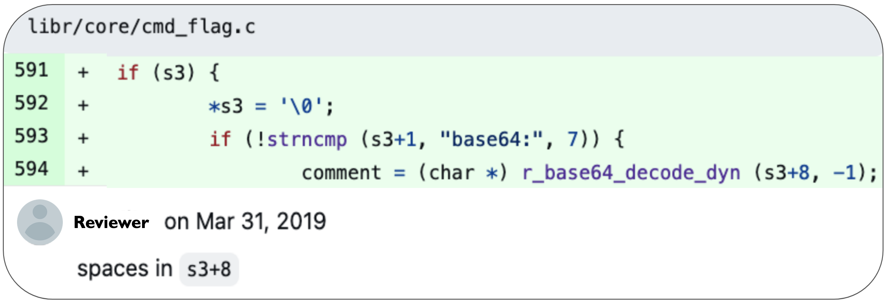

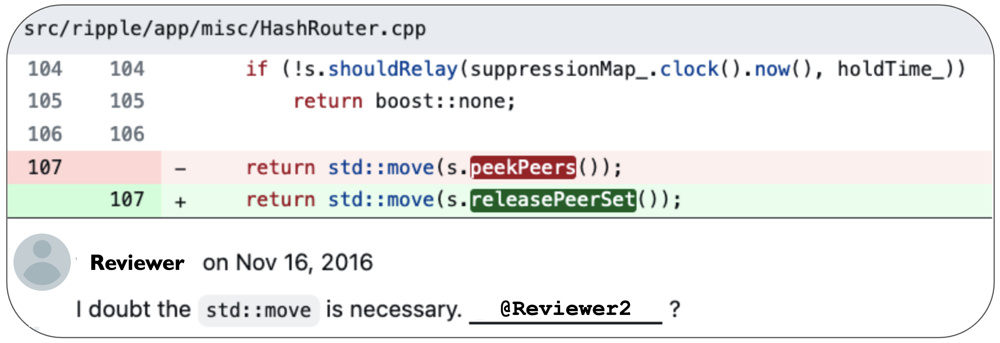

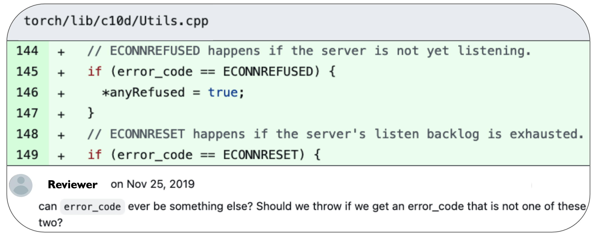

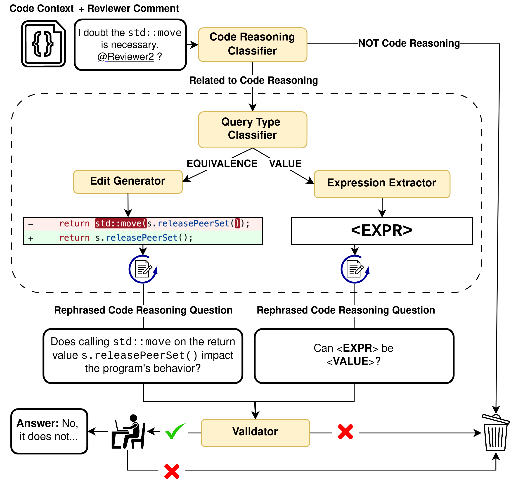

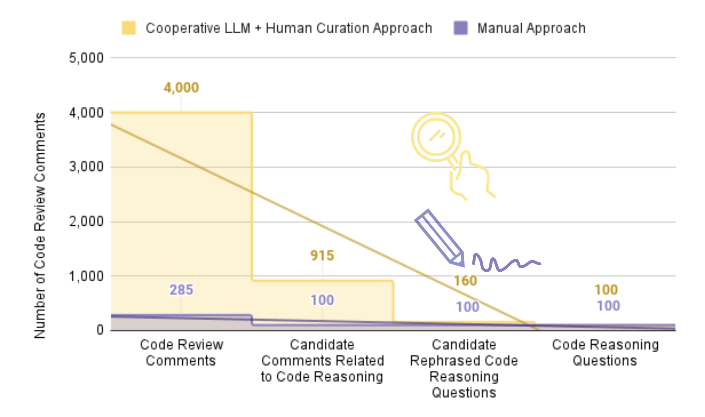

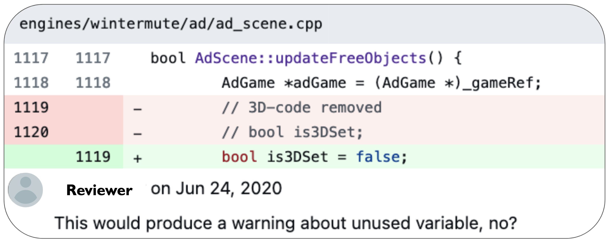

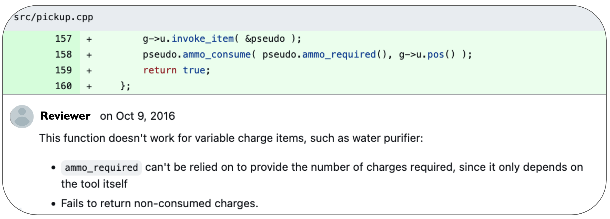

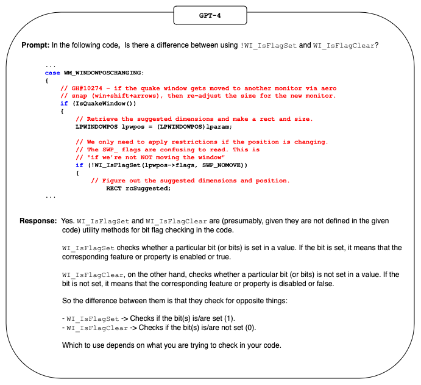

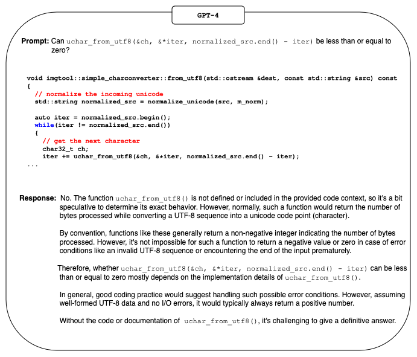

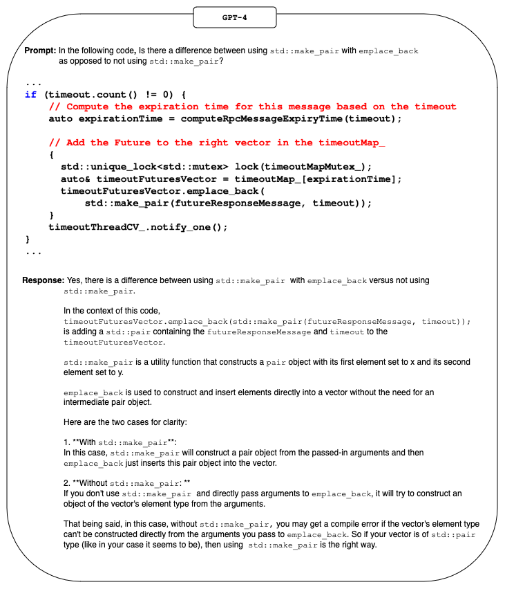

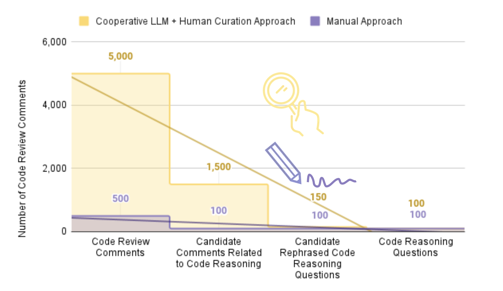

[Arxiv](https://arxiv.org/abs/2408.08453)