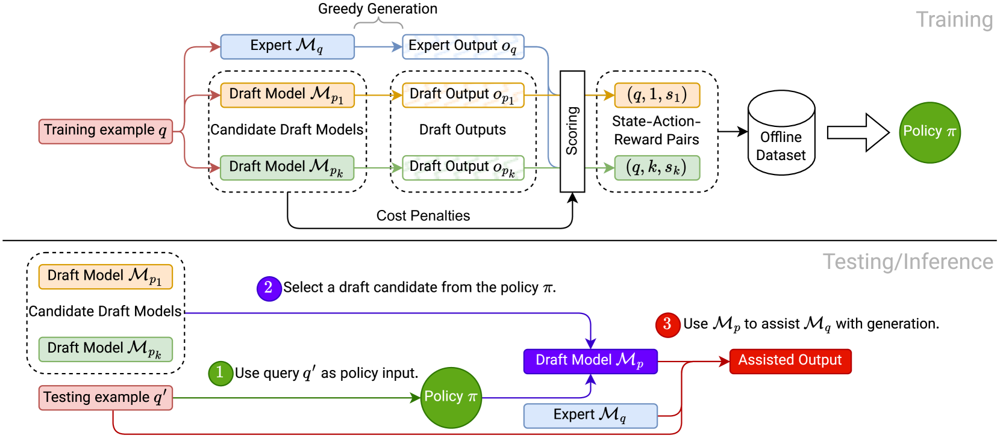
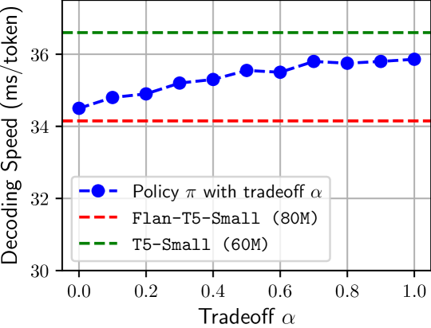
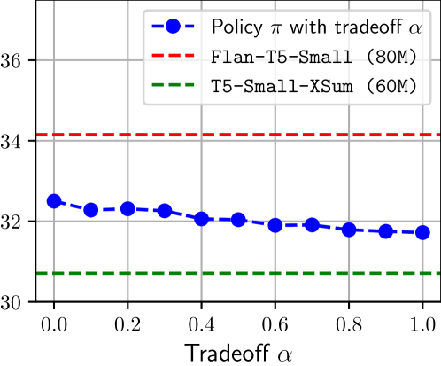
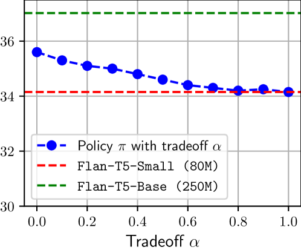
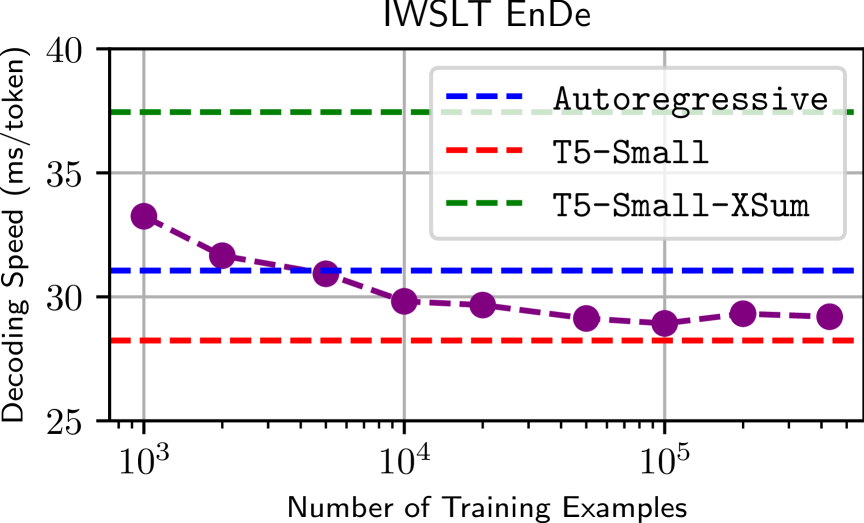
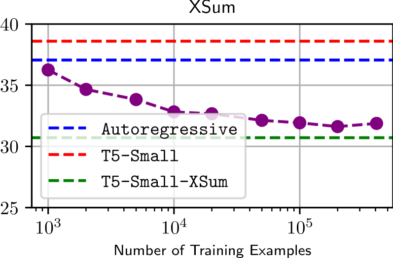

# 通过上下文感知助手选择，提升大型语言模型推理加速效果

发布时间：2024年08月15日

`LLM应用` `计算机科学` `人工智能`

> Context-Aware Assistant Selection for Improved Inference Acceleration with Large Language Models

# 摘要

> 尽管大型语言模型（LLM）普及，但在资源有限时使用它们仍显昂贵，其体积不断增大，使用门槛也随之提高。自回归生成带来的高延迟问题，使得大型LLM依赖于高端计算设施。辅助解码通过小模型引导大模型生成，虽缓解了这一问题，但仍需两模型间的良好对齐。若小模型在某领域能力不足，性能便会受损。另一种方法是利用多个小模型来涵盖大模型的专业领域，但在众多黑箱小模型中挑选合适的助手却颇具挑战。我们将此决策问题视为情境强盗问题，策略需根据上下文选择小模型。研究表明，即便对小模型一无所知，通过独立小/大模型的输出构建离线数据集，并在输出对齐上训练策略，也能在多领域提升性能，前提是候选模型有效。进一步研究显示，在多种设置下，多个辅助解码候选模型均适用，凸显了其灵活性及此类决策的积极作用。

> Despite their widespread adoption, large language models (LLMs) remain prohibitive to use under resource constraints, with their ever growing sizes only increasing the barrier for use. One noted issue is the high latency associated with auto-regressive generation, rendering large LLMs use dependent on advanced computing infrastructure. Assisted decoding, where a smaller draft model guides a larger target model's generation, has helped alleviate this, but remains dependent on alignment between the two models. Thus if the draft model is insufficiently capable on some domain relative to the target model, performance can degrade. Alternatively, one can leverage multiple draft models to better cover the expertise of the target, but when multiple black-box draft models are available, selecting an assistant without details about its construction can be difficult. To better understand this decision making problem, we observe it as a contextual bandit, where a policy must choose a draft model based on a context. We show that even without prior knowledge of the draft models, creating an offline dataset from only outputs of independent draft/target models and training a policy over the alignment of these outputs can accelerate performance on multiple domains provided the candidates are effective. Further results show this to hold on various settings with multiple assisted decoding candidates, highlighting its flexibility and the advantageous role that such decision making can play.

[Arxiv](https://arxiv.org/abs/2408.08470)