# Ex3：自动小说创作——提取、优化、扩展

发布时间：2024年08月15日

`LLM应用`

> Ex3: Automatic Novel Writing by Extracting, Excelsior and Expanding

# 摘要

> 人工智能生成小说等长篇文本一直颇具挑战。传统方法依赖大型语言模型（LLM）构建分层框架，先规划后创作。然而，这些小说虽篇幅足够，情节逻辑与吸引力却显不足，角色与事件描绘亦有欠缺，整体叙事质量受损。本文提出“提取精益求精并扩展”（Ex3）方法，先从原始数据提取结构信息，结合数据精心制作指令遵循数据集，进而微调LLM以提升生成质量。最终，采用树状扩展法，助力生成任意长度的优质小说。Ex3在评估中表现优异，能产出更高质量的长篇作品。

> Generating long-term texts such as novels using artificial intelligence has always been a challenge. A common approach is to use large language models (LLMs) to construct a hierarchical framework that first plans and then writes. Despite the fact that the generated novels reach a sufficient length, they exhibit poor logical coherence and appeal in their plots and deficiencies in character and event depiction, ultimately compromising the overall narrative quality. In this paper, we propose a method named Extracting Excelsior and Expanding. Ex3 initially extracts structure information from raw novel data. By combining this structure information with the novel data, an instruction-following dataset is meticulously crafted. This dataset is then utilized to fine-tune the LLM, aiming for excelsior generation performance. In the final stage, a tree-like expansion method is deployed to facilitate the generation of arbitrarily long novels. Evaluation against previous methods showcases Ex3's ability to produce higher-quality long-form novels.

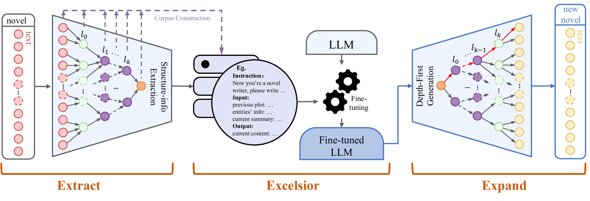

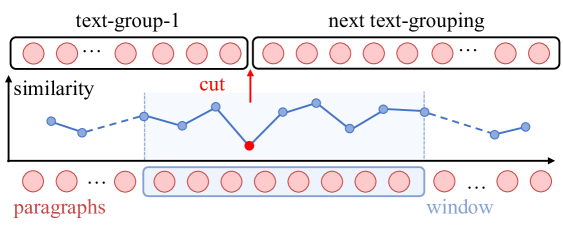

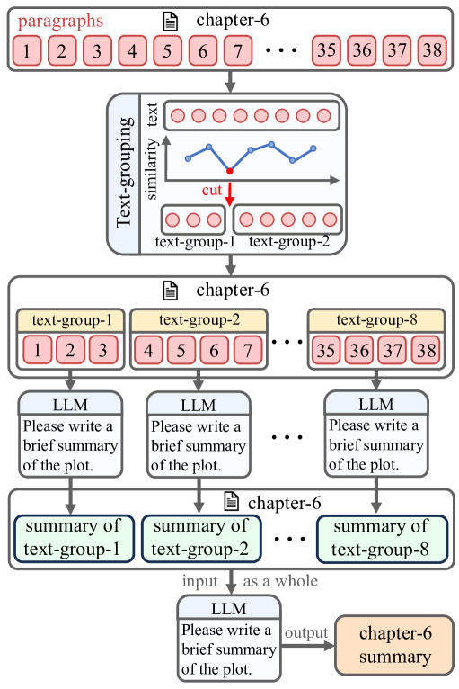

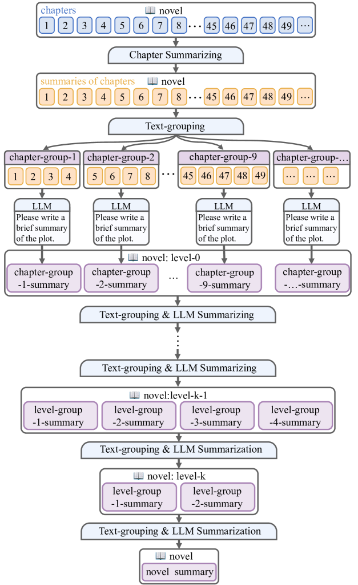

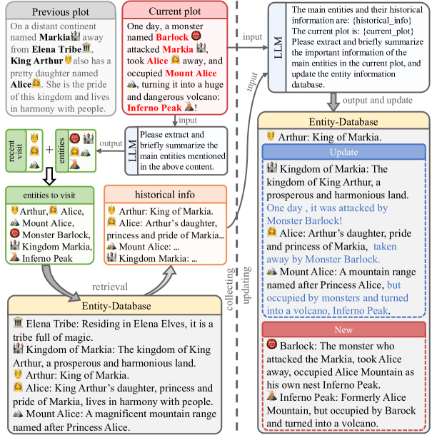

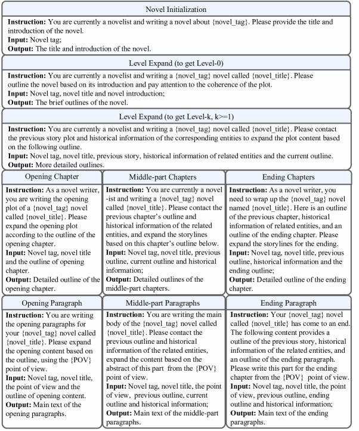

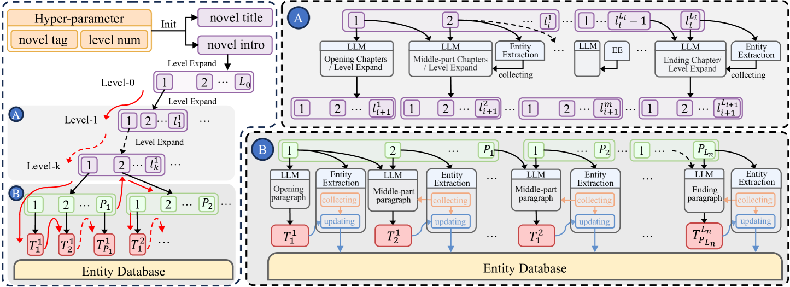

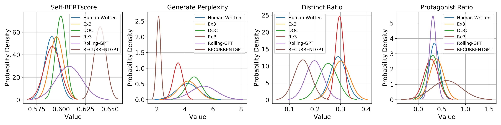

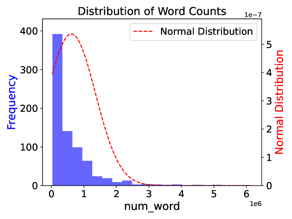

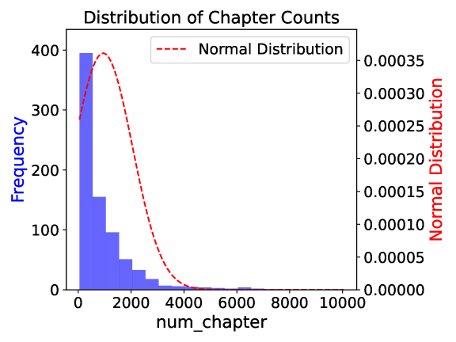

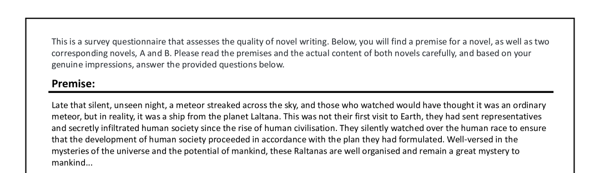

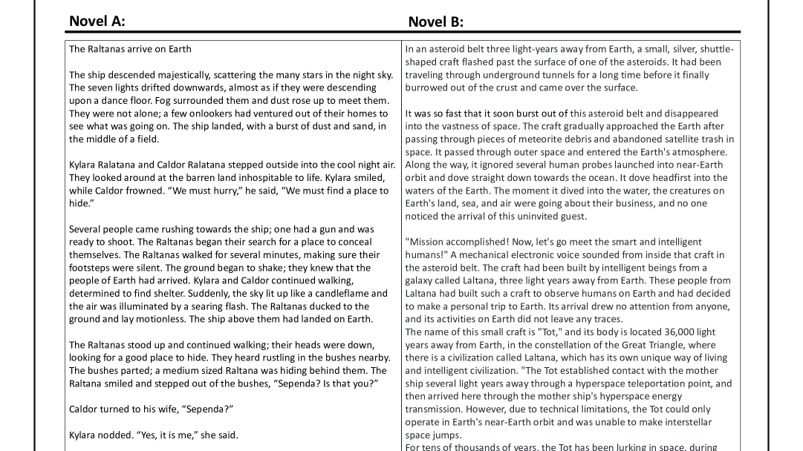

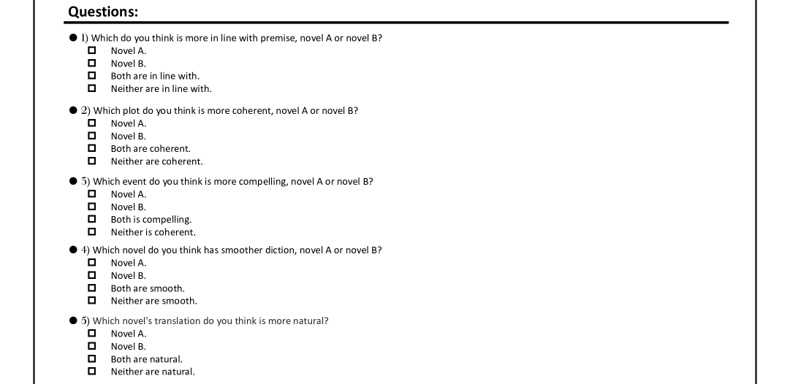

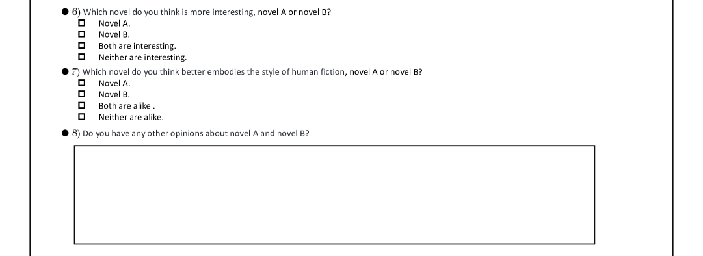

[Arxiv](https://arxiv.org/abs/2408.08506)