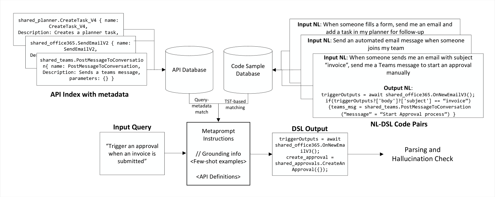

# 代码规划：探索从自然语言到领域特定语言生成的稳健方法比较

发布时间：2024年08月15日

`RAG` `自动化` `软件开发`

> Plan with Code: Comparing approaches for robust NL to DSL generation

# 摘要

> 代码规划因其可靠性和处理复杂逻辑的能力，在众多编排任务中备受青睐。然而，大型语言模型（LLM）在处理特定领域语言（DSL）中的自定义函数时仍显不足，常导致幻觉和语法错误。本文聚焦于RPA领域，探讨了RAG方法在DSL生成中的优化，并对比了其与微调模型的性能。实验表明，尽管微调模型在代码相似度上表现最佳，但RAG优化后的方法在处理领域内API名称时质量相当，且在处理未见过的API名称时优势显著，相似度评分高出7分。

> Planning in code is considered a more reliable approach for many orchestration tasks. This is because code is more tractable than steps generated via Natural Language and make it easy to support more complex sequences by abstracting deterministic logic into functions. It also allows spotting issues with incorrect function names with the help of parsing checks that can be run on code. Progress in Code Generation methodologies, however, remains limited to general-purpose languages like C, C++, and Python. LLMs continue to face challenges with custom function names in Domain Specific Languages or DSLs, leading to higher hallucination rates and syntax errors. This is more common for custom function names, that are typically part of the plan. Moreover, keeping LLMs up-to-date with newer function names is an issue. This poses a challenge for scenarios like task planning over a large number of APIs, since the plan is represented as a DSL having custom API names. In this paper, we focus on workflow automation in RPA (Robotic Process Automation) domain as a special case of task planning. We present optimizations for using Retrieval Augmented Generation (or RAG) with LLMs for DSL generation along with an ablation study comparing these strategies with a fine-tuned model. Our results showed that the fine-tuned model scored the best on code similarity metric. However, with our optimizations, RAG approach is able to match the quality for in-domain API names in the test set. Additionally, it offers significant advantage for out-of-domain or unseen API names, outperforming Fine-Tuned model on similarity metric by 7 pts.

[Arxiv](https://arxiv.org/abs/2408.08335)