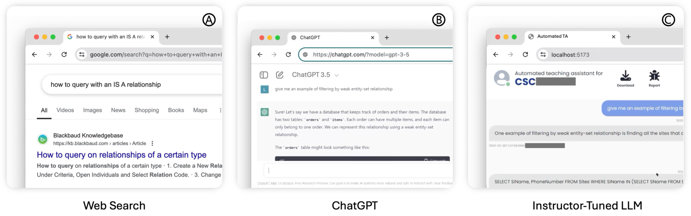
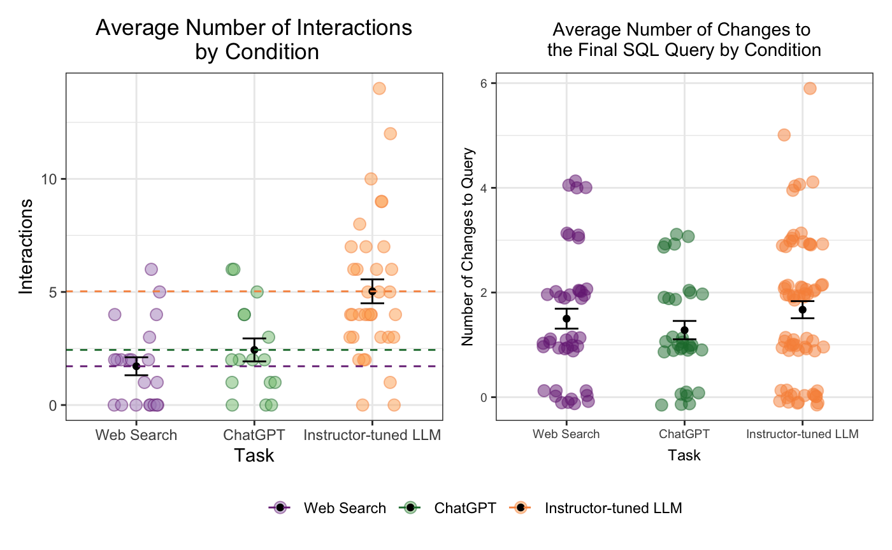
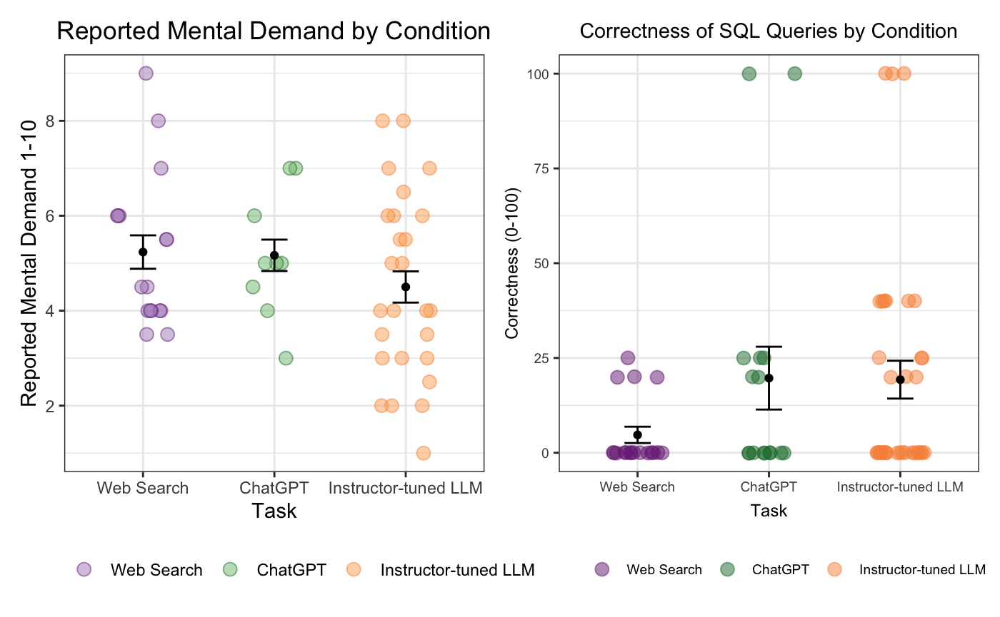

# 探究学生在编写 SQL 查询时，选择 LLM 还是网络搜索的求助行为

发布时间：2024年08月15日

`LLM应用`

> Understanding Help-Seeking Behavior of Students Using LLMs vs. Web Search for Writing SQL Queries

# 摘要

> 随着大型语言模型（LLM）在编程教育中的普及，学生编写SQL查询的方式正在发生变革。过去，学生主要依赖网络搜索获取编程帮助，但ChatGPT等LLM的引入改变了这一局面。我们进行了一项随机访谈研究，旨在比较网络搜索与LLM（包括ChatGPT和教师定制的LLM）在编写SQL查询方面的效果。研究发现，教师定制的LLM虽然需要更多交互，但其最终SQL查询的编辑次数与ChatGPT和网络搜索相当。尽管LLM在查询质量上略有优势，但各方法在最终SQL查询质量上并无显著差异。此外，使用教师定制LLM的学生感受到的心理压力较小。这些发现对编程教育的学习效率和学生心理负担具有深远影响。

> Growth in the use of large language models (LLMs) in programming education is altering how students write SQL queries. Traditionally, students relied heavily on web search for coding assistance, but this has shifted with the adoption of LLMs like ChatGPT. However, the comparative process and outcomes of using web search versus LLMs for coding help remain underexplored. To address this, we conducted a randomized interview study in a database classroom to compare web search and LLMs, including a publicly available LLM (ChatGPT) and an instructor-tuned LLM, for writing SQL queries. Our findings indicate that using an instructor-tuned LLM required significantly more interactions than both ChatGPT and web search, but resulted in a similar number of edits to the final SQL query. No significant differences were found in the quality of the final SQL queries between conditions, although the LLM conditions directionally showed higher query quality. Furthermore, students using instructor-tuned LLM reported a lower mental demand. These results have implications for learning and productivity in programming education.

[Arxiv](https://arxiv.org/abs/2408.08401)