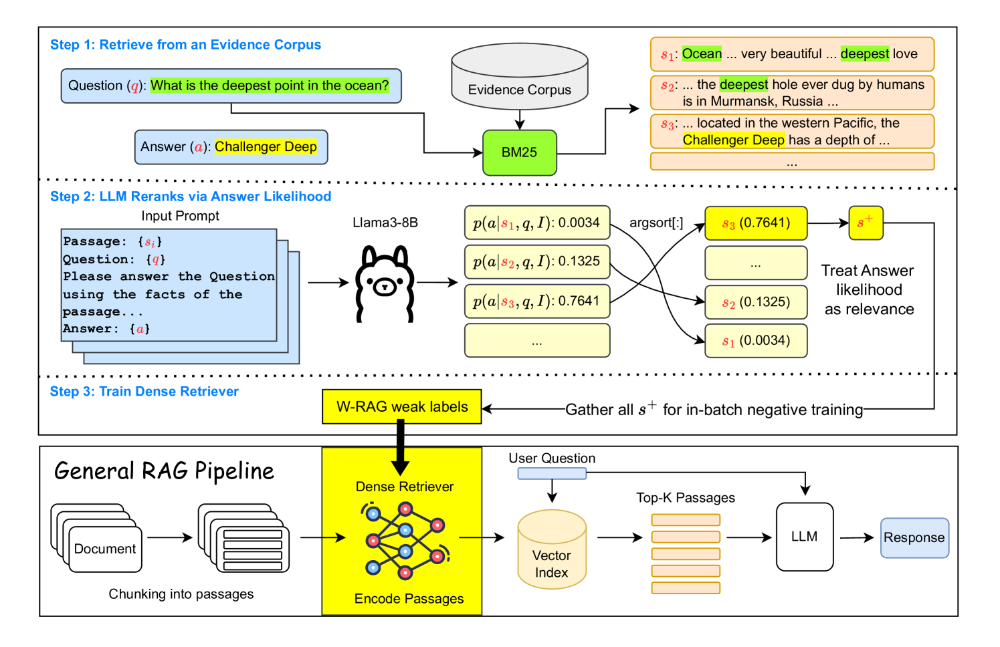
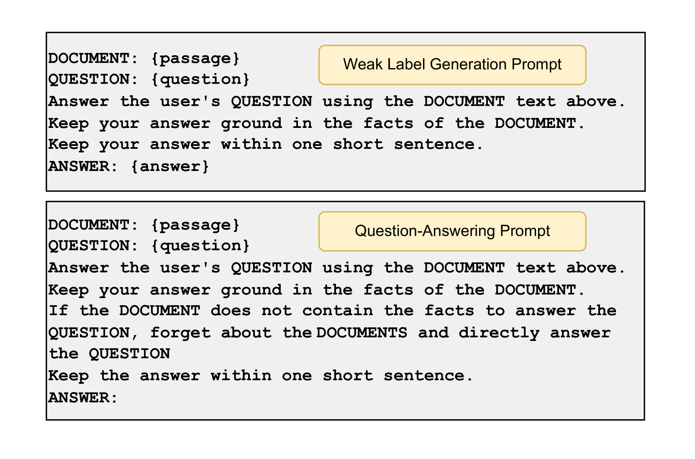
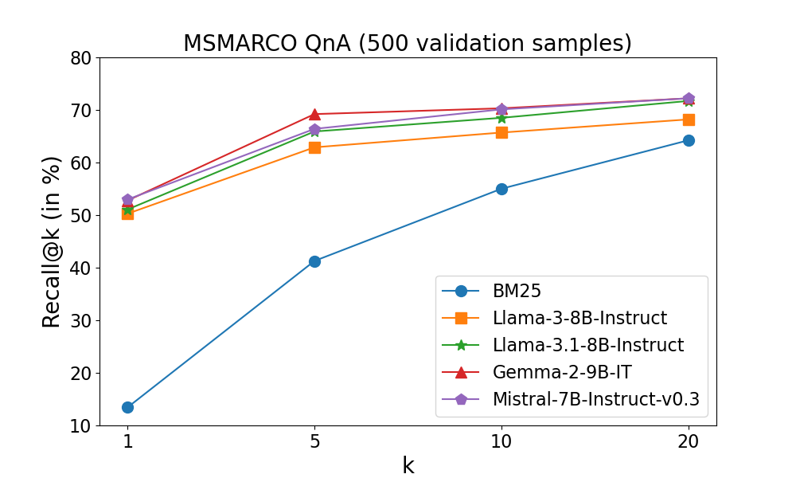

# W-RAG：开放域问答中的弱监督密集检索技术

发布时间：2024年08月15日

`RAG` `问答系统` `信息检索`

> W-RAG: Weakly Supervised Dense Retrieval in RAG for Open-domain Question Answering

# 摘要

> 在开放领域问答等知识密集型任务中，大型语言模型常因仅依赖内部知识而难以生成准确答案。为此，检索增强生成系统通过外部信息检索来强化模型，使检索器成为核心组件。尽管密集检索性能卓越，但其训练因缺乏真实证据而受阻，主要原因是人工标注成本高昂。本文提出W-RAG，利用模型排序能力为密集检索训练生成弱标签数据。我们通过评估模型基于问题和段落生成正确答案的概率，对BM25检索的top-$K$段落重新排序，并将最高排名的段落作为正训练样本。实验显示，与基线模型相比，我们的方法在检索和问答性能上均有显著提升。

> In knowledge-intensive tasks such as open-domain question answering (OpenQA), Large Language Models (LLMs) often struggle to generate factual answers relying solely on their internal (parametric) knowledge. To address this limitation, Retrieval-Augmented Generation (RAG) systems enhance LLMs by retrieving relevant information from external sources, thereby positioning the retriever as a pivotal component. Although dense retrieval demonstrates state-of-the-art performance, its training poses challenges due to the scarcity of ground-truth evidence, largely attributed to the high costs of human annotation. In this paper, we propose W-RAG by utilizing the ranking capabilities of LLMs to create weakly labeled data for training dense retrievers. Specifically, we rerank the top-$K$ passages retrieved via BM25 by assessing the probability that LLMs will generate the correct answer based on the question and each passage. The highest-ranking passages are then used as positive training examples for dense retrieval. Our comprehensive experiments across four publicly available OpenQA datasets demonstrate that our approach enhances both retrieval and OpenQA performance compared to baseline models.

[Arxiv](https://arxiv.org/abs/2408.08444)