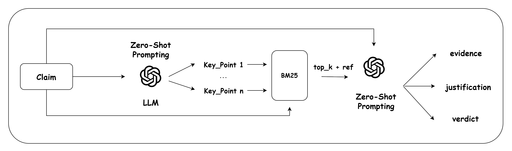

# 零-Shot 学习与关键点，自动化事实核查的全部所需。

发布时间：2024年08月15日

`LLM应用` `新闻媒体` `信息安全`

> Zero-Shot Learning and Key Points Are All You Need for Automated Fact-Checking

# 摘要

> 自动化事实核查至关重要，因为它能帮助我们在海量在线信息中识别主张的真伪。现代大型语言模型（LLM）因其强大的自然语言处理能力，通过恰当的提示策略，能够模拟人类直觉，有望成为解决问题的替代者。我们提出的基于零-shot学习和关键点（ZSL-KeP）的框架，虽简单却高效，在AVeriTeC数据集上显著提升了基线表现，并取得了第10名的佳绩。

> Automated fact-checking is an important task because determining the accurate status of a proposed claim within the vast amount of information available online is a critical challenge. This challenge requires robust evaluation to prevent the spread of false information. Modern large language models (LLMs) have demonstrated high capability in performing a diverse range of Natural Language Processing (NLP) tasks. By utilizing proper prompting strategies, their versatility due to their understanding of large context sizes and zero-shot learning ability enables them to simulate human problem-solving intuition and move towards being an alternative to humans for solving problems. In this work, we introduce a straightforward framework based on Zero-Shot Learning and Key Points (ZSL-KeP) for automated fact-checking, which despite its simplicity, performed well on the AVeriTeC shared task dataset by robustly improving the baseline and achieving 10th place.

[Arxiv](https://arxiv.org/abs/2408.08400)