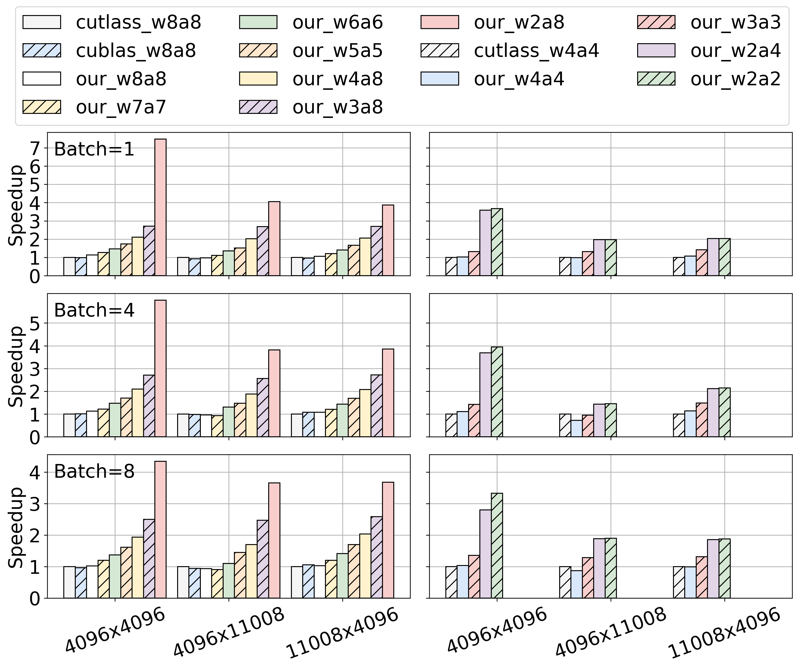

# ABQ-LLM：针对大型语言模型，实现任意位量化的推理加速技术。

发布时间：2024年08月16日

`LLM理论` `计算机科学` `人工智能`

> ABQ-LLM: Arbitrary-Bit Quantized Inference Acceleration for Large Language Models

# 摘要

> 大型语言模型（LLM）在自然语言处理领域掀起革命，但其应用受限于高内存和计算需求。后训练量化（PTQ）虽是加速LLM推理的有效手段，却面临两大难题：低比特量化性能下降和GPU整数计算单元限制。为此，我们推出创新框架ABQ-LLM，不仅在多量化场景下表现卓越，还能在GPU上实现任意精度量化推理。ABQ-LLM的核心创新包括：变换器块的分布校正、低比特宽度下的比特平衡策略，以及基于BTC的量化加速框架，突破了INT4/INT8计算单元的束缚。在LLaMA-7B模型上，ABQ-LLM以W2*A8量化配置，将WikiText2困惑度降至7.59，相比SmoothQuant，加速提升1.6倍，内存压缩达2.7倍。

> Large Language Models (LLMs) have revolutionized natural language processing tasks. However, their practical application is constrained by substantial memory and computational demands. Post-training quantization (PTQ) is considered an effective method to accelerate LLM inference. Despite its growing popularity in LLM model compression, PTQ deployment faces two major challenges. First, low-bit quantization leads to performance degradation. Second, restricted by the limited integer computing unit type on GPUs, quantized matrix operations with different precisions cannot be effectively accelerated. To address these issues, we introduce a novel arbitrary-bit quantization algorithm and inference framework, ABQ-LLM. It achieves superior performance across various quantization settings and enables efficient arbitrary-precision quantized inference on the GPU. ABQ-LLM introduces several key innovations: (1) a distribution correction method for transformer blocks to mitigate distribution differences caused by full quantization of weights and activations, improving performance at low bit-widths. (2) the bit balance strategy to counteract performance degradation from asymmetric distribution issues at very low bit-widths (e.g., 2-bit). (3) an innovative quantization acceleration framework that reconstructs the quantization matrix multiplication of arbitrary precision combinations based on BTC (Binary TensorCore) equivalents, gets rid of the limitations of INT4/INT8 computing units. ABQ-LLM can convert each component bit width gain into actual acceleration gain, maximizing performance under mixed precision(e.g., W6A6, W2A8). Based on W2*A8 quantization configuration on LLaMA-7B model, it achieved a WikiText2 perplexity of 7.59 (2.17$\downarrow $ vs 9.76 in AffineQuant). Compared to SmoothQuant, we realized 1.6$\times$ acceleration improvement and 2.7$\times$ memory compression gain.

[Arxiv](https://arxiv.org/abs/2408.08554)