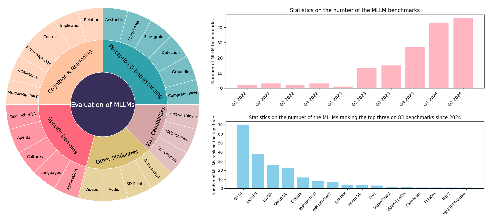
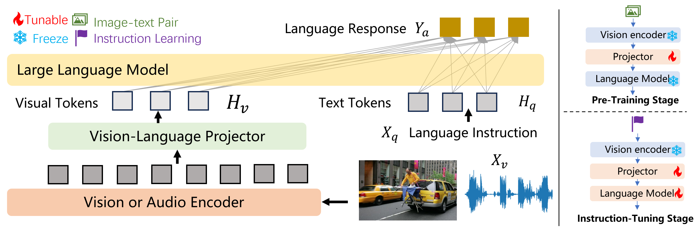

# 多模态大型语言模型基准调查

发布时间：2024年08月16日

`LLM应用` `人工智能` `计算机视觉`

> A Survey on Benchmarks of Multimodal Large Language Models

# 摘要

> 多模态大型语言模型（MLLMs）因其出色的视觉问答、感知、理解和推理能力，在学术和工业领域日益受到青睐。本文深入探讨了180个MLLMs的评估基准，涵盖感知、认知、特定领域、关键能力及其他模态。我们不仅指出了现有评估方法的局限，还展望了未来研究方向，强调评估对MLLMs发展的重要性。更多信息，请访问GitHub仓库：https://github.com/swordlidev/Evaluation-Multimodal-LLMs-Survey。

> Multimodal Large Language Models (MLLMs) are gaining increasing popularity in both academia and industry due to their remarkable performance in various applications such as visual question answering, visual perception, understanding, and reasoning. Over the past few years, significant efforts have been made to examine MLLMs from multiple perspectives. This paper presents a comprehensive review of \textbf{180 benchmarks} and evaluation for MLLMs, focusing on (1)perception and understanding, (2)cognition and reasoning, (3)specific domains, (4)key capabilities, and (5)other modalities. Finally, we discuss the limitations of the current evaluation methods for MLLMs and explore promising future directions. Our key argument is that evaluation should be regarded as a crucial discipline to better support the development of MLLMs. For more details, please visit our GitHub repository: https://github.com/swordlidev/Evaluation-Multimodal-LLMs-Survey.

[Arxiv](https://arxiv.org/abs/2408.08632)