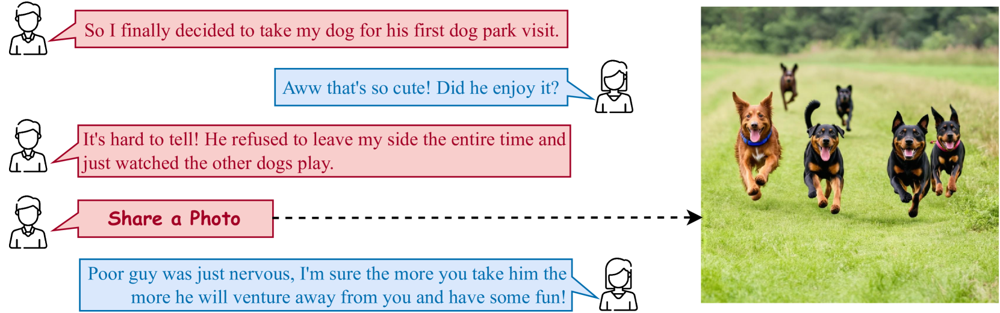
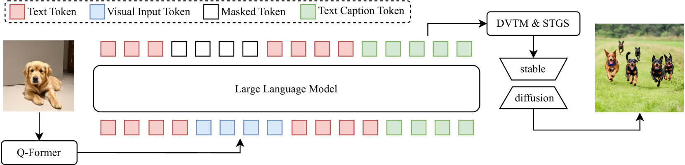

# 照片分享多模态对话生成的端到端解决方案

发布时间：2024年08月16日

`Agent` `社交媒体` `人工智能`

> An End-to-End Model for Photo-Sharing Multi-modal Dialogue Generation

# 摘要

> 在照片分享多模态对话生成中，对话代理需在恰当时刻分享照片，并生成文本回复。我们通过集成图像感知器、生成器与大型语言模型，提出了首个端到端模型，解决了传统流水线模型因图像文本描述离散而导致的梯度传播障碍。实验表明，我们的端到端模型在PhotoChat和DialogCC数据集上，不仅优化了图像与文本的生成质量，还显著提升了系统的整体性能。这一创新方法为多模态对话生成领域带来了新的突破。

> Photo-Sharing Multi-modal dialogue generation requires a dialogue agent not only to generate text responses but also to share photos at the proper moment. Using image text caption as the bridge, a pipeline model integrates an image caption model, a text generation model, and an image generation model to handle this complex multi-modal task. However, representing the images with text captions may loss important visual details and information and cause error propagation in the complex dialogue system. Besides, the pipeline model isolates the three models separately because discrete image text captions hinder end-to-end gradient propagation. We propose the first end-to-end model for photo-sharing multi-modal dialogue generation, which integrates an image perceptron and an image generator with a large language model. The large language model employs the Q-Former to perceive visual images in the input end. For image generation in the output end, we propose a dynamic vocabulary transformation matrix and use straight-through and gumbel-softmax techniques to align the large language model and stable diffusion model and achieve end-to-end gradient propagation. We perform experiments on PhotoChat and DialogCC datasets to evaluate our end-to-end model. Compared with pipeline models, the end-to-end model gains state-of-the-art performances on various metrics of text and image generation. More analysis experiments also verify the effectiveness of the end-to-end model for photo-sharing multi-modal dialogue generation.

[Arxiv](https://arxiv.org/abs/2408.08650)