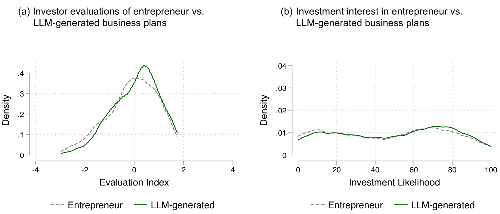
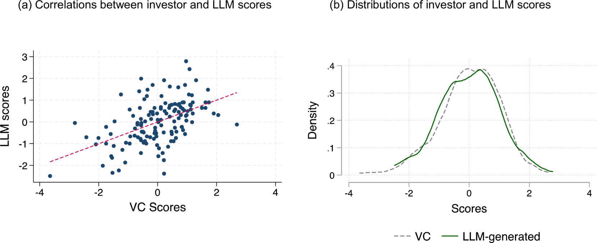
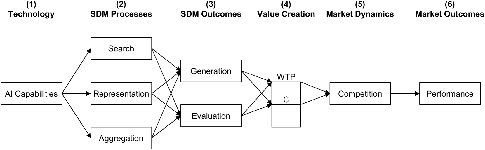
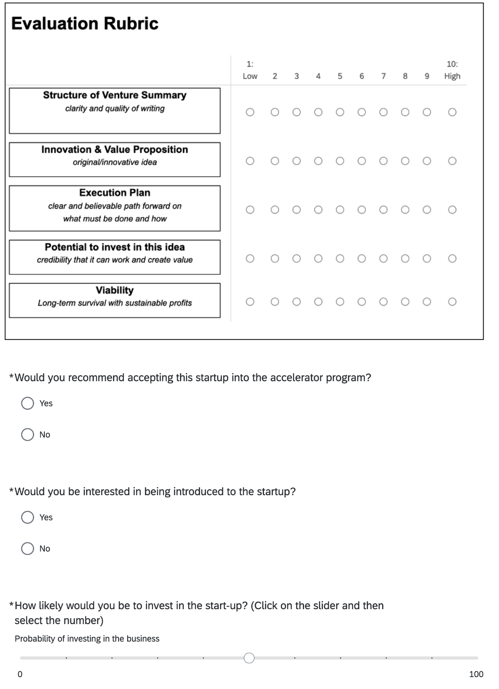
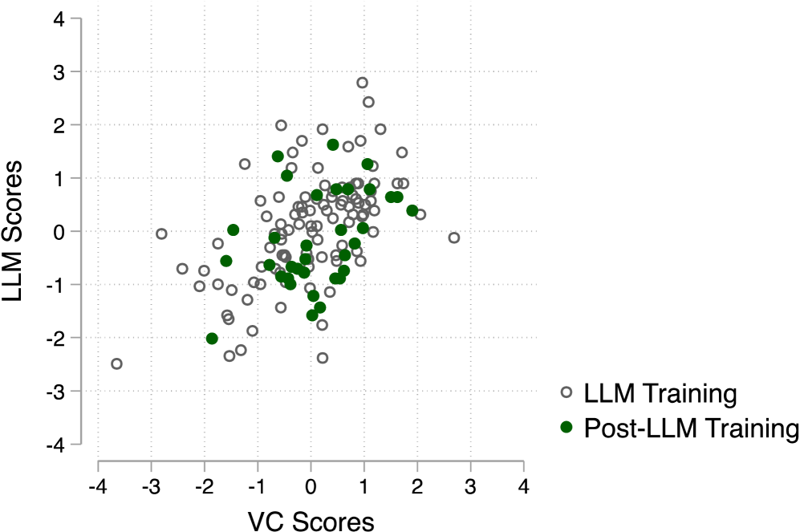

# 人工智能在战略决策中的应用：企业家与投资者的实证研究

发布时间：2024年08月16日

`LLM应用` `企业战略` `人工智能`

> Artificial Intelligence and Strategic Decision-Making: Evidence from Entrepreneurs and Investors

# 摘要

> 本文深入探讨了人工智能（AI）在企业战略决策过程中的潜在影响。通过案例分析和实证研究，我们展示了AI如何优化现有决策工具，并证实大型语言模型（LLM）在战略生成与评估方面与专业人士不相上下。进一步地，我们分析了AI对战略决策核心环节——信息搜索、策略表达与整合的深远影响，指出AI不仅能加速决策过程、提升决策质量，还能开辟如虚拟模拟等创新应用。尽管AI的实际效果受市场竞争格局制约，我们仍构建了一个连接AI应用与企业绩效的分析框架，并探讨了AI如何重新定义竞争优势。最终，我们反思了AI对传统战略理论的挑战与补充，勾勒出AI与战略学融合的新研究领域。

> This paper explores how artificial intelligence (AI) may impact the strategic decision-making (SDM) process in firms. We illustrate how AI could augment existing SDM tools and provide empirical evidence from a leading accelerator program and a startup competition that current Large Language Models (LLMs) can generate and evaluate strategies at a level comparable to entrepreneurs and investors. We then examine implications for key cognitive processes underlying SDM -- search, representation, and aggregation. Our analysis suggests AI has the potential to enhance the speed, quality, and scale of strategic analysis, while also enabling new approaches like virtual strategy simulations. However, the ultimate impact on firm performance will depend on competitive dynamics as AI capabilities progress. We propose a framework connecting AI use in SDM to firm outcomes and discuss how AI may reshape sources of competitive advantage. We conclude by considering how AI could both support and challenge core tenets of the theory-based view of strategy. Overall, our work maps out an emerging research frontier at the intersection of AI and strategy.

[Arxiv](https://arxiv.org/abs/2408.08811)