# 利用大型语言模型进行波束预测

发布时间：2024年08月16日

`LLM应用` `无线通信`

> Beam Prediction based on Large Language Models

# 摘要

> 毫米波通信虽为下一代无线网络带来希望，却因严重路径损耗而需大量天线与频繁波束训练。传统深度学习模型如 LSTM 虽提升波束跟踪精度，但其鲁棒性与泛化能力欠佳。本研究利用大型语言模型 (LLM) 增强波束预测的鲁棒性，通过将时间序列数据文本化并运用 PaP 技术丰富上下文，充分发挥 LLM 在时间序列预测中的优势。仿真显示，相较于 LSTM，我们的 LLM 方法在鲁棒性与泛化能力上更胜一筹，彰显了 LLM 在无线通信领域的巨大潜力。

> Millimeter-wave (mmWave) communication is promising for next-generation wireless networks but suffers from significant path loss, requiring extensive antenna arrays and frequent beam training. Traditional deep learning models, such as long short-term memory (LSTM), enhance beam tracking accuracy however are limited by poor robustness and generalization. In this letter, we use large language models (LLMs) to improve the robustness of beam prediction. By converting time series data into text-based representations and employing the Prompt-as-Prefix (PaP) technique for contextual enrichment, our approach unleashes the strength of LLMs for time series forecasting. Simulation results demonstrate that our LLM-based method offers superior robustness and generalization compared to LSTM-based models, showcasing the potential of LLMs in wireless communications.

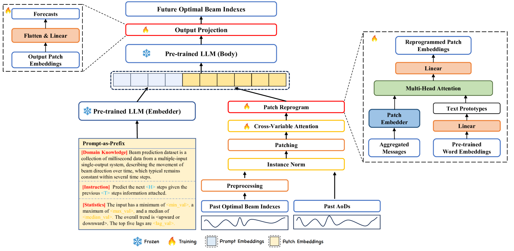

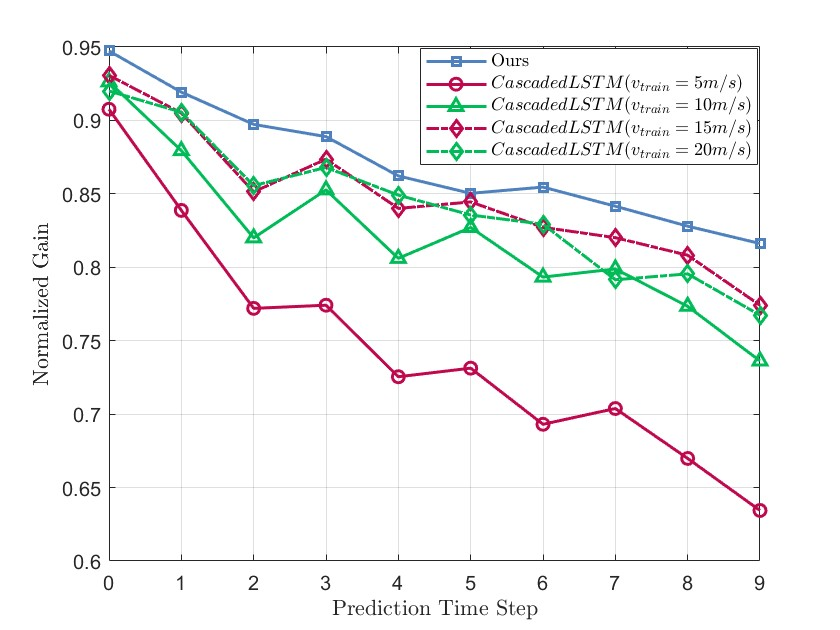

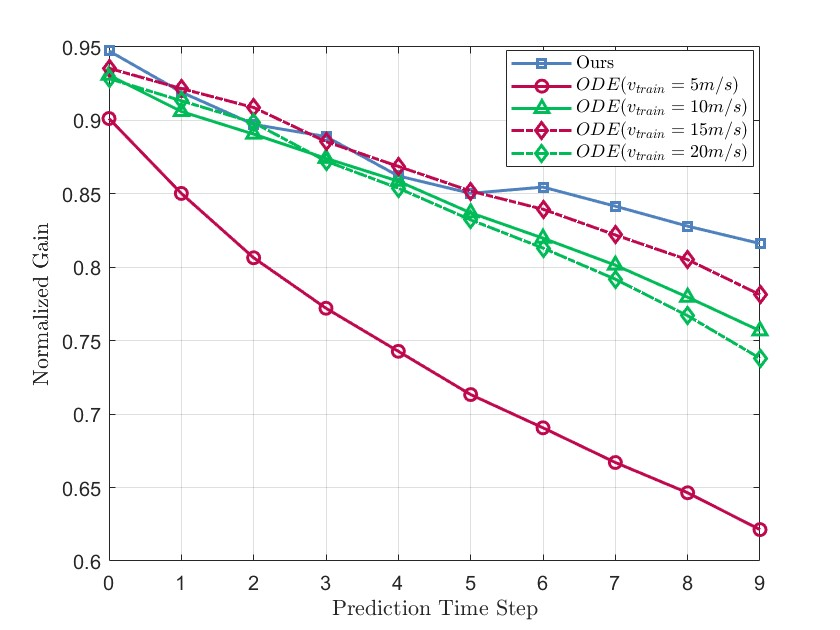

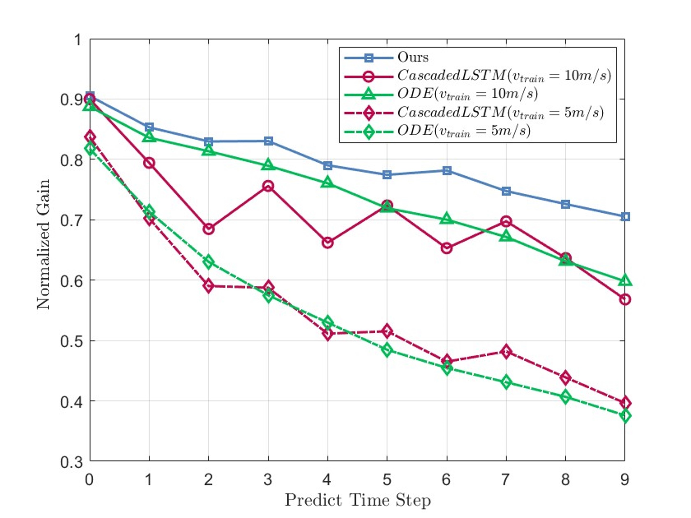

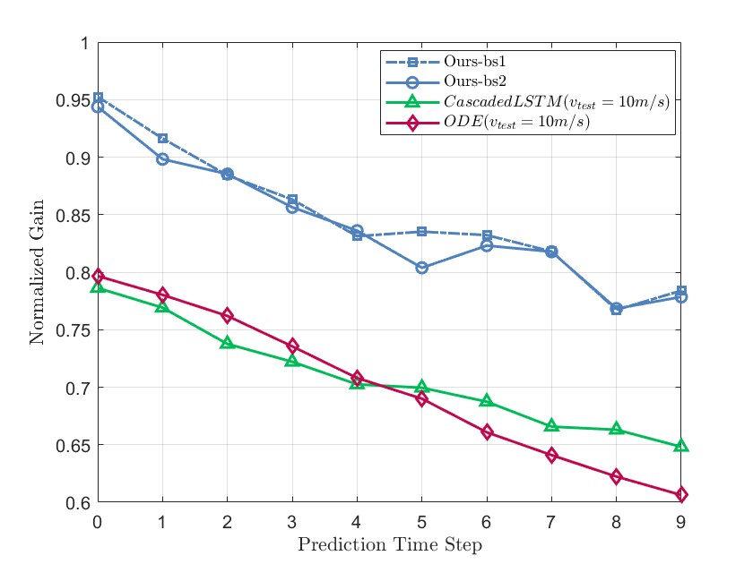

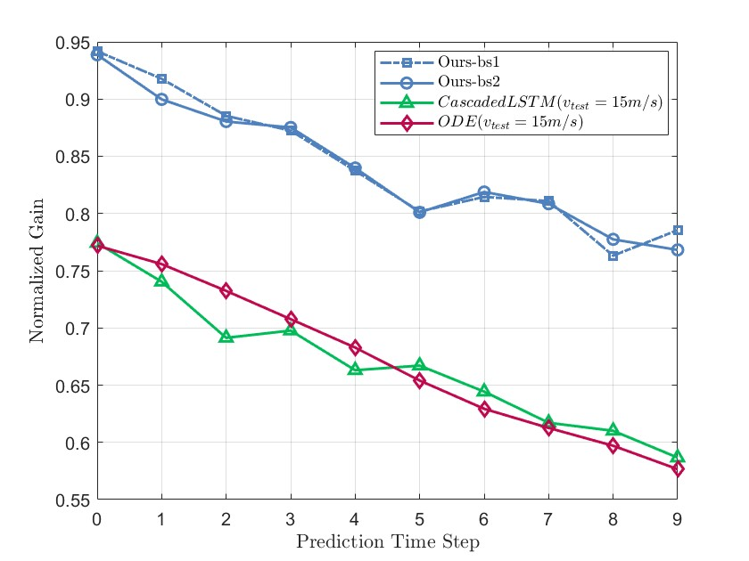

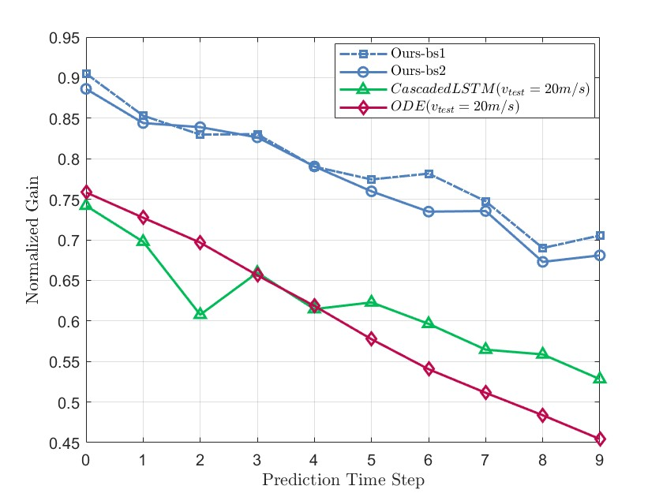

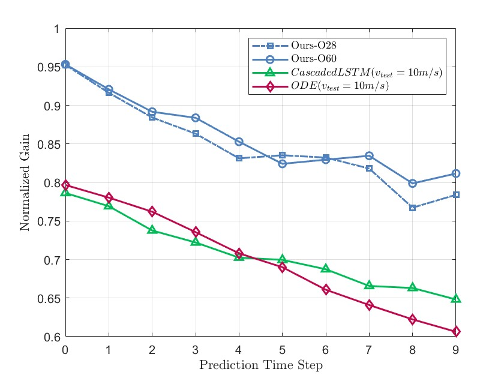

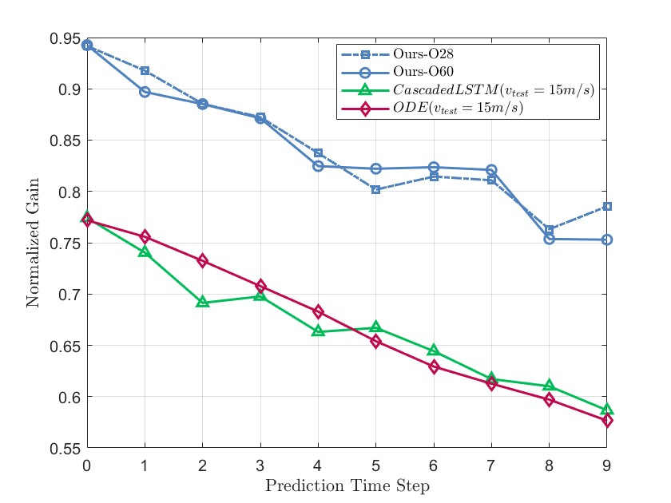

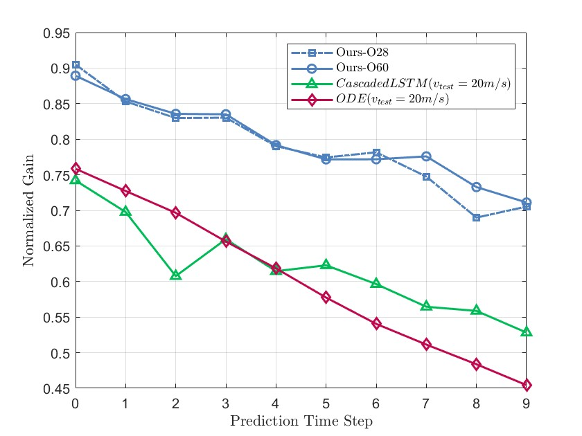

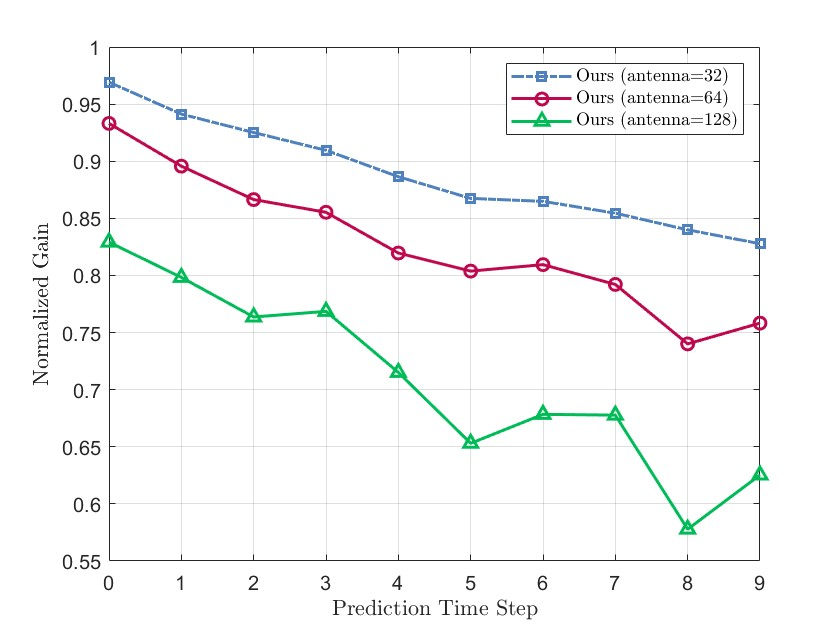

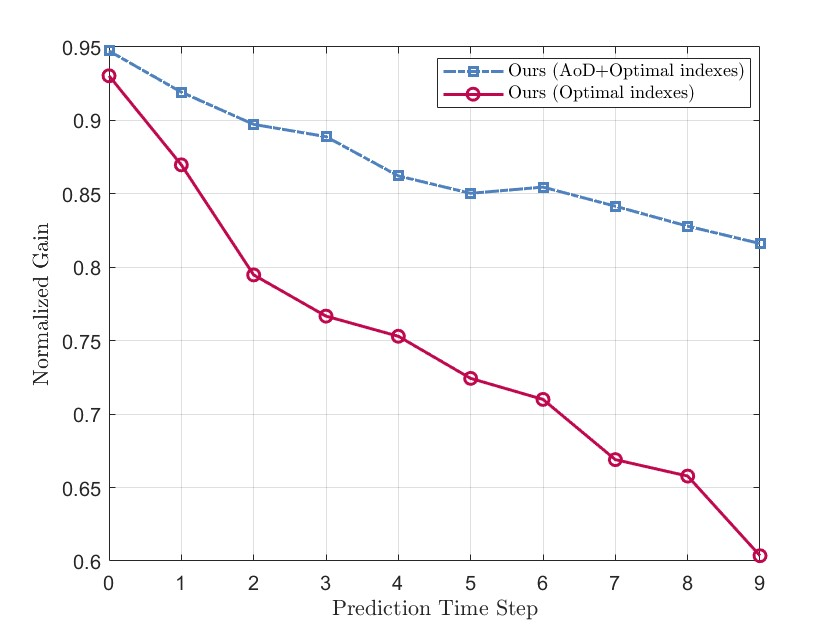

[Arxiv](https://arxiv.org/abs/2408.08707)