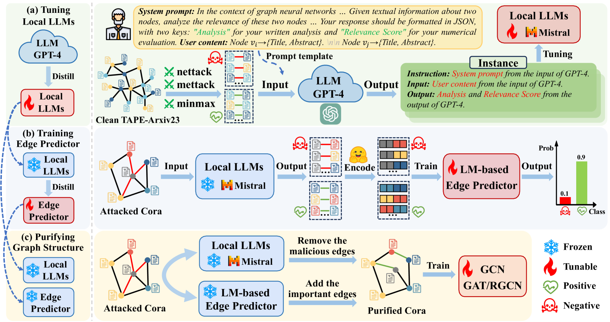

# 大型语言模型能否增强图神经网络的对抗鲁棒性？

发布时间：2024年08月16日

`LLM应用` `网络安全` `人工智能`

> Can Large Language Models Improve the Adversarial Robustness of Graph Neural Networks?

# 摘要

> 图神经网络 (GNNs) 对拓扑攻击等对抗性扰动极为敏感，众多提升 GNNs 鲁棒性的方法备受瞩目。随着大型语言模型 (LLMs) 的显著成就，人们开始探索其在 GNNs 上的应用潜力。然而，当前研究主要集中在利用 LLMs 优化节点特征以提升性能。我们不禁思考：LLMs 的强大理解和推理能力能否同样增强 GNNs 的鲁棒性？实证结果显示，尽管 LLMs 有所助益，GNNs 在拓扑攻击下的准确率仍平均下降 23.1%，凸显其脆弱性。因此，我们进一步探讨如何强化 LLMs 在图对抗鲁棒性方面的应用。本文提出的 LLM4RGNN 框架，融合 GPT-4 的推理能力，通过识别恶意边和预测缺失重要边，重建鲁棒图结构。实验证明，LLM4RGNN 在多种 GNNs 上显著提升了鲁棒性，即使在高达 40% 的扰动下，性能仍超越原始图。

> Graph neural networks (GNNs) are vulnerable to adversarial perturbations, especially for topology attacks, and many methods that improve the robustness of GNNs have received considerable attention. Recently, we have witnessed the significant success of large language models (LLMs), leading many to explore the great potential of LLMs on GNNs. However, they mainly focus on improving the performance of GNNs by utilizing LLMs to enhance the node features. Therefore, we ask: Will the robustness of GNNs also be enhanced with the powerful understanding and inference capabilities of LLMs? By presenting the empirical results, we find that despite that LLMs can improve the robustness of GNNs, there is still an average decrease of 23.1% in accuracy, implying that the GNNs remain extremely vulnerable against topology attack. Therefore, another question is how to extend the capabilities of LLMs on graph adversarial robustness. In this paper, we propose an LLM-based robust graph structure inference framework, LLM4RGNN, which distills the inference capabilities of GPT-4 into a local LLM for identifying malicious edges and an LM-based edge predictor for finding missing important edges, so as to recover a robust graph structure. Extensive experiments demonstrate that LLM4RGNN consistently improves the robustness across various GNNs. Even in some cases where the perturbation ratio increases to 40%, the accuracy of GNNs is still better than that on the clean graph.

[Arxiv](https://arxiv.org/abs/2408.08685)