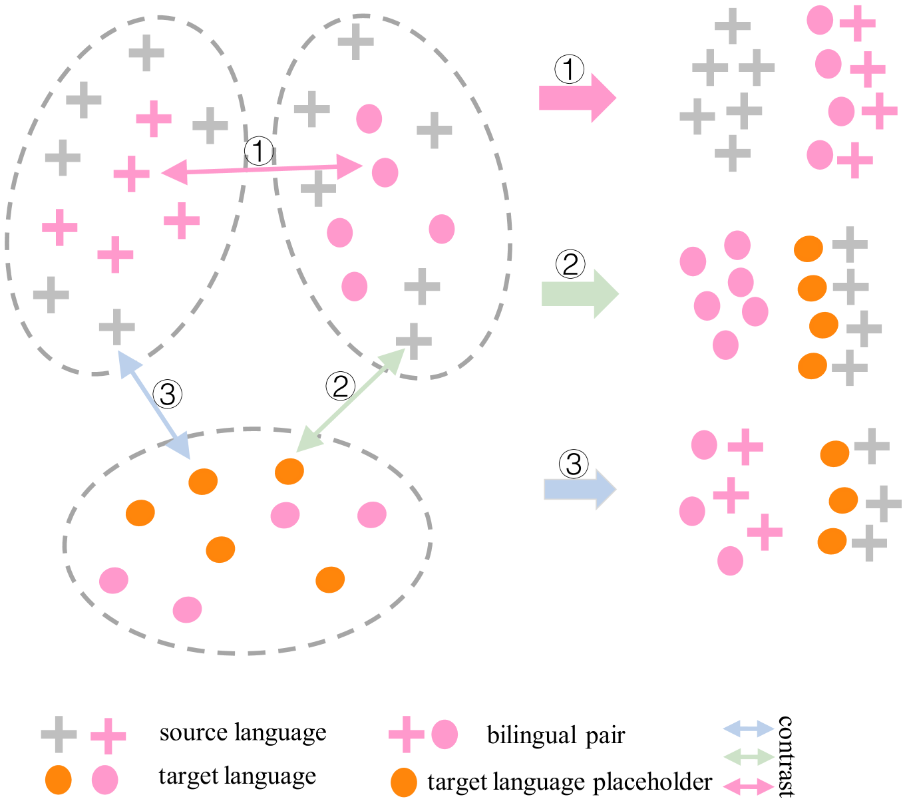
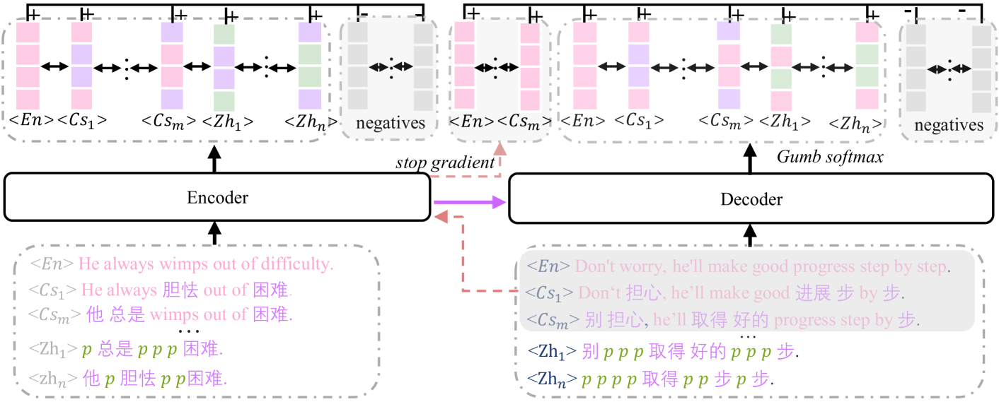
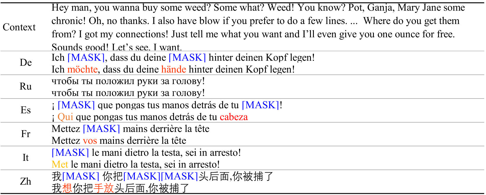

# ChatZero：借助伪目标语言技术，实现零-shot的跨语言对话生成。

发布时间：2024年08月16日

`LLM应用` `人工智能` `语言技术`

> ChatZero:Zero-shot Cross-Lingual Dialogue Generation via Pseudo-Target Language

# 摘要

> 尽管LLM在多种语言中展现出卓越能力，但在低资源语言的应用上仍显不足。现有方法多依赖大规模对话数据，使得零-shot对话生成系统构建颇具挑战。为此，我们创新性地提出了ChatZero模型，该模型基于跨语言代码切换技术。我们首先构建了包含占位符的代码切换语言和伪目标语言。随后，通过无监督对比学习，我们有效缩小了源语言、代码切换语言及伪目标语言间的语义鸿沟。实验结果显示，ChatZero在零-shot场景下性能接近监督学习，且在多语言数据集上超越了其他模型，达到了业界领先水平。

> Although large language models(LLMs) show amazing capabilities, among various exciting applications discovered for LLMs fall short in other low-resource languages. Besides, most existing methods depend on large-scale dialogue corpora and thus building systems for dialogue generation in a zero-shot scenario remains a considerable challenge. To address this challenge, we propose a novel end-to-end zero-shot dialogue generation model ChatZero based on cross-lingual code-switching method. First, we construct code-switching language and pseudo-target language with placeholders. Then for cross-lingual semantic transfer, we employ unsupervised contrastive learning to minimize the semantics gap of the source language, code-switching language, and pseudo-target language that are mutually positive examples in the high dimensional semantic space. Experiments on the multilingual DailyDialog and DSTC7-AVSD datasets demonstrate that ChatZero can achieve more than 90\% of the original performance under the zero-shot case compared to supervised learning, and achieve state-of-the-art performance compared with other baselines.

[Arxiv](https://arxiv.org/abs/2408.08724)