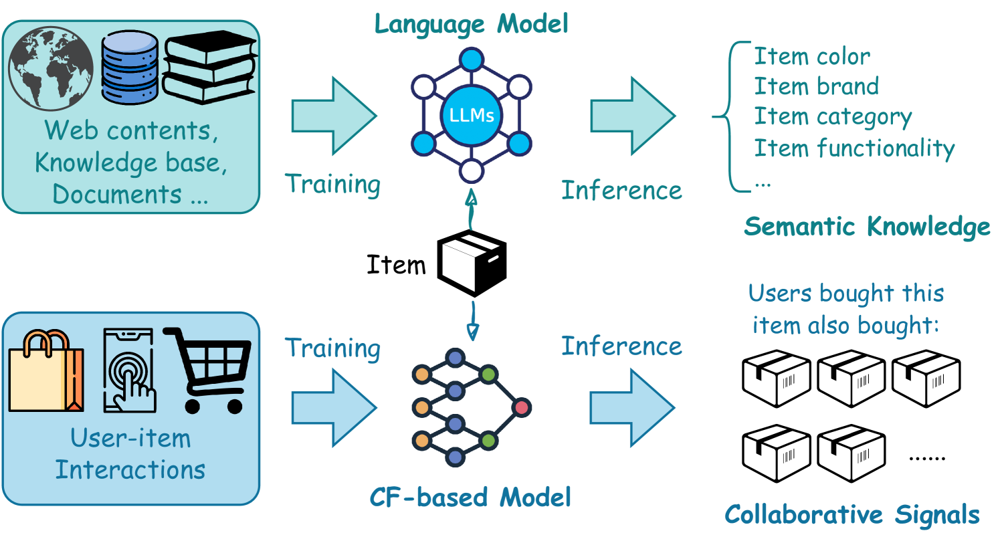
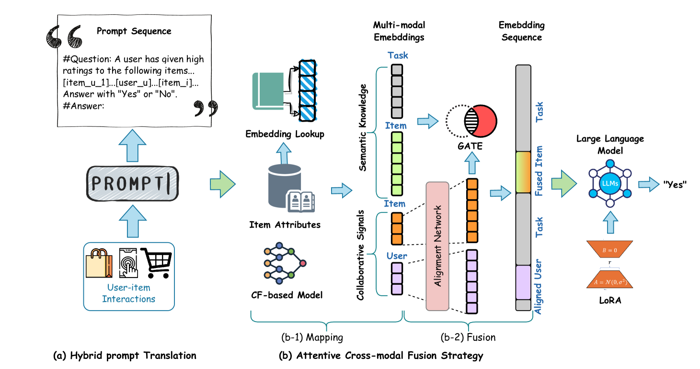
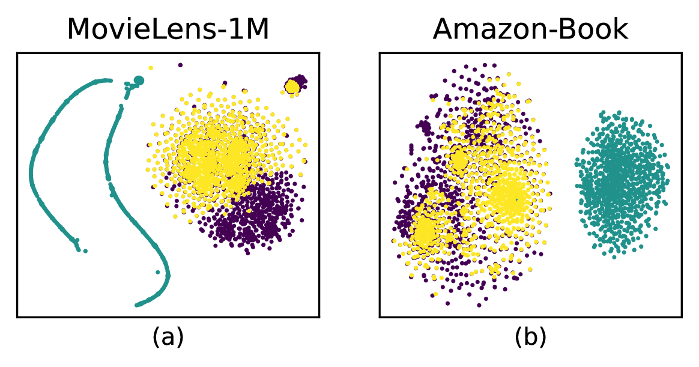

# 大型语言模型助力协同跨模态融合，提升推荐系统性能

发布时间：2024年08月16日

`LLM应用` `推荐系统` `电子商务`

> Collaborative Cross-modal Fusion with Large Language Model for Recommendation

# 摘要

> 尽管传统协同过滤（CF）在推荐系统中表现出色，但在挖掘用户与项目文本属性中的语义知识方面仍有不足。近期，大型语言模型在推荐领域的应用（LLM4Rec）凸显了其捕捉语义的潜力，但常忽略用户行为的协同效应。为此，我们提出了CCF-LLM框架，通过混合提示整合语义与协同信息，并运用注意力机制融合多模态嵌入。实验证明，CCF-LLM在整合语义与协同信号方面表现卓越，超越了现有方法。

> Despite the success of conventional collaborative filtering (CF) approaches for recommendation systems, they exhibit limitations in leveraging semantic knowledge within the textual attributes of users and items. Recent focus on the application of large language models for recommendation (LLM4Rec) has highlighted their capability for effective semantic knowledge capture. However, these methods often overlook the collaborative signals in user behaviors. Some simply instruct-tune a language model, while others directly inject the embeddings of a CF-based model, lacking a synergistic fusion of different modalities. To address these issues, we propose a framework of Collaborative Cross-modal Fusion with Large Language Models, termed CCF-LLM, for recommendation. In this framework, we translate the user-item interactions into a hybrid prompt to encode both semantic knowledge and collaborative signals, and then employ an attentive cross-modal fusion strategy to effectively fuse latent embeddings of both modalities. Extensive experiments demonstrate that CCF-LLM outperforms existing methods by effectively utilizing semantic and collaborative signals in the LLM4Rec context.

[Arxiv](https://arxiv.org/abs/2408.08564)