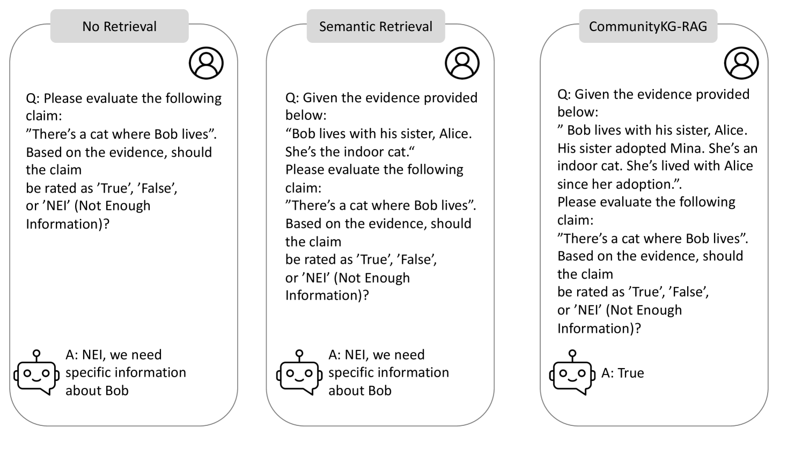
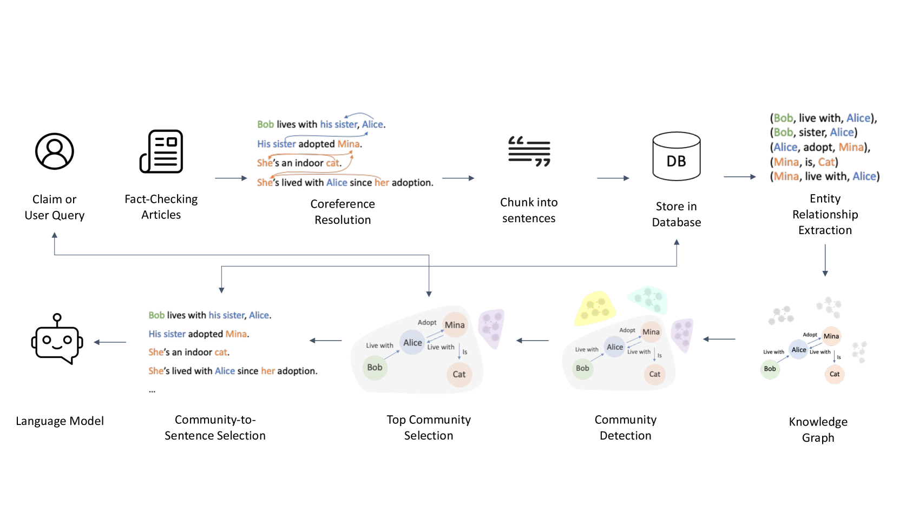

# CommunityKG-RAG：借助知识图谱的社区结构，提升事实核查中的检索增强生成技术

发布时间：2024年08月16日

`RAG` `知识图谱` `事实核查`

> CommunityKG-RAG: Leveraging Community Structures in Knowledge Graphs for Advanced Retrieval-Augmented Generation in Fact-Checking

# 摘要

> 尽管 LLM 和 RAG 系统有所发展，但它们在事实核查中的表现常因缺乏与实体关系和社区结构的整合而受限。为此，我们推出了 CommunityKG-RAG，这一创新的零-shot 框架通过整合社区结构与 KG 和 RAG 系统，大幅提升了事实核查的效率。CommunityKG-RAG 无需额外训练即可适应新领域和查询，其利用 KG 中社区结构的多跳特性，显著提高了信息检索的准确性和相关性。实验结果显示，CommunityKG-RAG 超越了传统方法，为事实核查提供了一个强大、可扩展且高效的解决方案，标志着该领域的重大进步。

> Despite advancements in Large Language Models (LLMs) and Retrieval-Augmented Generation (RAG) systems, their effectiveness is often hindered by a lack of integration with entity relationships and community structures, limiting their ability to provide contextually rich and accurate information retrieval for fact-checking. We introduce CommunityKG-RAG (Community Knowledge Graph-Retrieval Augmented Generation), a novel zero-shot framework that integrates community structures within Knowledge Graphs (KGs) with RAG systems to enhance the fact-checking process. Capable of adapting to new domains and queries without additional training, CommunityKG-RAG utilizes the multi-hop nature of community structures within KGs to significantly improve the accuracy and relevance of information retrieval. Our experimental results demonstrate that CommunityKG-RAG outperforms traditional methods, representing a significant advancement in fact-checking by offering a robust, scalable, and efficient solution.

[Arxiv](https://arxiv.org/abs/2408.08535)