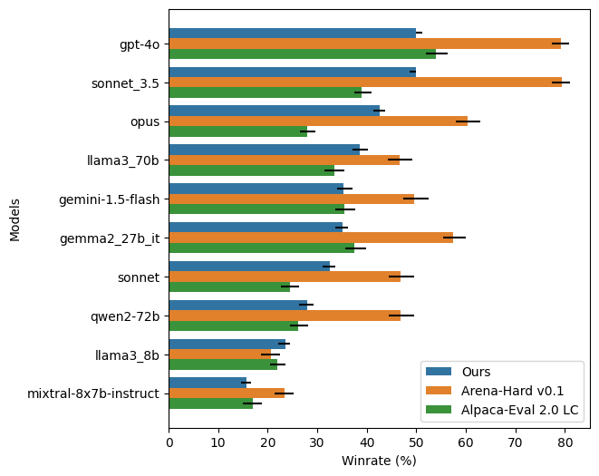

# 打造专为 LLM 评判的领域特定评估集

发布时间：2024年08月16日

`LLM理论` `机器学习` `人工智能`

> Constructing Domain-Specific Evaluation Sets for LLM-as-a-judge

# 摘要

> 大型语言模型（LLM）已彻底变革机器学习领域，但现有基准往往未能全面反映这些模型在实际应用中的多样性。一个有效的基准应能清晰区分不同能力的模型，并紧密契合人类偏好。现有框架如 Alpaca-Eval 2.0 LC 和 Arena-Hard v0.1 因侧重通用查询且缺乏跨领域多样性而受限。本文通过引入创新数据管道，针对 LLM-as-a-Judge 框架，精心策划多样化、领域特定的评估集。我们结合人工筛选、半监督学习及分层抽样，确保广泛领域和语言的平衡代表性。最终评估集包含 1573 个样本，跨越 14 类，展示出 84% 的高可分离性，与 Chatbot Arena 一致性达 84%，Spear曼相关性为 0.915。一致性较 Arena Hard 提升 9%，较 AlpacaEval 2.0 LC 提升 20%，Spear曼系数领先 0.7，显著提升基准实用性。此外，我们提供开源评估工具，支持用户定义类别中模型性能的细致分析，为从业者提供深刻见解。此研究助力提升 LLM 评估方法的透明度、多样性与效能。

> Large Language Models (LLMs) have revolutionized the landscape of machine learning, yet current benchmarks often fall short in capturing the diverse behavior of these models in real-world applications. A benchmark's usefulness is determined by its ability to clearly differentiate between models of varying capabilities (separability) and closely align with human preferences. Existing frameworks like Alpaca-Eval 2.0 LC \cite{dubois2024lengthcontrolledalpacaevalsimpleway} and Arena-Hard v0.1 \cite{li2024crowdsourced} are limited by their focus on general-purpose queries and lack of diversity across domains such as law, medicine, and multilingual contexts. In this paper, we address these limitations by introducing a novel data pipeline that curates diverse, domain-specific evaluation sets tailored for LLM-as-a-Judge frameworks. Our approach leverages a combination of manual curation, semi-supervised learning to generate clusters, and stratified sampling to ensure balanced representation across a wide range of domains and languages. The resulting evaluation set, which includes 1573 samples across 14 categories, demonstrates high separability (84\%) across ten top-ranked models, and agreement (84\%) with Chatbot Arena and (0.915) Spearman correlation. The agreement values are 9\% better than Arena Hard and 20\% better than AlpacaEval 2.0 LC, while the Spearman coefficient is 0.7 more than the next best benchmark, showcasing a significant improvement in the usefulness of the benchmark. We further provide an open-source evaluation tool that enables fine-grained analysis of model performance across user-defined categories, offering valuable insights for practitioners. This work contributes to the ongoing effort to enhance the transparency, diversity, and effectiveness of LLM evaluation methodologies.

[Arxiv](https://arxiv.org/abs/2408.08808)