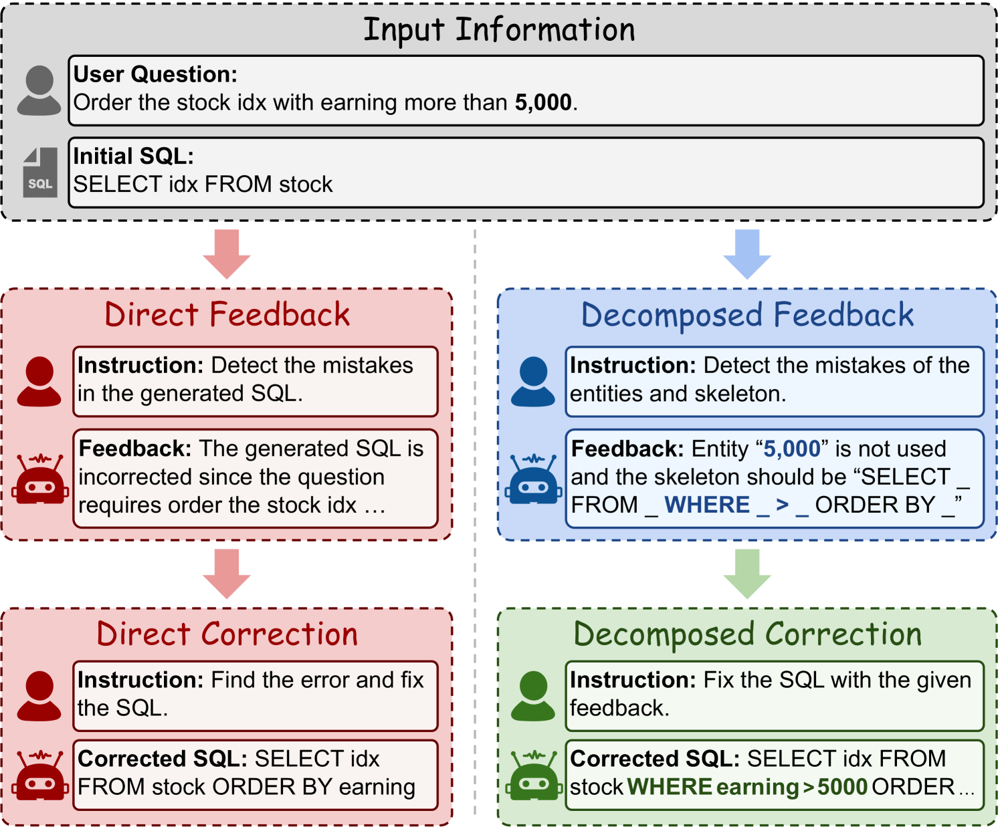
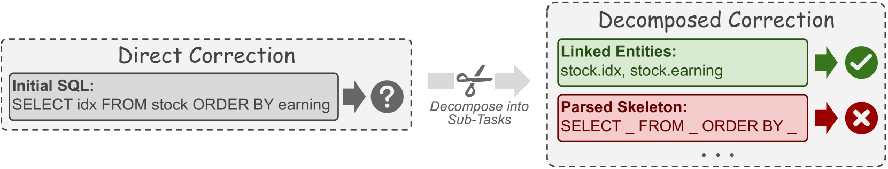
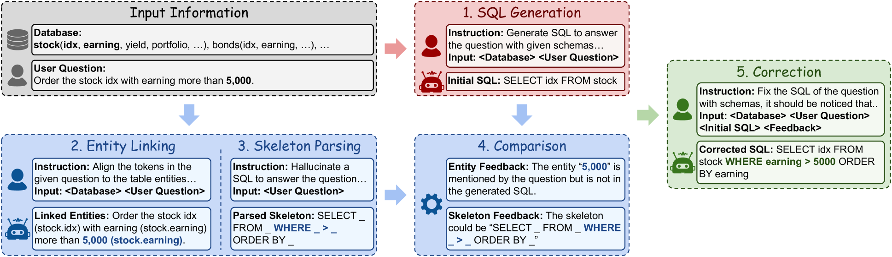
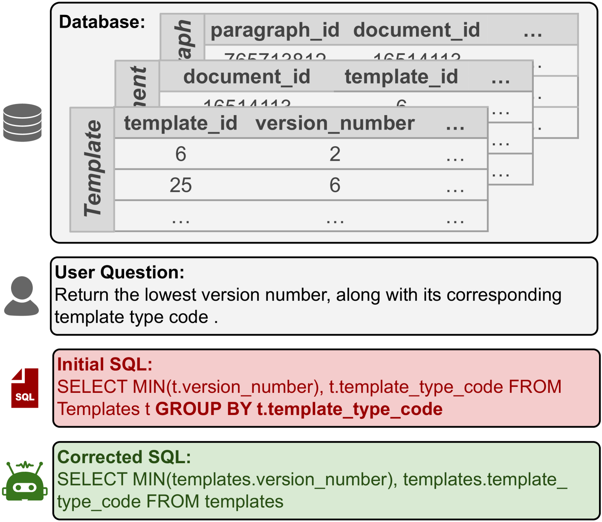

# DAC：文本转SQL的分解式自动校正

发布时间：2024年08月16日

`LLM应用` `数据库` `人工智能`

> DAC: Decomposed Automation Correction for Text-to-SQL

# 摘要

> Text-to-SQL 任务通过自动生成 SQL 查询，帮助人们轻松获取数据库信息。基于大型语言模型 (LLM) 的方法因其卓越性能成为主流。自动纠正是提升性能的关键，但现有方法直接让 LLM 纠正 SQL 错误，效果不佳。本文提出分解纠正法 (DAC)，通过分解 Text-to-SQL 任务，先识别并修正子任务错误，再整合生成正确 SQL。实验表明，DAC 在多个数据集上平均提升性能 3.7%，显著优于传统方法。

> Text-to-SQL is an important task that helps people obtain information from databases by automatically generating SQL queries. Considering the brilliant performance, approaches based on Large Language Models (LLMs) become the mainstream for text-to-SQL. Among these approaches, automated correction is an effective approach that further enhances performance by correcting the mistakes in the generated results. The existing correction methods require LLMs to directly correct with generated SQL, while previous research shows that LLMs do not know how to detect mistakes, leading to poor performance. Therefore, in this paper, we propose to employ the decomposed correction to enhance text-to-SQL performance. We first demonstrate that decomposed correction outperforms direct correction since detecting and fixing mistakes with the results of the decomposed sub-tasks is easier than with SQL. Based on this analysis, we introduce Decomposed Automation Correction (DAC), which corrects SQL by decomposing text-to-SQL into entity linking and skeleton parsing. DAC first generates the entity and skeleton corresponding to the question and then compares the differences between the initial SQL and the generated entities and skeleton as feedback for correction. Experimental results show that our method improves performance by $3.7\%$ on average of Spider, Bird, and KaggleDBQA compared with the baseline method, demonstrating the effectiveness of DAC.

[Arxiv](https://arxiv.org/abs/2408.08779)