# ECG-Chat：一款专为心脏疾病诊断设计的大型 ECG 语言模型

发布时间：2024年08月16日

`LLM应用` `人工智能`

> ECG-Chat: A Large ECG-Language Model for Cardiac Disease Diagnosis

# 摘要

> 多模态大型语言模型（MLLMs）在医疗辅助领域展现出巨大潜力，使患者能够利用生理信号数据进行对话。然而，通用MLLMs在心脏病诊断方面表现不佳，尤其是在心电图（ECG）数据分析和长文本医疗报告生成方面，这主要归因于ECG数据分析的复杂性和文本与ECG信号模态之间的差距。此外，由于缺乏与用户查询紧密相关的精确知识，模型在长文本生成中经常表现出严重的稳定性缺陷。为了解决这些问题，我们提出了ECG-Chat，这是首个专注于ECG医疗报告生成的多任务MLLMs，提供基于心脏病学知识的多种对话能力。我们采用了一种对比学习方法，将ECG波形数据与文本报告集成，以细粒度的方式对齐ECG特征与报告，这种方法还产生了一个在零-shot报告检索任务中表现出色的ECG编码器。此外，通过扩展现有数据集，我们构建了一个19k的ECG诊断数据集和一个25k的多轮对话数据集，用于训练和微调ECG-Chat，提供专业的诊断和对话能力。ECG-Chat还能通过自动化的LaTeX生成管道生成全面的ECG分析报告。我们为ECG报告生成任务建立了一个基准，并在多个基线上测试了我们的模型。ECG-Chat在分类、检索、多模态对话和医疗报告生成任务中取得了最佳性能。我们的报告模板设计也得到了医疗从业者的广泛认可。

> The success of Multimodal Large Language Models (MLLMs) in the medical auxiliary field shows great potential, allowing patients to engage in conversations using physiological signal data. However, general MLLMs perform poorly in cardiac disease diagnosis, particularly in the integration of ECG data analysis and long-text medical report generation, mainly due to the complexity of ECG data analysis and the gap between text and ECG signal modalities. Additionally, models often exhibit severe stability deficiencies in long-text generation due to the lack of precise knowledge strongly related to user queries. To address these issues, we propose ECG-Chat, the first multitask MLLMs focused on ECG medical report generation, providing multimodal conversational capabilities based on cardiology knowledge. We propose a contrastive learning approach that integrates ECG waveform data with text reports, aligning ECG features with reports in a fine-grained manner. This method also results in an ECG encoder that excels in zero-shot report retrieval tasks. Additionally, expanding existing datasets, we constructed a 19k ECG diagnosis dataset and a 25k multi-turn dialogue dataset for training and fine-tuning ECG-Chat, which provides professional diagnostic and conversational capabilities. Furthermore, ECG-Chat can generate comprehensive ECG analysis reports through an automated LaTeX generation pipeline. We established a benchmark for the ECG report generation task and tested our model on multiple baselines. ECG-Chat achieved the best performance in classification, retrieval, multimodal dialogue, and medical report generation tasks. Our report template design has also been widely recognized by medical practitioners.

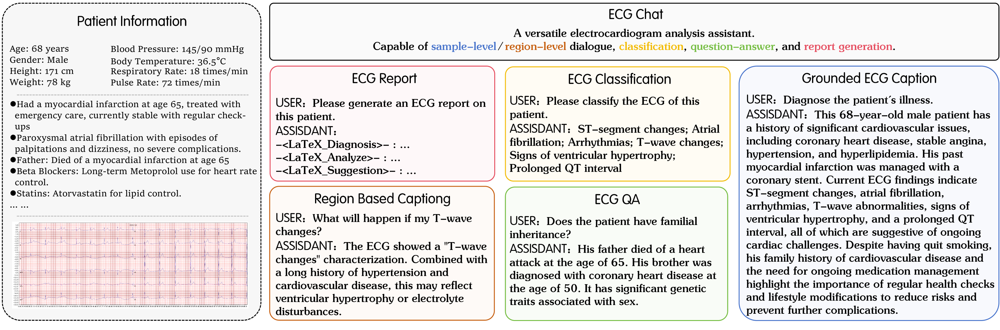

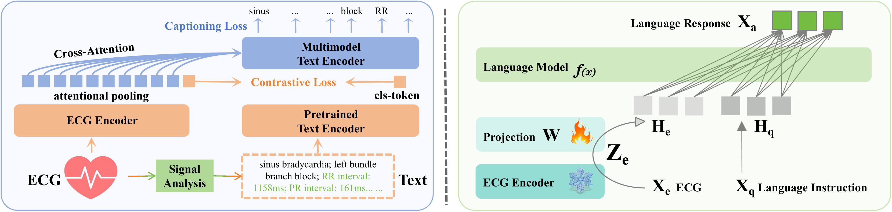

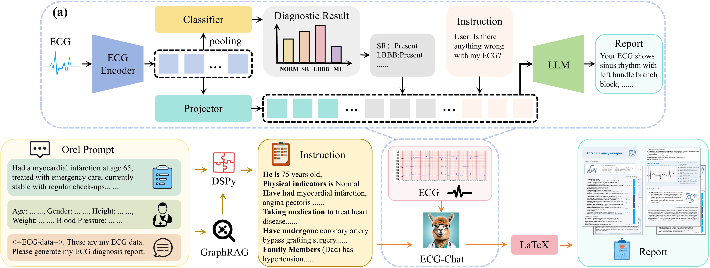

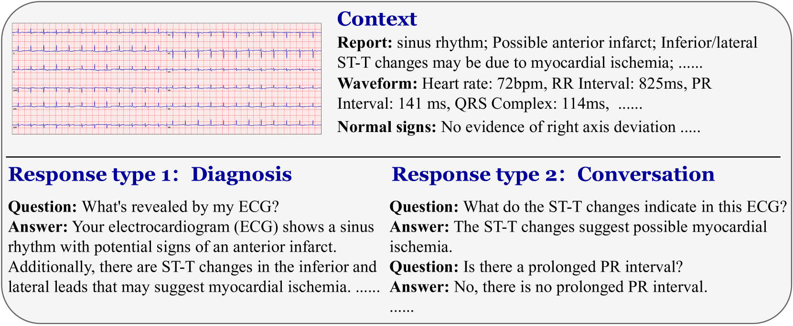

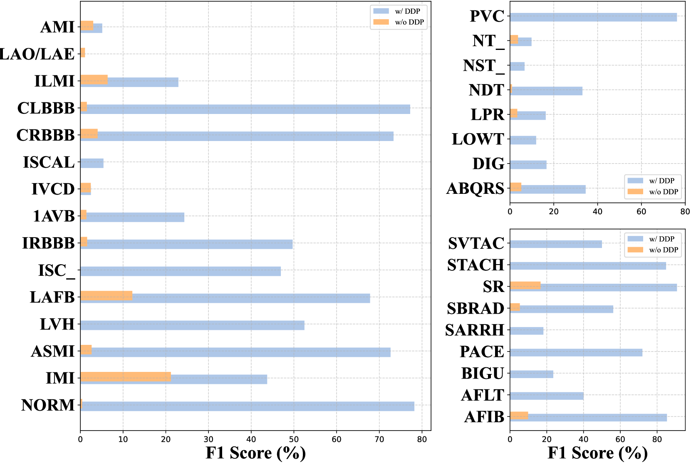

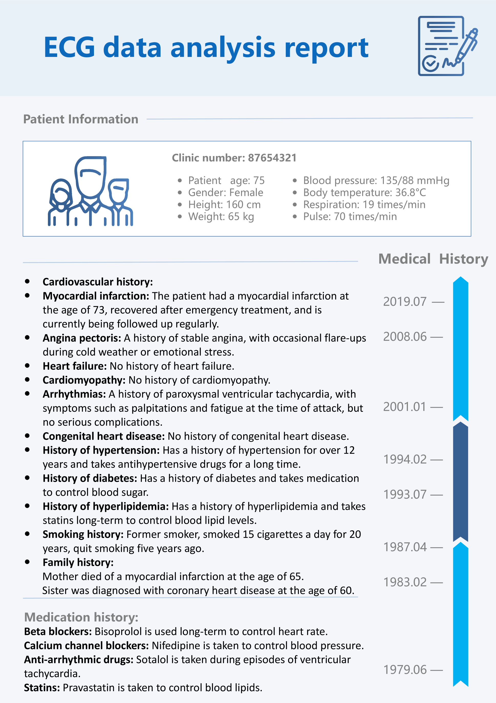

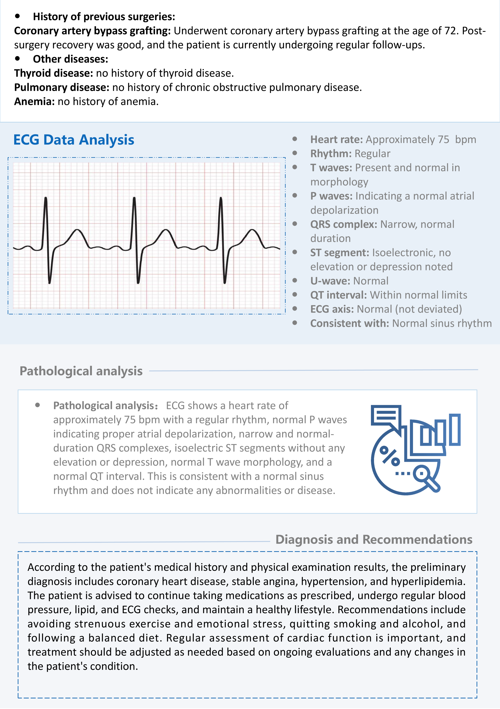

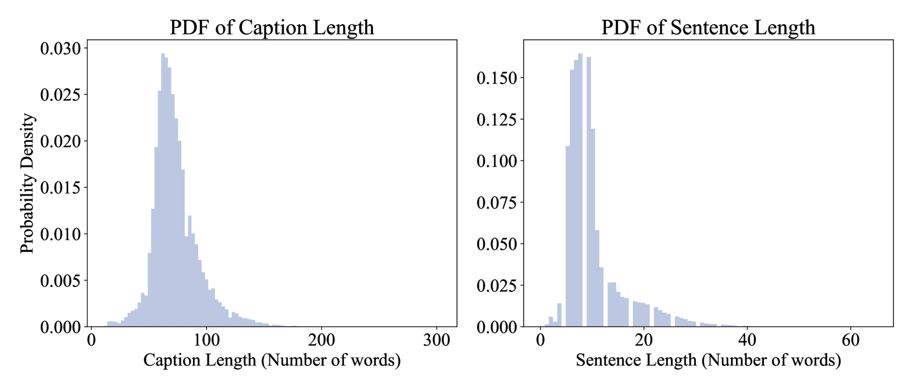

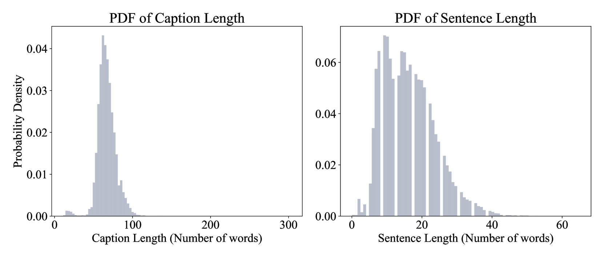

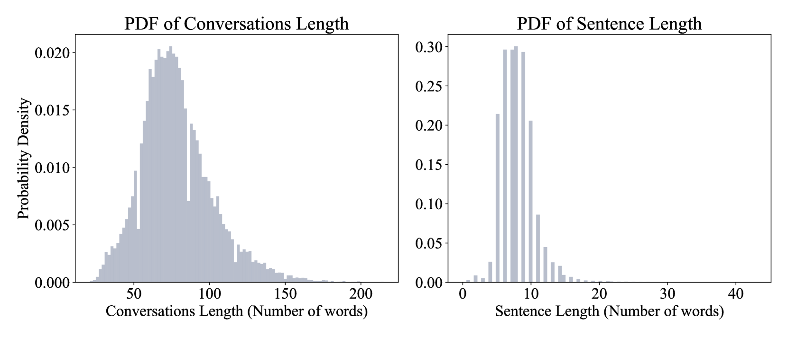

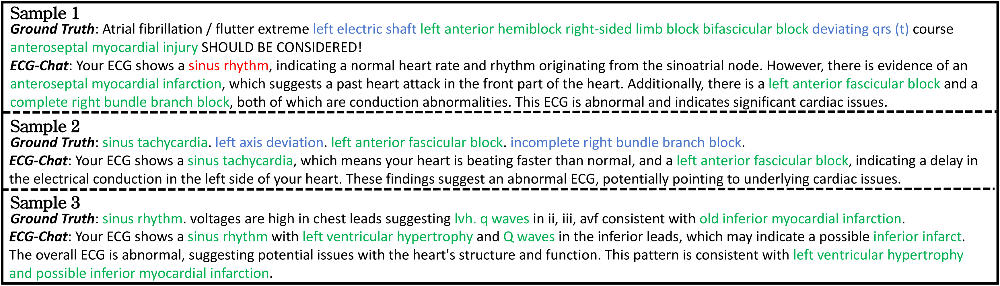

[Arxiv](https://arxiv.org/abs/2408.08849)