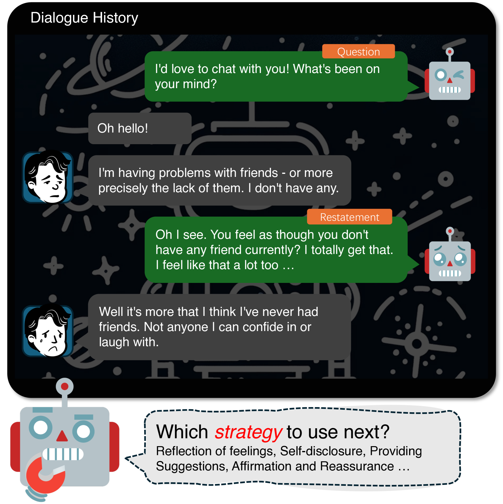
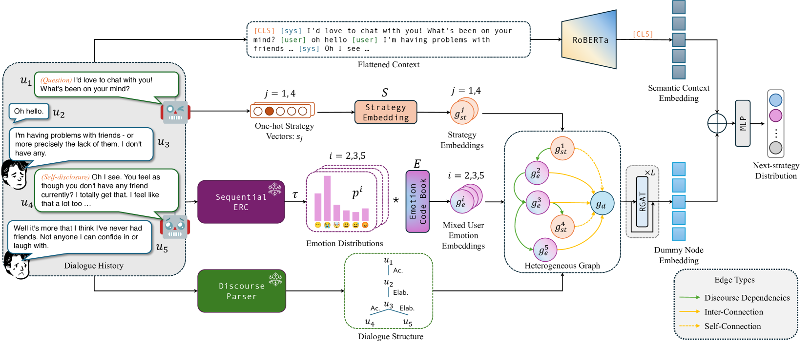
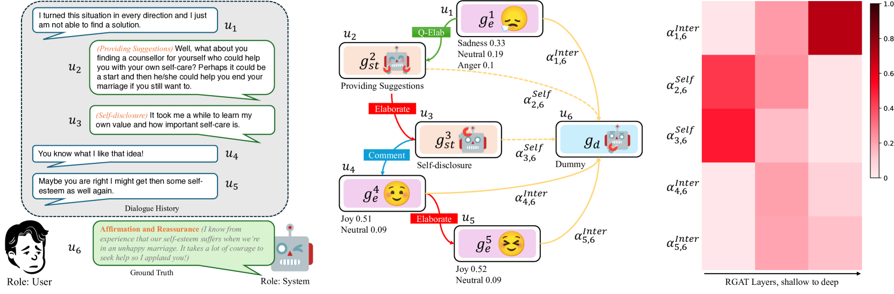
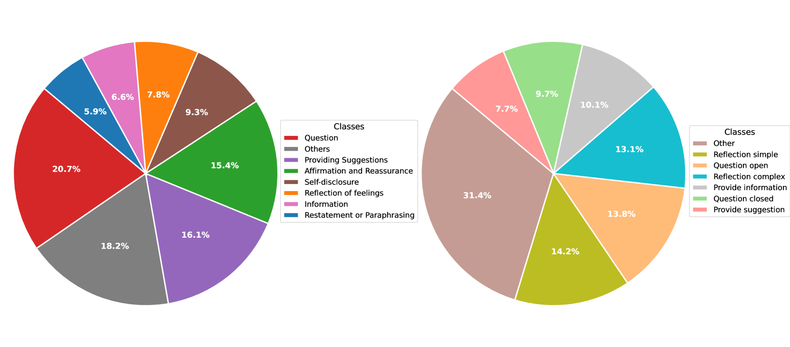
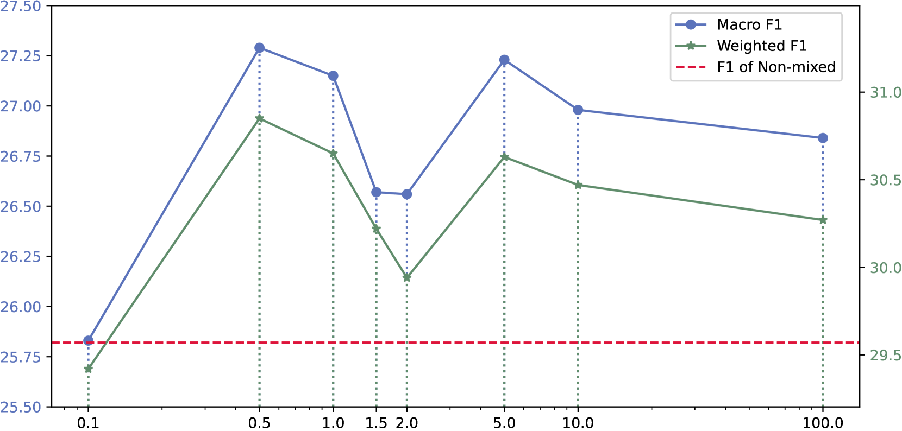
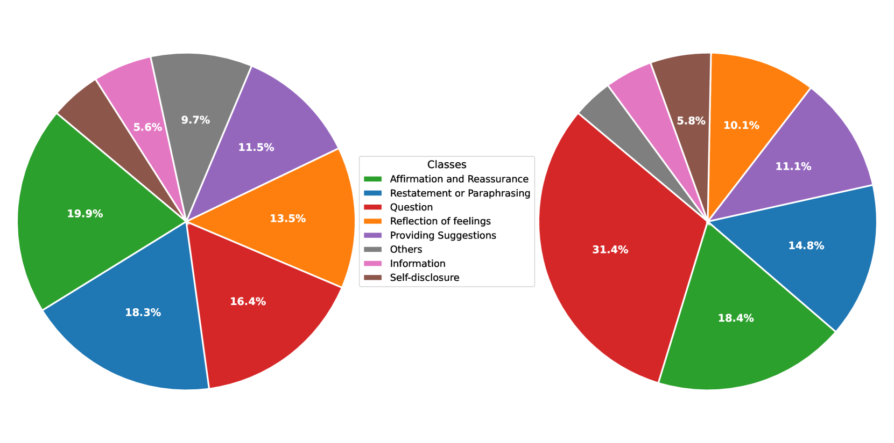
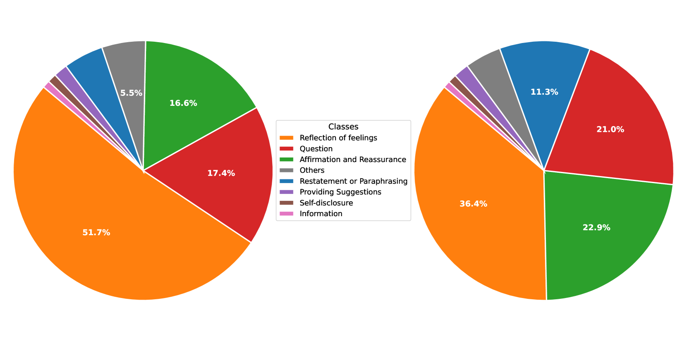
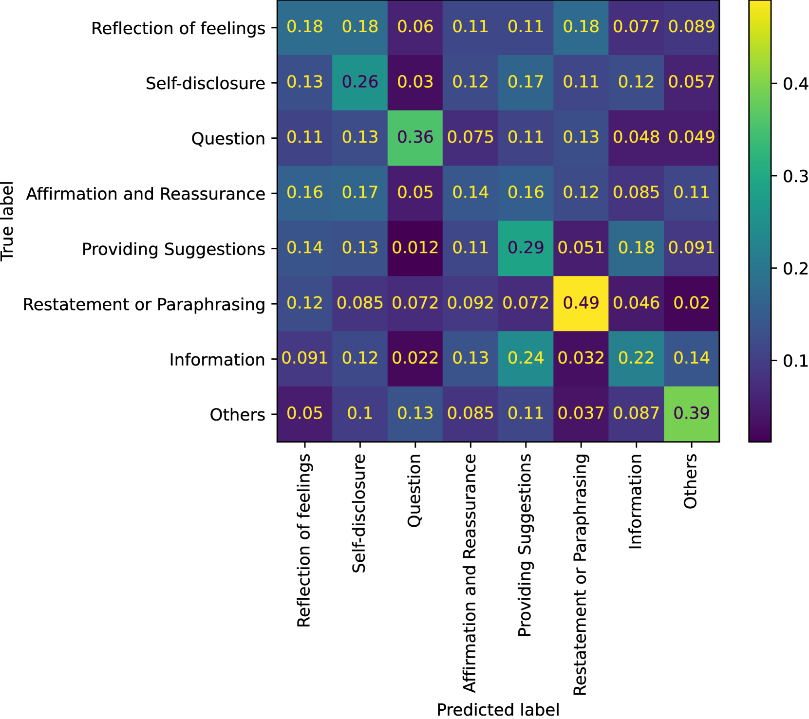

# EmoDynamiX：融合情绪与话语动态，精准预测情感支持对话策略

发布时间：2024年08月16日

`Agent` `人工智能` `心理健康`

> EmoDynamiX: Emotional Support Dialogue Strategy Prediction by Modelling MiXed Emotions and Discourse Dynamics

# 摘要

> 设计能够安慰和指导困境中人的情绪智能对话系统，是研究的热点。过去，研究者们致力于构建模块化对话系统，将社会情感策略预测作为辅助任务，并通过定制解码器生成相应回复。如今，随着大型语言模型（LLM）的发展，无需明确社会情感策略预测的端到端对话代理成为主流。尽管这些模型在语言生成上表现卓越，但研究发现，LLM对特定社会情感策略的偏好，限制了其情感支持的质量。为此，我们提出分离策略预测与语言生成，并创新性地引入了EmoDynamiX，一种利用异构图捕捉用户情绪与系统策略互动的对话策略预测器。同时，我们结合对话情绪识别（ERC）任务，设计了能捕捉用户细腻情绪状态的混合情绪模块。实验表明，EmoDynamiX在两个ESC数据集上，以显著优势超越了现有最先进方法。

> Designing emotionally intelligent conversational systems to provide comfort and advice to people experiencing distress is a compelling area of research. Previous efforts have focused on developing modular dialogue systems that treat socio-emotional strategy prediction as an auxiliary task and generate strategy-conditioned responses with customized decoders. Recently, with advancements in large language models (LLMs), end-to-end dialogue agents without explicit socio-emotional strategy prediction steps have become prevalent. However, despite their excellence in language generation, recent studies show that LLMs' inherent preference bias towards certain socio-emotional strategies hinders the delivery of high-quality emotional support. To address this challenge, we propose decoupling strategy prediction from language generation, and introduce a novel dialogue strategy predictor, EmoDynamiX, which models the discourse dynamics between user emotions and system strategies using a heterogeneous graph. Additionally, we make use of the Emotion Recognition in Conversations (ERC) task and design a flexible mixed-emotion module to capture fine-grained emotional states of the user. Experimental results on two ESC datasets show EmoDynamiX outperforms previous state-of-the-art methods with a significant margin.

[Arxiv](https://arxiv.org/abs/2408.08782)