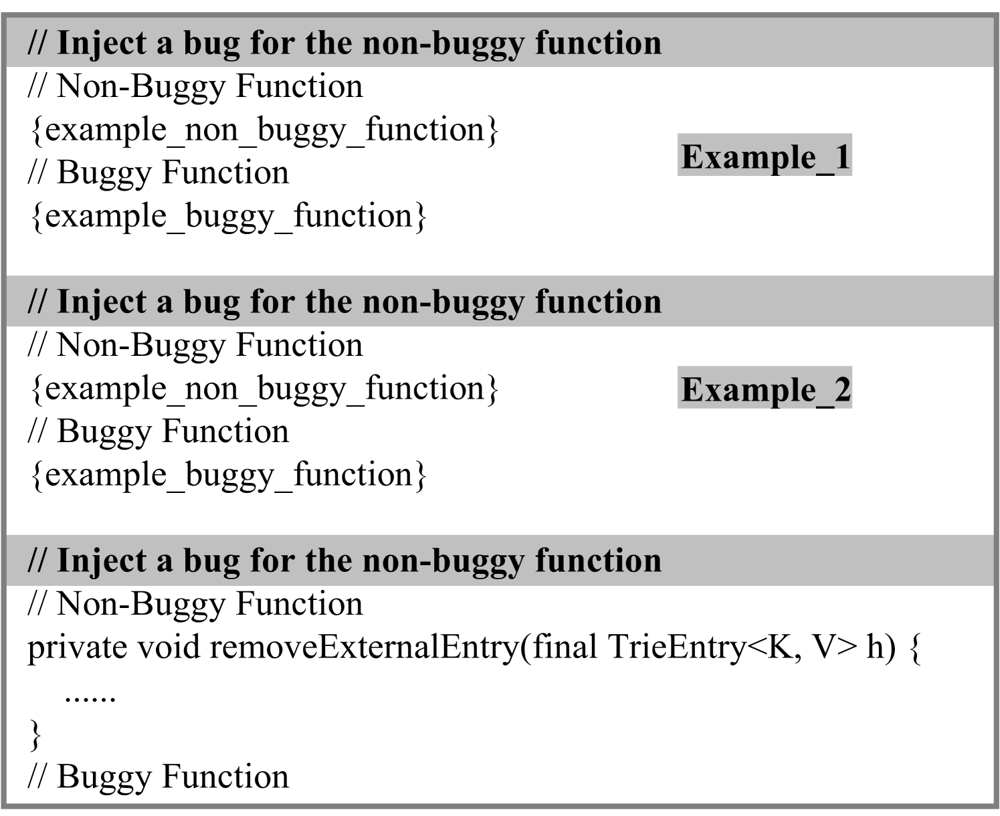
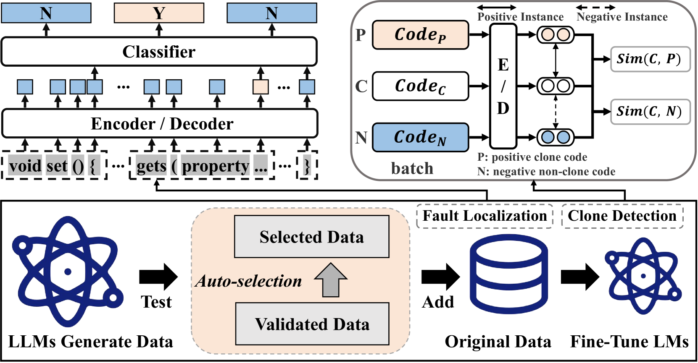
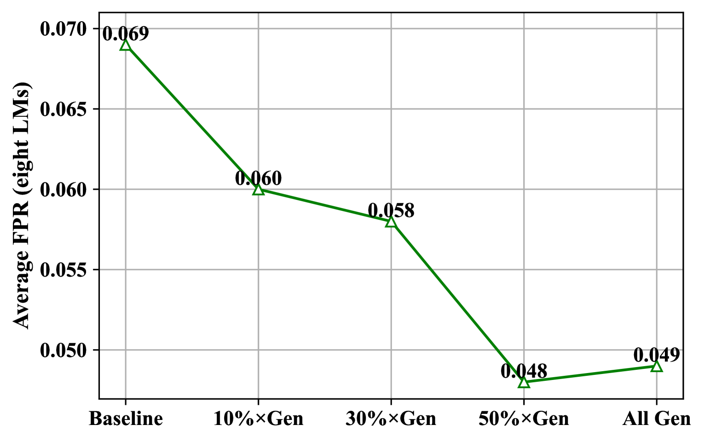

# 借助大型语言模型的经验，引导预训练模型提升判别任务的表现。

发布时间：2024年08月16日

`LLM应用` `软件工程` `人工智能`

> Enhancing Discriminative Tasks by Guiding the Pre-trained Language Model with Large Language Model's Experience

# 摘要

> 大型语言模型（LLM）和预训练模型（LM）在软件工程任务中表现卓越，如代码补全和生成。借助庞大的现有代码库（如GitHub），这些模型解析源代码模式，预测代码特性。但微调LLM对终端用户和小组织而言，既耗时又昂贵，且依赖于数据集的数量与质量。当前数据稀缺和高收集成本限制了LM的实际应用。本文中，我们利用LLM的生成力，通过生成特定领域数据，提升预训练LM的性能。实验中，我们融合不同LLM，让LM学习LLM生成的数据，并比较学习前后的性能。结果显示，LLM生成的数据大幅提升LM性能，故障定位提升高达58.36%，克隆检测提升6.09%。研究表明，LLM生成数据能显著增强LM的表现。

> Large Language Models (LLMs) and pre-trained Language Models (LMs) have achieved impressive success on many software engineering tasks (e.g., code completion and code generation). By leveraging huge existing code corpora (e.g., GitHub), these models aim to understand the patterns in source code and use these patterns to predict code properties. However, fine-tuning LLMs is time-consuming and costly for end users and small organizations. Furthermore, fine-tuning LMs heavily depends on the amount and quality of datasets available. As a result, the current lack of data and the high cost of collecting it in real-world scenarios further limit the applicability of LMs. In this paper, we leverage the powerful generation capabilities of LLMs to enhance pre-trained LMs. Specifically, we use LLMs to generate domain-specific data, thereby improving the performance of pre-trained LMs on the target tasks. We conduct experiments by combining different LLMs in our generation phase and introducing various LMs to learn from the LLM-generated data. Then, we compare the performance of these LMs before and after learning the data. We find that LLM-generated data significantly enhances the performance of LMs. The improvement can reach up to 58.36% for fault localization and up to 6.09% for clone detection. Our study highlights that using LLMs to generate data for LMs can improve performance by a large margin.

[Arxiv](https://arxiv.org/abs/2408.08553)