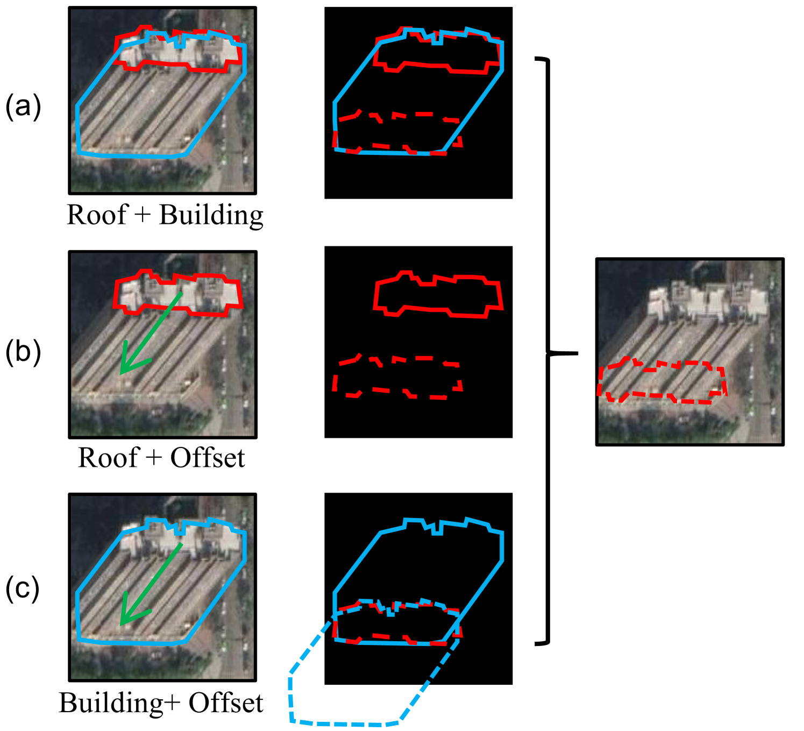
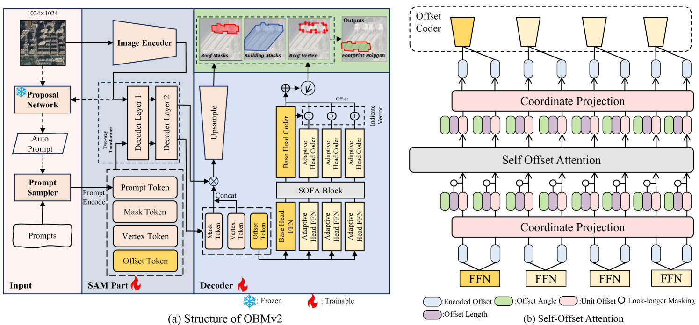
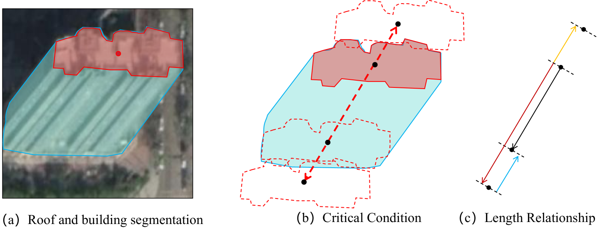
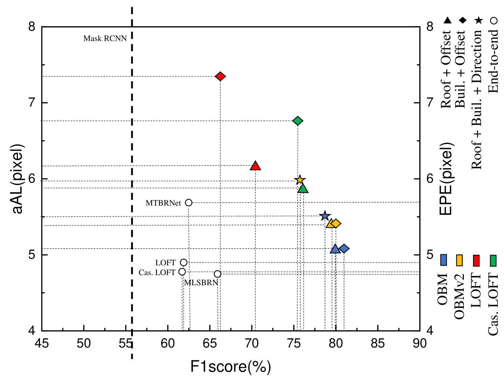
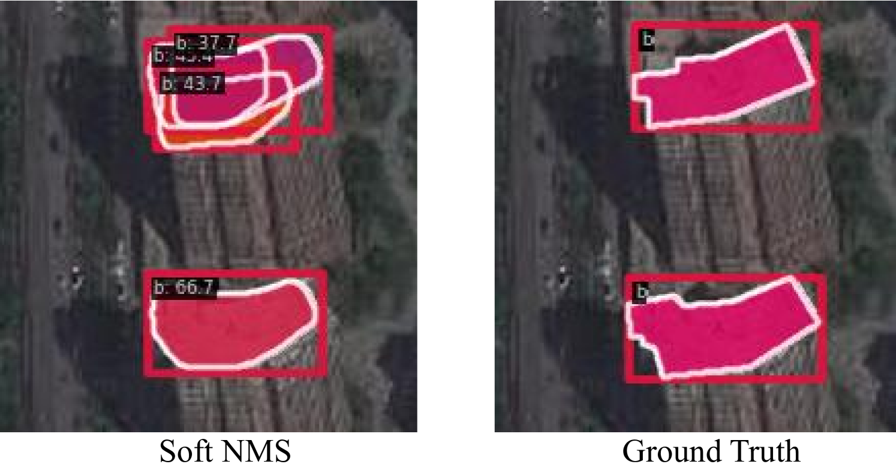
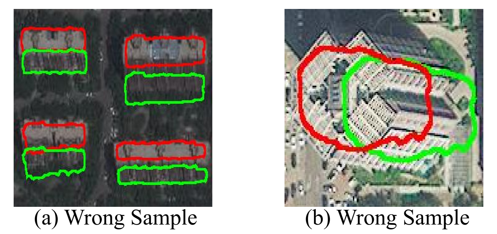

# 利用 Segment Anything Model 在非正视图像中精准提取多边形足迹

发布时间：2024年08月16日

`RAG`

> Extracting polygonal footprints in off-nadir images with Segment Anything Model

# 摘要

> 在非天底航空图像中，建筑轮廓提取（BFE）常通过屋顶分割和偏移预测来实现，但因掩码质量低，多阶段推理结果不适用于实际生产。为此，我们推出了OBMv2，它不仅支持端到端的多边形轮廓预测，还能通过新机制SOFA缩小不同建筑类型间的性能差距，实现无后处理的真正端到端预测。我们还引入了多层次信息系统（MISS），确保即使在预测不足时也能准确预测轮廓。受自然语言处理中RAG的启发，我们探索了“BFE中的RAG”问题，以进一步优化信息提取。实验证明，我们的方法在多个公开数据集上表现优异，并在惠州测试集上进行了泛化测试。代码即将在GitHub上发布。

> Building Footprint Extraction (BFE) in off-nadir aerial images often relies on roof segmentation and roof-to-footprint offset prediction, then drugging roof-to-footprint via the offset. However, the results from this multi-stage inference are not applicable in data production, because of the low quality of masks given by prediction. To solve this problem, we proposed OBMv2 in this paper, which supports both end-to-end and promptable polygonal footprint prediction. Different from OBM, OBMv2 using a newly proposed Self Offset Attention (SOFA) to bridge the performance gap on bungalow and skyscraper, which realized a real end-to-end footprint polygon prediction without postprocessing. %, such as Non-Maximum Suppression (NMS) and Distance NMS (DNMS). % To fully use information contained in roof masks, building masks and offsets, we proposed a Multi-level Information SyStem (MISS) for footprint prediction, with which OBMv2 can predict footprints even with insufficient predictions. Additionally, to squeeze information from the same model, we were inspired by Retrieval-Augmented Generation (RAG) in Nature Language Processing and proposed "RAG in BFE" problem. To verify the effectiveness of the proposed method, experiments were conducted on open datasets BONAI and OmniCity-view3. A generalization test was also conducted on Huizhou test set. The code will be available at \url{https://github.com/likaiucas/OBM}.

[Arxiv](https://arxiv.org/abs/2408.08645)