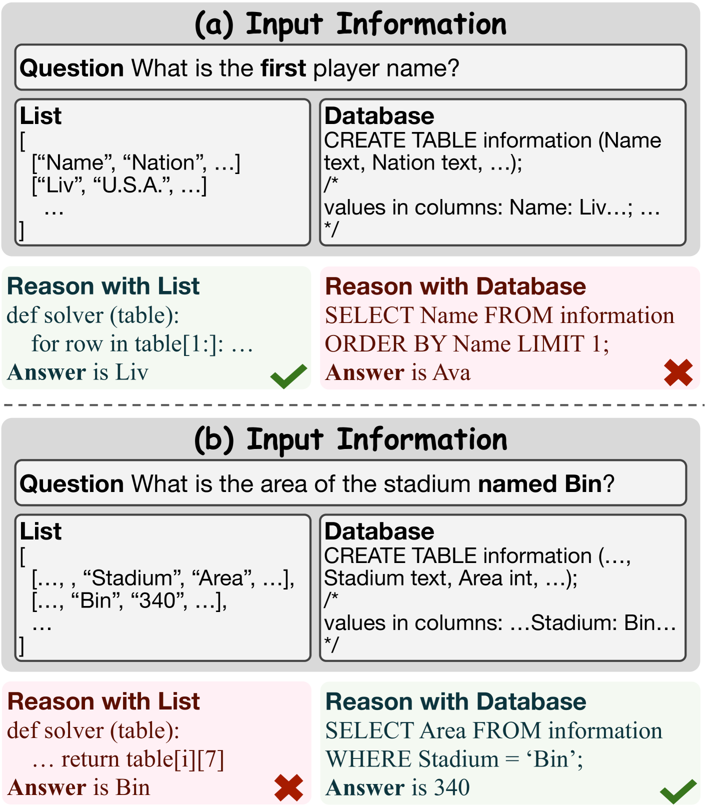
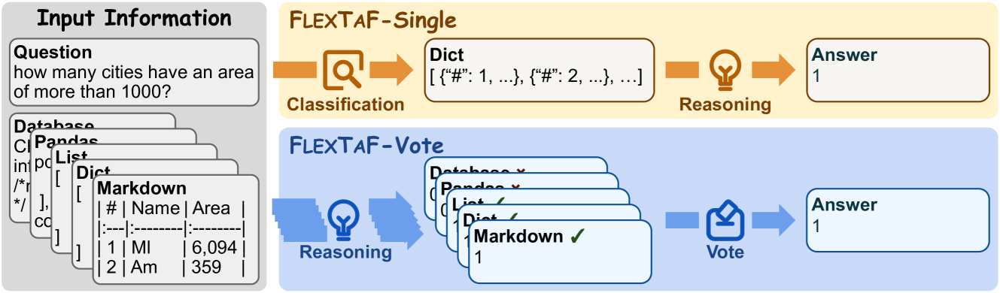
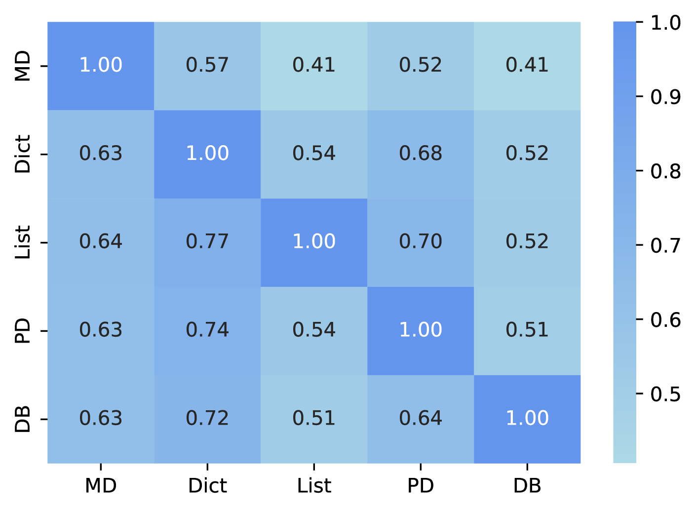
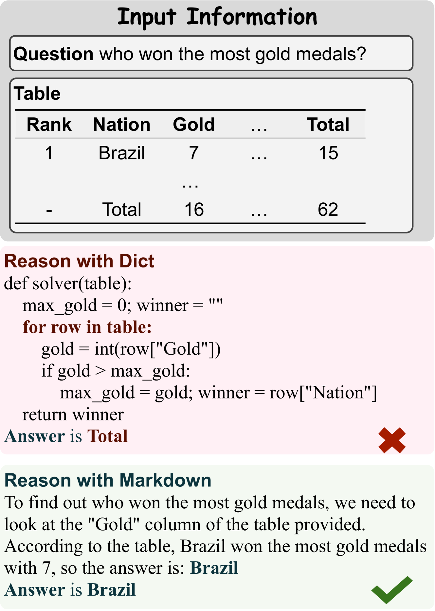
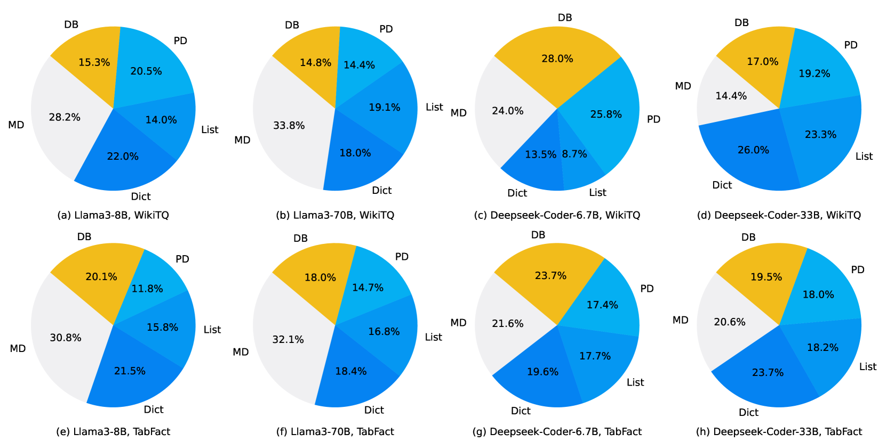
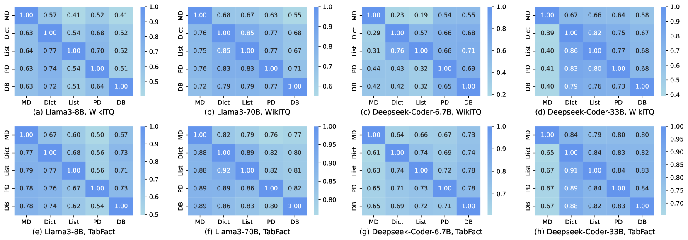
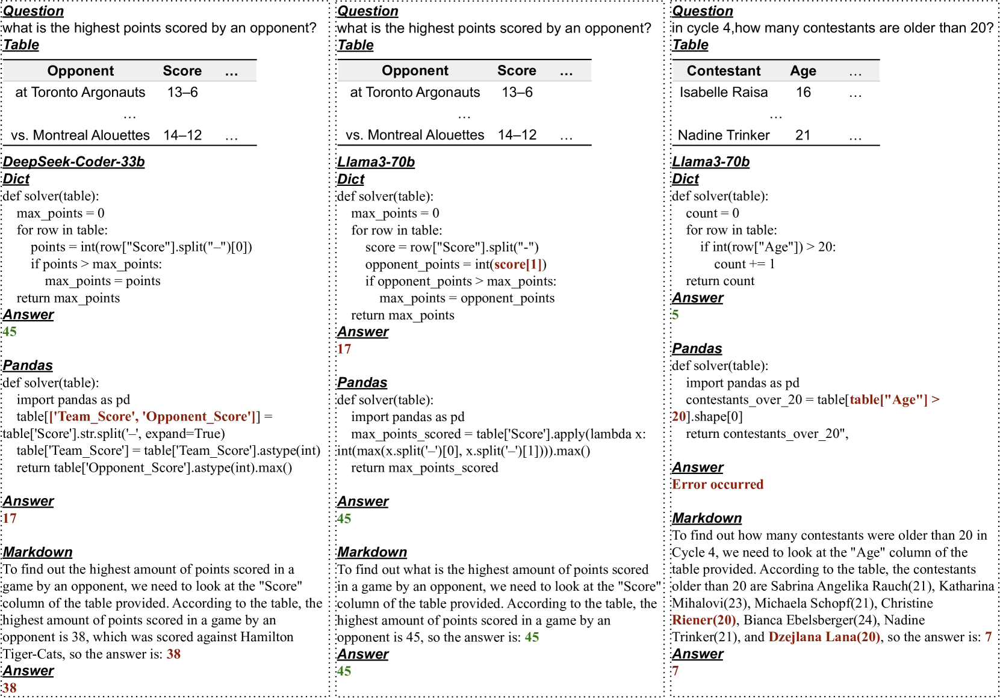

# FLEXTAF 利用灵活的表格格式，提升表格推理能力。

发布时间：2024年08月16日

`LLM应用` `数据分析` `人工智能`

> FLEXTAF: Enhancing Table Reasoning with Flexible Tabular Formats

# 摘要

> 表格推理任务的关键在于根据给定表格解答问题。当前，大型语言模型 (LLM) 是这一领域的首选方法。然而，多数方法依赖于固定表格格式，这可能限制了性能的发挥。考虑到每个问题和模型都有其独特性，我们认为不同的场景和模型应采用不同的表格格式。通过实验数据的量化分析，我们证实了这一观点：不同的表格格式确实能带来性能上的差异。为此，我们创新性地提出了 FLEXTAF-Single 和 FLEXTAF-Vote 两种方法，通过灵活的表格格式来提升推理性能。FLEXTAF-Single 通过训练分类器，为每个实例和模型选择最优格式；而 FLEXTAF-Vote 则整合多种格式的结果，以达到更优的推理效果。在 WikiTableQuestions 和 TabFact 数据集上的实验表明，我们的方法相较于传统固定格式方法，分别实现了 2.3% 和 4.8% 的性能提升，充分证明了其有效性。

> The table reasoning task aims to answer the question according to the given table. Currently, using Large Language Models (LLMs) is the predominant method for table reasoning. Most existing methods employ a fixed tabular format to represent the table, which could limit the performance. Given that each instance requires different capabilities and models possess varying abilities, we assert that different instances and models suit different tabular formats. We prove the aforementioned claim through quantitative analysis of experimental results, where different instances and models achieve different performances using various tabular formats. Building on this discussion, we propose FLEXTAF-Single and FLEXTAF-Vote to enhance table reasoning performance by employing flexible tabular formats. Specifically, (i) FLEXTAF-Single trains a classifier to predict the most suitable tabular format based on the instance and the LLM. (ii) FLEXTAF-Vote integrates the results across different formats. Our experiments on WikiTableQuestions and TabFact reveal significant improvements, with average gains of 2.3% and 4.8% compared to the best performance achieved using a fixed tabular format with greedy decoding and self-consistency decoding, thereby validating the effectiveness of our methods.

[Arxiv](https://arxiv.org/abs/2408.08841)