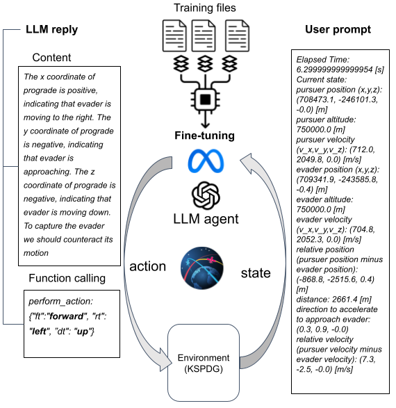
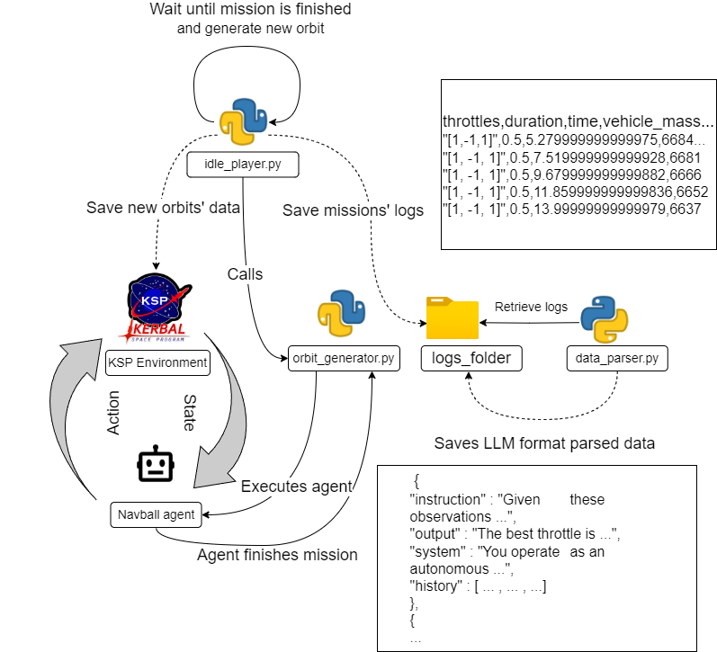
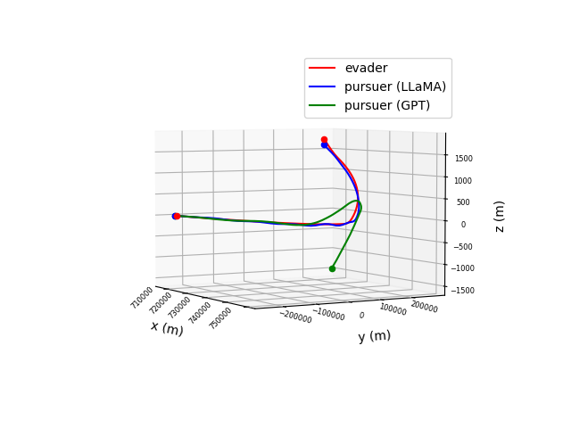

# LLM 微调在自主航天器控制中的应用：基于 Kerbal Space Program 的实证研究

发布时间：2024年08月16日

`Agent` `人工智能`

> Fine-tuning LLMs for Autonomous Spacecraft Control: A Case Study Using Kerbal Space Program

# 摘要

> 近期，大型语言模型 (LLM) 被用作自主代理，根据用户文本提示执行任务。本研究利用微调的 LLM 在 Kerbal Space Program Differential Games 套件 (KSPDG) 环境中进行航天器自主控制。传统强化学习 (RL) 在此领域受限于模拟和数据不足。我们通过微调 GPT-3.5 和 LLaMA 等模型，展示了如何利用语言输入输出有效控制航天器。该方法将实时任务遥测融入文本提示，由 LLM 处理后生成控制指令。研究结果引发了对 LLM 在空间操作中应用潜力的探讨，未来计划扩展至其他空间控制任务，并评估不同 LLM 模型的性能。相关代码已公开于 \texttt{https://github.com/ARCLab-MIT/kspdg}。

> Recent trends are emerging in the use of Large Language Models (LLMs) as autonomous agents that take actions based on the content of the user text prompt. This study explores the use of fine-tuned Large Language Models (LLMs) for autonomous spacecraft control, using the Kerbal Space Program Differential Games suite (KSPDG) as a testing environment. Traditional Reinforcement Learning (RL) approaches face limitations in this domain due to insufficient simulation capabilities and data. By leveraging LLMs, specifically fine-tuning models like GPT-3.5 and LLaMA, we demonstrate how these models can effectively control spacecraft using language-based inputs and outputs. Our approach integrates real-time mission telemetry into textual prompts processed by the LLM, which then generate control actions via an agent. The results open a discussion about the potential of LLMs for space operations beyond their nominal use for text-related tasks. Future work aims to expand this methodology to other space control tasks and evaluate the performance of different LLM families. The code is available at this URL: \texttt{https://github.com/ARCLab-MIT/kspdg}.

[Arxiv](https://arxiv.org/abs/2408.08676)