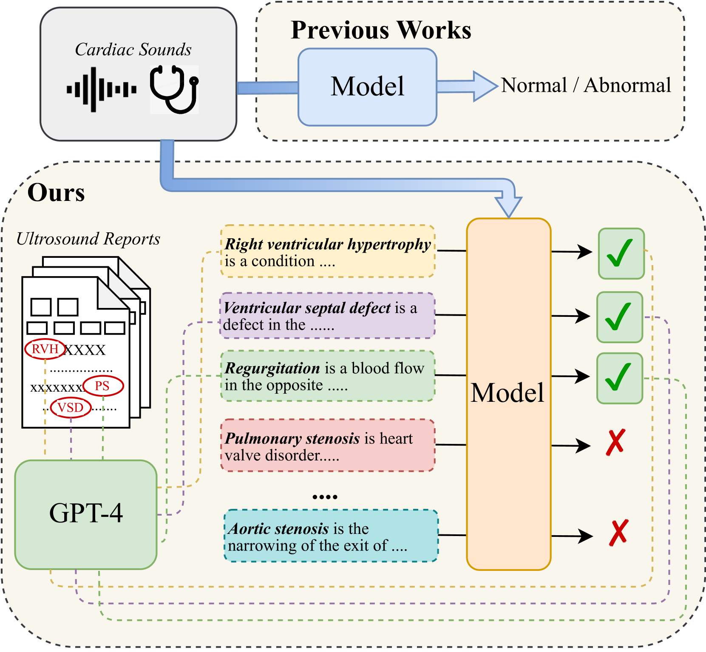
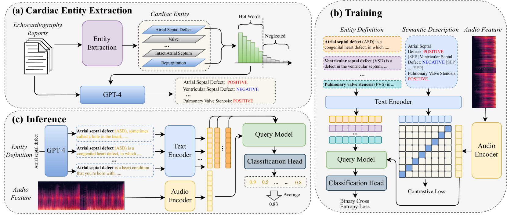
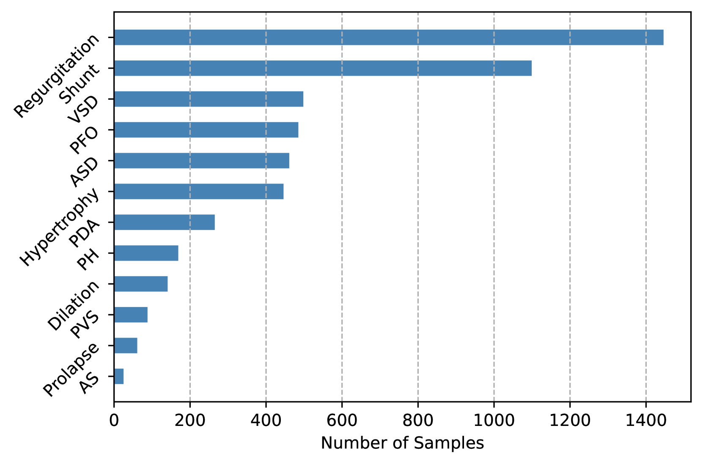
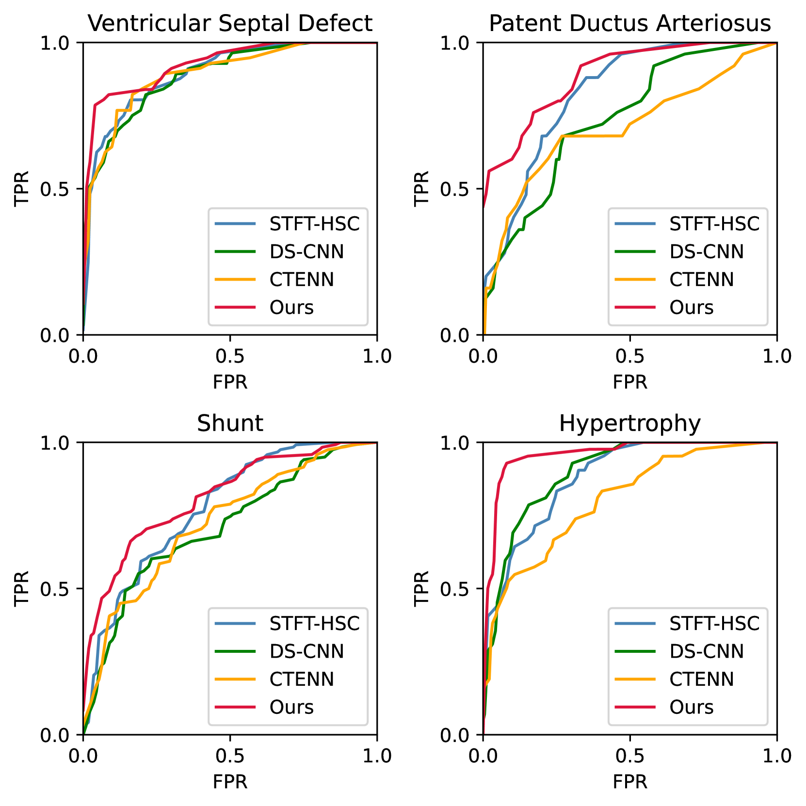
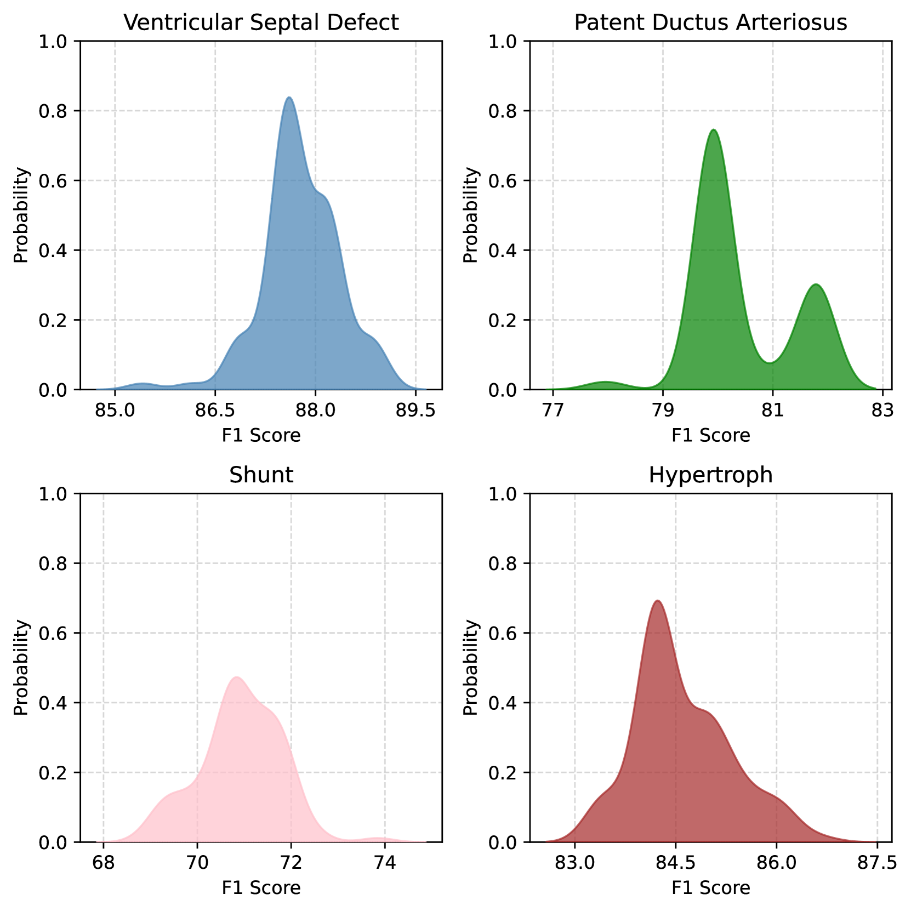

# HSDreport：结合超声心动图报告的心音诊断工具

发布时间：2024年08月16日

`LLM应用` `人工智能`

> HSDreport: Heart Sound Diagnosis with Echocardiography Reports

# 摘要

> 心脏听诊在先天性心脏病诊断中至关重要，但现有HSD方法局限于固定分类，未能充分利用超声心动图报告这一金标准。为此，我们推出HSDreport基准，直接利用听诊心音预测超声报告，融合听诊便捷与报告全面性。我们收集了2,275个心音样本及对应报告，并开发知识感知查询变换器，结合医学预训练与LLM内部知识，提升方法的鲁棒性与科学性。实验显示，我们的方法在检测心音异常方面显著超越传统HSD与多模态LLMs。

> Heart sound auscultation holds significant importance in the diagnosis of congenital heart disease. However, existing methods for Heart Sound Diagnosis (HSD) tasks are predominantly limited to a few fixed categories, framing the HSD task as a rigid classification problem that does not fully align with medical practice and offers only limited information to physicians. Besides, such methods do not utilize echocardiography reports, the gold standard in the diagnosis of related diseases. To tackle this challenge, we introduce HSDreport, a new benchmark for HSD, which mandates the direct utilization of heart sounds obtained from auscultation to predict echocardiography reports. This benchmark aims to merge the convenience of auscultation with the comprehensive nature of echocardiography reports. First, we collect a new dataset for this benchmark, comprising 2,275 heart sound samples along with their corresponding reports. Subsequently, we develop a knowledge-aware query-based transformer to handle this task. The intent is to leverage the capabilities of medically pre-trained models and the internal knowledge of large language models (LLMs) to address the task's inherent complexity and variability, thereby enhancing the robustness and scientific validity of the method. Furthermore, our experimental results indicate that our method significantly outperforms traditional HSD approaches and existing multimodal LLMs in detecting key abnormalities in heart sounds.

[Arxiv](https://arxiv.org/abs/2408.08669)