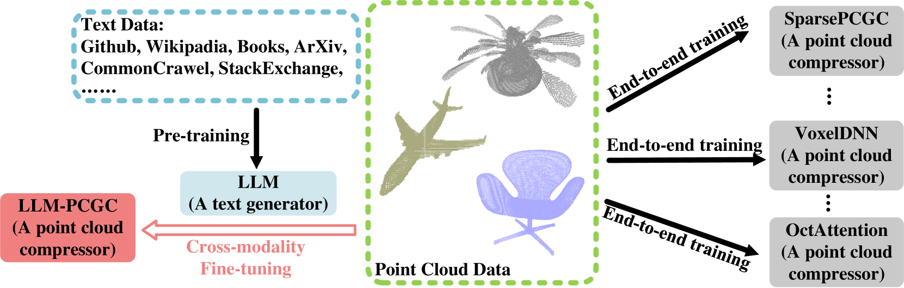
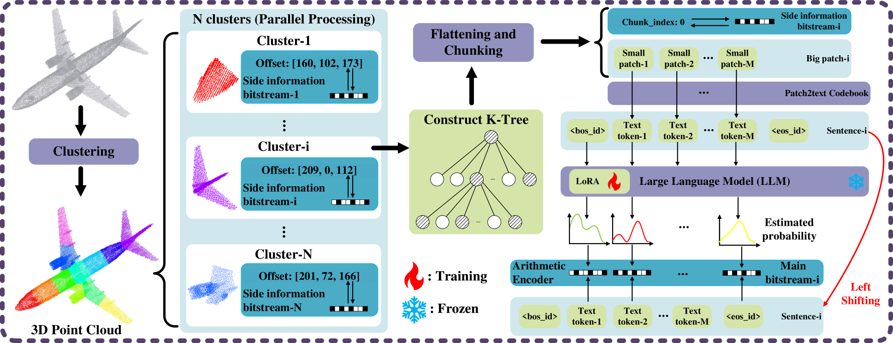
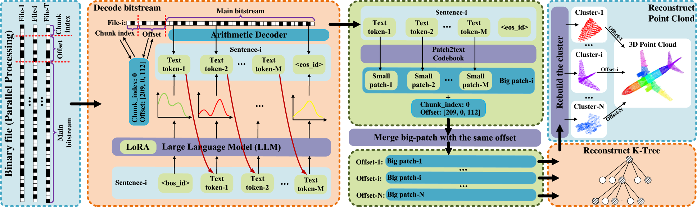
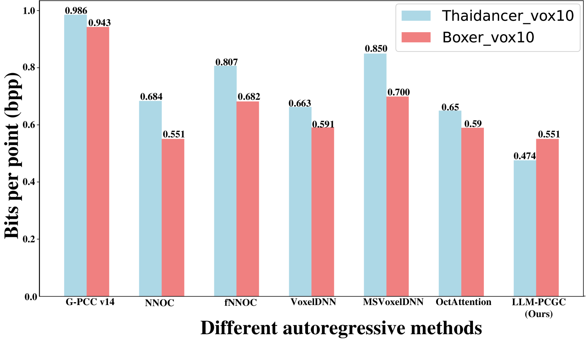

# LLM-PCGC：基于大型语言模型的点云几何压缩技术

发布时间：2024年08月16日

`LLM应用` `计算机视觉` `数据压缩`

> LLM-PCGC: Large Language Model-based Point Cloud Geometry Compression

# 摘要

> 实现高效点云压缩的核心在于构建一个与复杂3D结构相匹配的稳健上下文模型。随着大型语言模型（LLM）的进步，它们不仅作为强大的上下文学习与生成工具，还展现出卓越的压缩能力。LLM的双重特性使其成为数据压缩的理想选择。本文深入探讨了LLM在无损点云几何压缩（PCGC）中的应用潜力。尽管直接应用LLM于PCGC面临挑战，如难以准确理解点云结构及通过文本描述跨越文本与点云间的鸿沟，尤其是处理大型复杂或小型无定形点云时，我们仍提出了一种创新的基于LLM的点云几何压缩（LLM-PCGC）方法。该方法无需文本描述或对齐操作，通过跨模态表示对齐与语义一致性的适应技术，如聚类、K-树、令牌映射不变性和低秩适应（LoRA），成功将LLM转化为点云压缩器/生成器。实验结果显示，LLM-PCGC在性能上大幅超越现有方法，与MPEG的G-PCC标准参考软件相比，比特率降低达40.213%，与顶尖学习型方法相比，降低2.267%。

> The key to effective point cloud compression is to obtain a robust context model consistent with complex 3D data structures. Recently, the advancement of large language models (LLMs) has highlighted their capabilities not only as powerful generators for in-context learning and generation but also as effective compressors. These dual attributes of LLMs make them particularly well-suited to meet the demands of data compression. Therefore, this paper explores the potential of using LLM for compression tasks, focusing on lossless point cloud geometry compression (PCGC) experiments. However, applying LLM directly to PCGC tasks presents some significant challenges, i.e., LLM does not understand the structure of the point cloud well, and it is a difficult task to fill the gap between text and point cloud through text description, especially for large complicated and small shapeless point clouds. To address these problems, we introduce a novel architecture, namely the Large Language Model-based Point Cloud Geometry Compression (LLM-PCGC) method, using LLM to compress point cloud geometry information without any text description or aligning operation. By utilizing different adaptation techniques for cross-modality representation alignment and semantic consistency, including clustering, K-tree, token mapping invariance, and Low Rank Adaptation (LoRA), the proposed method can translate LLM to a compressor/generator for point cloud. To the best of our knowledge, this is the first structure to employ LLM as a compressor for point cloud data. Experiments demonstrate that the LLM-PCGC outperforms the other existing methods significantly, by achieving -40.213% bit rate reduction compared to the reference software of MPEG Geometry-based Point Cloud Compression (G-PCC) standard, and by achieving -2.267% bit rate reduction compared to the state-of-the-art learning-based method.

[Arxiv](https://arxiv.org/abs/2408.08682)