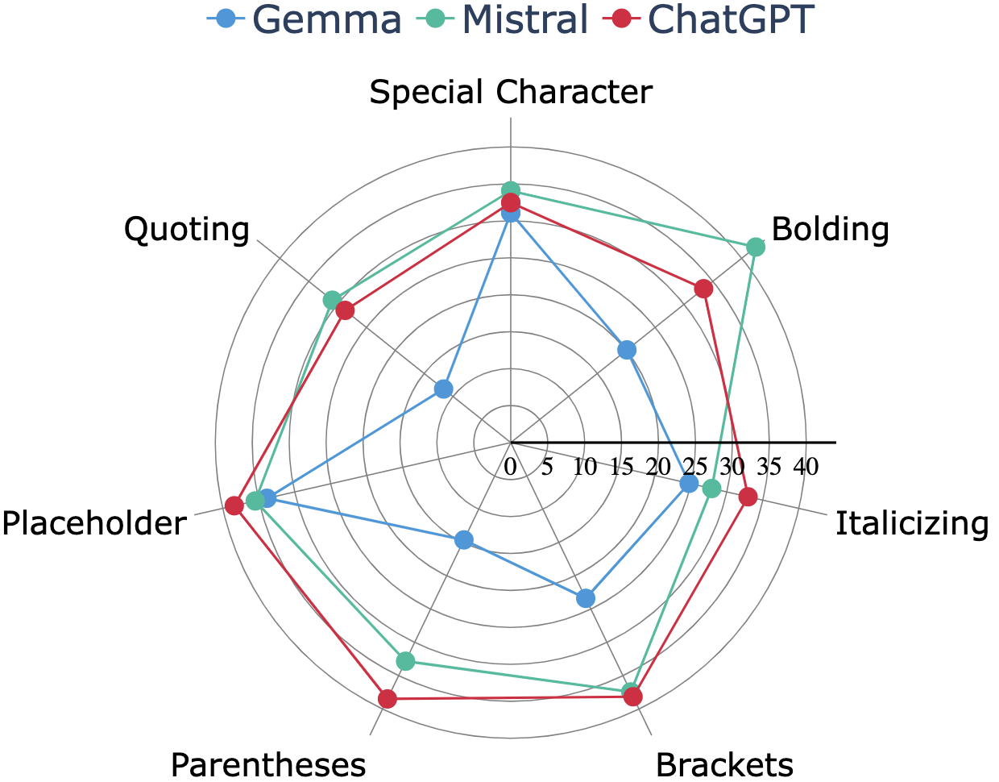

# LLM 对输出格式有偏好！我们系统地评估并尝试减轻这种输出格式偏差。

发布时间：2024年08月16日

`LLM理论` `人工智能` `数据科学`

> LLMs Are Biased Towards Output Formats! Systematically Evaluating and Mitigating Output Format Bias of LLMs

# 摘要

> 我们首次系统评估了大型语言模型（LLM）性能中的格式偏差。通过区分两种评估指标，我们确保了在格式约束下的性能评估既可靠又准确。我们不仅定义了衡量格式偏差的指标，还制定了减少偏差的策略。在涵盖多项选择、包装、列表和映射等四类常见格式的广泛评估中，我们发现最先进的LLM在多个生成任务中存在显著的格式偏差。此外，我们发现提升LLM在不同格式中的指令遵循能力有助于减少偏差。基于这些发现，我们探索了使用合成格式数据的提示和微调技术，有效降低了ChatGPT在包装格式中的性能差异，从235.33降至0.71。

> We present the first systematic evaluation examining format bias in performance of large language models (LLMs). Our approach distinguishes between two categories of an evaluation metric under format constraints to reliably and accurately assess performance: one measures performance when format constraints are adhered to, while the other evaluates performance regardless of constraint adherence. We then define a metric for measuring the format bias of LLMs and establish effective strategies to reduce it. Subsequently, we present our empirical format bias evaluation spanning four commonly used categories -- multiple-choice question-answer, wrapping, list, and mapping -- covering 15 widely-used formats. Our evaluation on eight generation tasks uncovers significant format bias across state-of-the-art LLMs. We further discover that improving the format-instruction following capabilities of LLMs across formats potentially reduces format bias. Based on our evaluation findings, we study prompting and fine-tuning with synthesized format data techniques to mitigate format bias. Our methods successfully reduce the variance in ChatGPT's performance among wrapping formats from 235.33 to 0.71 (%$^2$).

[Arxiv](https://arxiv.org/abs/2408.08656)