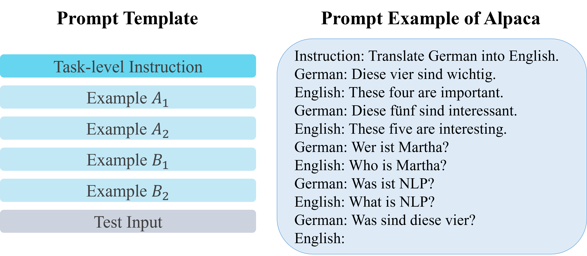
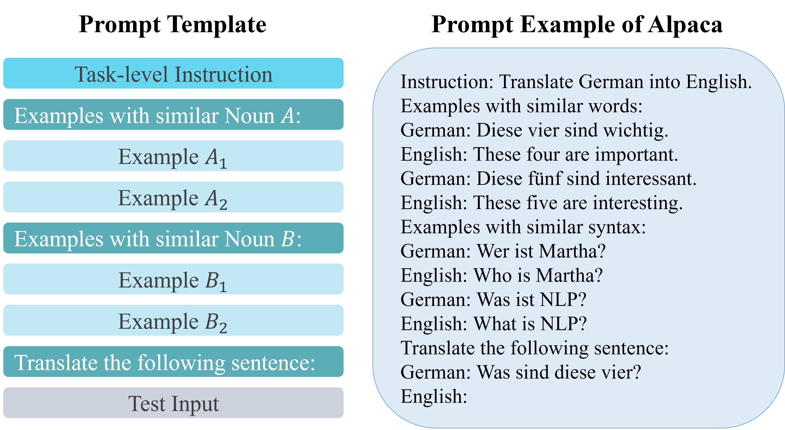
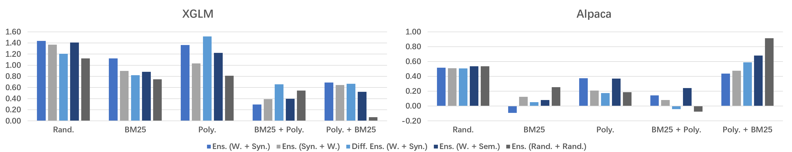
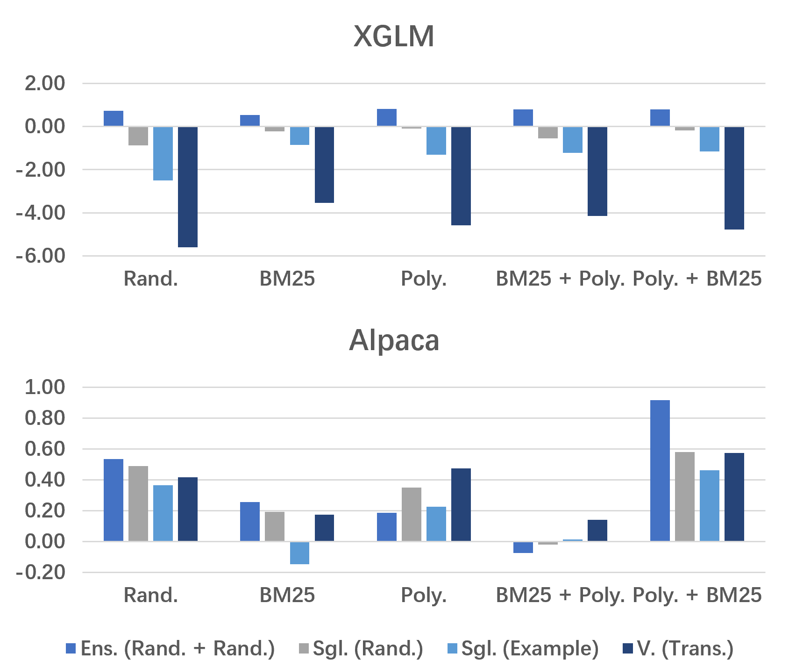
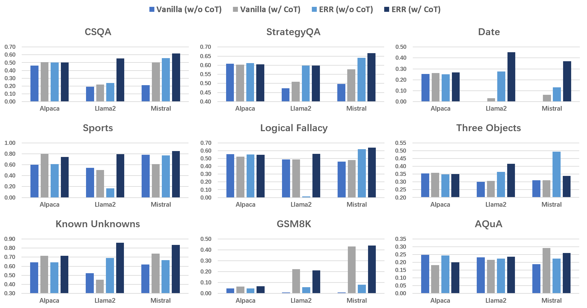
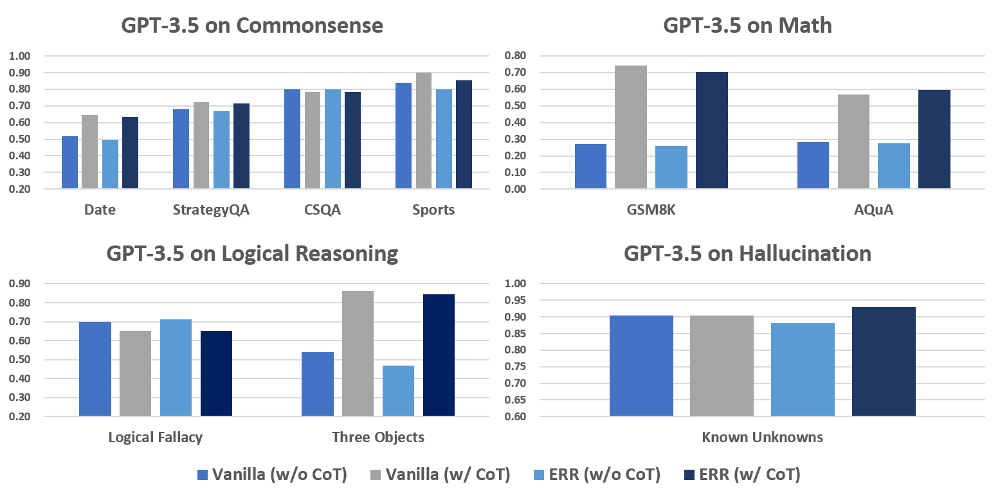

# 大型语言模型或许并不在意你的言辞，提示格式往往比描述更为有效。

发布时间：2024年08月16日

`LLM应用` `人工智能` `机器翻译`

> Large Language Models Might Not Care What You Are Saying: Prompt Format Beats Descriptions

# 摘要

> 通过 in-context learning (ICL)，大型语言模型 (LLMs) 在多任务中表现卓越。然而，描述性指令在 ICL 中的作用尚待深入研究。我们提出集成提示框架，明确 in-context 示例的选择标准，并在六种翻译方向的机器翻译实验中验证其提升 ICL 性能。有趣的是，LLMs 对描述内容的关注度不高，性能提升主要源于集成格式，即便使用随机描述性名词，框架仍能带来改进。我们还将此框架应用于多种任务，包括常识、数学、逻辑推理等，结果喜人，再次强调设计合适提示格式的重要性。代码将在论文发表后公开。

> With the help of in-context learning (ICL), large language models (LLMs) have achieved impressive performance across various tasks. However, the function of descriptive instructions during ICL remains under-explored. In this work, we propose an ensemble prompt framework to describe the selection criteria of multiple in-context examples, and preliminary experiments on machine translation (MT) across six translation directions confirm that this framework boosts ICL perfromance. But to our surprise, LLMs might not necessarily care what the descriptions actually say, and the performance gain is primarily caused by the ensemble format, since the framework could lead to improvement even with random descriptive nouns. We further apply this new ensemble prompt on a range of commonsense, math, logical reasoning and hallucination tasks with three LLMs and achieve promising results, suggesting again that designing a proper prompt format would be much more effective and efficient than paying effort into specific descriptions. Our code will be publicly available once this paper is published.

[Arxiv](https://arxiv.org/abs/2408.08780)