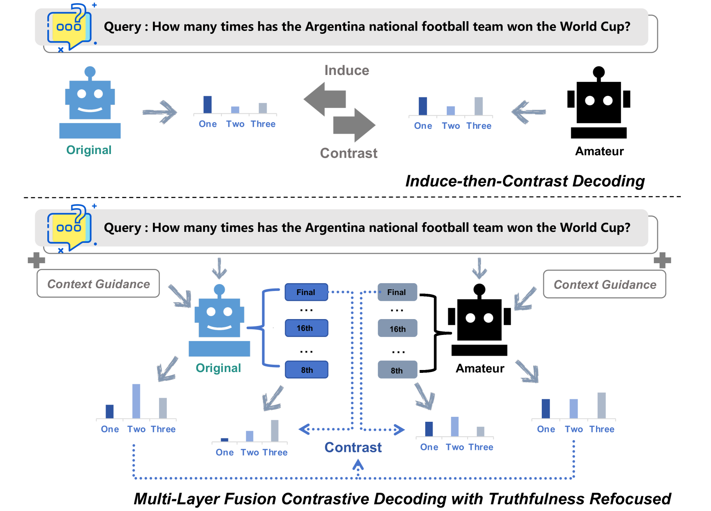
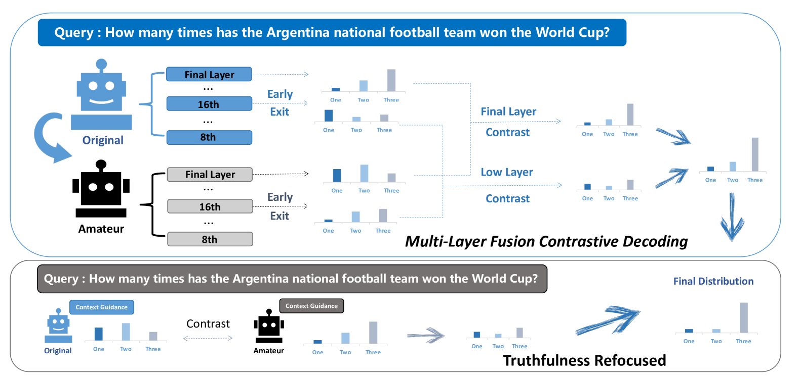
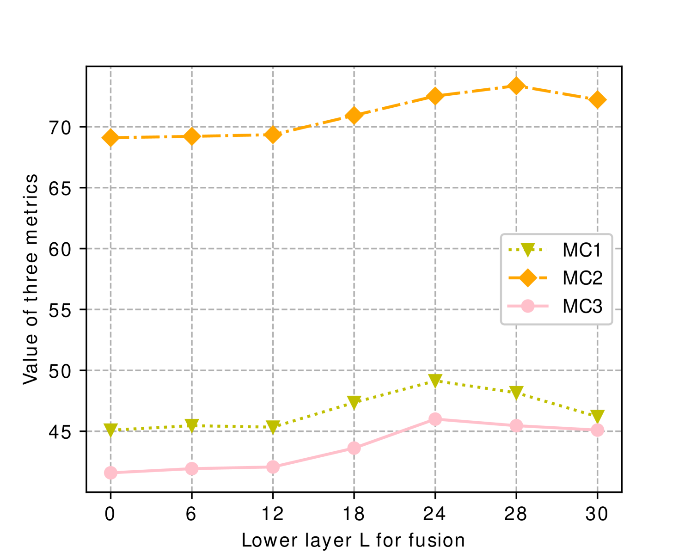
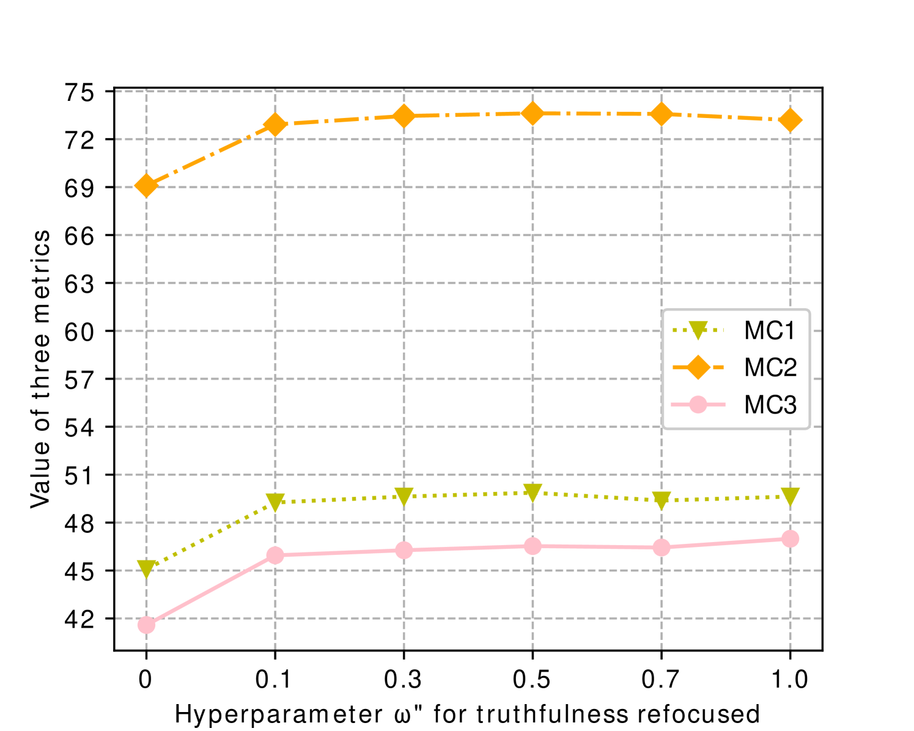

# 底层关键：采用多层融合对比解码及真实性重聚焦技术，有效减轻幻觉现象

发布时间：2024年08月16日

`LLM应用` `人工智能`

> Lower Layer Matters: Alleviating Hallucination via Multi-Layer Fusion Contrastive Decoding with Truthfulness Refocused

# 摘要

> 大型语言模型虽在 NLP 任务中表现卓越，但偶尔会出现“幻觉”现象，即输出内容与事实不符。为应对这一挑战，我们提出了 LOL 框架，通过多层融合和真实性重聚焦模块，有效减轻幻觉现象。实验结果显示，LOL 框架在多个数据集上均优于现有基线，平均提升达 4.5 分。源代码即将公开。

> Large Language Models (LLMs) have demonstrated exceptional performance across various natural language processing tasks, yet they occasionally tend to yield content that factually inaccurate or discordant with the expected output, a phenomenon empirically referred to as "hallucination". To tackle this issue, recent works have investigated contrastive decoding between the original model and an amateur model with induced hallucination, which has shown promising results. Nonetheless, this method may undermine the output distribution of the original LLM caused by its coarse contrast and simplistic subtraction operation, potentially leading to errors in certain cases. In this paper, we introduce a novel contrastive decoding framework termed LOL (LOwer Layer Matters). Our approach involves concatenating the contrastive decoding of both the final and lower layers between the original model and the amateur model, thereby achieving multi-layer fusion to aid in the mitigation of hallucination. Additionally, we incorporate a truthfulness refocused module that leverages contextual guidance to enhance factual encoding, further capturing truthfulness during contrastive decoding. Extensive experiments conducted on two publicly available datasets illustrate that our proposed LOL framework can substantially alleviate hallucination while surpassing existing baselines in most cases. Compared with the best baseline, we improve by average 4.5 points on all metrics of TruthfulQA. The source code is coming soon.

[Arxiv](https://arxiv.org/abs/2408.08769)