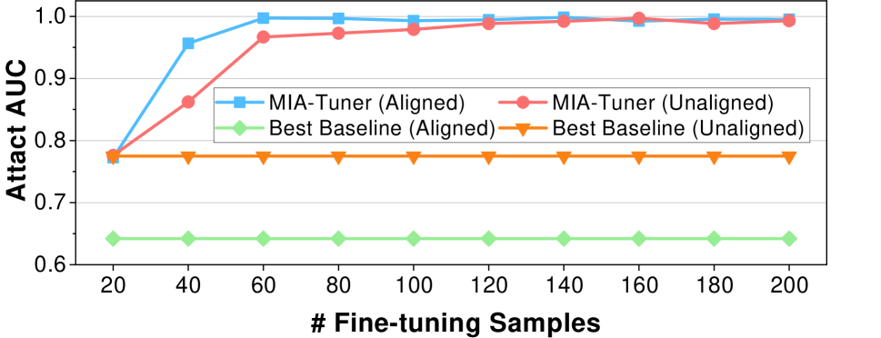
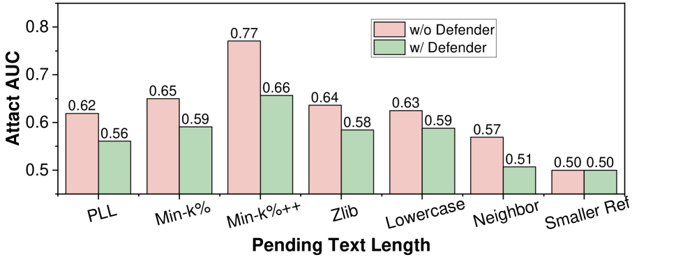
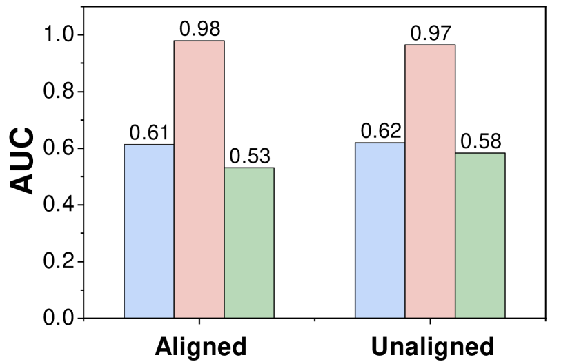
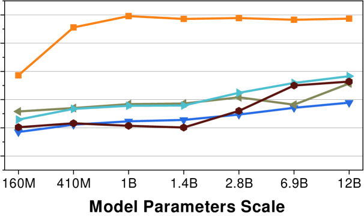

# MIA-Tuner：适配大型语言模型，使其成为预训练文本检测工具

发布时间：2024年08月16日

`LLM应用` `网络安全` `人工智能`

> MIA-Tuner: Adapting Large Language Models as Pre-training Text Detector

# 摘要

> 随着大型语言模型（LLM）的参数和数据集不断扩大，对解决其潜在隐私风险和版权问题的技术需求日益迫切。现有研究虽已通过预训练数据检测问题（成员推理攻击的一种）部分回应了这一需求，但如何实现高置信度检测及在已对齐的LLM上执行MIA仍充满挑战。为此，我们提出MIA-Tuner，一种基于指令的新型MIA方法，让LLM自身成为更精准的预训练数据检测器，而非依赖外部评分函数。同时，我们设计了两项基于指令的保护措施，以减轻现有方法及MIA-Tuner可能引发的隐私风险。为全面评估最新LLM，我们引入了更新的MIA基准数据集WIKIMIA-24。实验结果表明，MIA-Tuner能显著提升MIA的AUC至0.9，展现了其高效性。

> The increasing parameters and expansive dataset of large language models (LLMs) highlight the urgent demand for a technical solution to audit the underlying privacy risks and copyright issues associated with LLMs. Existing studies have partially addressed this need through an exploration of the pre-training data detection problem, which is an instance of a membership inference attack (MIA). This problem involves determining whether a given piece of text has been used during the pre-training phase of the target LLM. Although existing methods have designed various sophisticated MIA score functions to achieve considerable detection performance in pre-trained LLMs, how to achieve high-confidence detection and how to perform MIA on aligned LLMs remain challenging. In this paper, we propose MIA-Tuner, a novel instruction-based MIA method, which instructs LLMs themselves to serve as a more precise pre-training data detector internally, rather than design an external MIA score function. Furthermore, we design two instruction-based safeguards to respectively mitigate the privacy risks brought by the existing methods and MIA-Tuner. To comprehensively evaluate the most recent state-of-the-art LLMs, we collect a more up-to-date MIA benchmark dataset, named WIKIMIA-24, to replace the widely adopted benchmark WIKIMIA. We conduct extensive experiments across various aligned and unaligned LLMs over the two benchmark datasets. The results demonstrate that MIA-Tuner increases the AUC of MIAs from 0.7 to a significantly high level of 0.9.

[Arxiv](https://arxiv.org/abs/2408.08661)