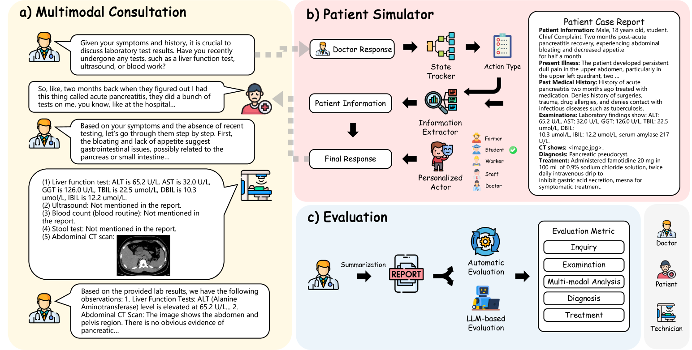

# Med-PMC：一种采用先问后观策略的医学个性化多模态咨询系统

发布时间：2024年08月16日

`LLM应用` `人工智能`

> Med-PMC: Medical Personalized Multi-modal Consultation with a Proactive Ask-First-Observe-Next Paradigm

# 摘要

> 多模态大型语言模型 (MLLMs) 在医疗临床场景中的应用尚待深入探索。以往的基准仅侧重于 MLLMs 在医疗视觉问答或报告生成方面的能力，而忽视了其在复杂临床多模态任务上的表现。为此，我们提出了一种创新的医疗个性化多模态咨询 (Med-PMC) 范式，旨在全面评估 MLLMs 的临床能力。Med-PMC 构建了一个模拟临床环境，要求 MLLMs 与患者模拟器互动，完成多模态信息收集和决策任务。患者模拟器通过个性化演员模拟真实场景中的多样化患者。我们通过广泛的实验，评估了 12 种类型的 MLLMs，全面展示了它们的临床表现。实验发现，当前的 MLLMs 在面对个性化患者模拟器时，未能有效收集多模态信息，并在决策任务中显示出潜在偏差。进一步分析证实了 Med-PMC 的有效性，揭示了其指导开发稳健可靠临床 MLLMs 的潜力。相关代码和数据已公开在 https://github.com/LiuHC0428/Med-PMC。

> The application of the Multi-modal Large Language Models (MLLMs) in medical clinical scenarios remains underexplored. Previous benchmarks only focus on the capacity of the MLLMs in medical visual question-answering (VQA) or report generation and fail to assess the performance of the MLLMs on complex clinical multi-modal tasks. In this paper, we propose a novel Medical Personalized Multi-modal Consultation (Med-PMC) paradigm to evaluate the clinical capacity of the MLLMs. Med-PMC builds a simulated clinical environment where the MLLMs are required to interact with a patient simulator to complete the multi-modal information-gathering and decision-making task. Specifically, the patient simulator is decorated with personalized actors to simulate diverse patients in real scenarios. We conduct extensive experiments to access 12 types of MLLMs, providing a comprehensive view of the MLLMs' clinical performance. We found that current MLLMs fail to gather multimodal information and show potential bias in the decision-making task when consulted with the personalized patient simulators. Further analysis demonstrates the effectiveness of Med-PMC, showing the potential to guide the development of robust and reliable clinical MLLMs. Code and data are available at https://github.com/LiuHC0428/Med-PMC.

[Arxiv](https://arxiv.org/abs/2408.08693)