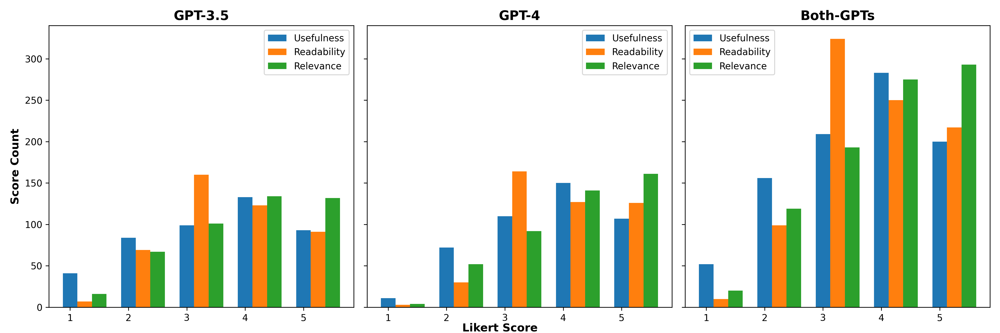

# MuRAR：一款简洁高效的多模态问答框架，集检索与答案优化于一体

发布时间：2024年08月16日

`RAG`

> MuRAR: A Simple and Effective Multimodal Retrieval and Answer Refinement Framework for Multimodal Question Answering

# 摘要

> 近期，检索增强生成 (RAG) 技术在问答任务中表现卓越，但多数研究仍局限于文本答案。尽管有研究涉足多模态数据，但在生成详尽的多模态答案方面仍有欠缺，尤其是在概念解释或步骤指导方面。这种能力在企业聊天机器人和教育系统等场景中尤为重要。为此，我们提出了 MuRAR 框架，通过整合多模态数据并优化答案，生成连贯的多模态答案。该框架易于扩展，适用于企业聊天机器人，且人类评估显示，其生成的多模态答案比纯文本答案更实用、更易懂。

> Recent advancements in retrieval-augmented generation (RAG) have demonstrated impressive performance in the question-answering (QA) task. However, most previous works predominantly focus on text-based answers. While some studies address multimodal data, they still fall short in generating comprehensive multimodal answers, particularly for explaining concepts or providing step-by-step tutorials on how to accomplish specific goals. This capability is especially valuable for applications such as enterprise chatbots and settings such as customer service and educational systems, where the answers are sourced from multimodal data. In this paper, we introduce a simple and effective framework named MuRAR (Multimodal Retrieval and Answer Refinement). MuRAR enhances text-based answers by retrieving relevant multimodal data and refining the responses to create coherent multimodal answers. This framework can be easily extended to support multimodal answers in enterprise chatbots with minimal modifications. Human evaluation results indicate that multimodal answers generated by MuRAR are more useful and readable compared to plain text answers.

[Arxiv](https://arxiv.org/abs/2408.08521)