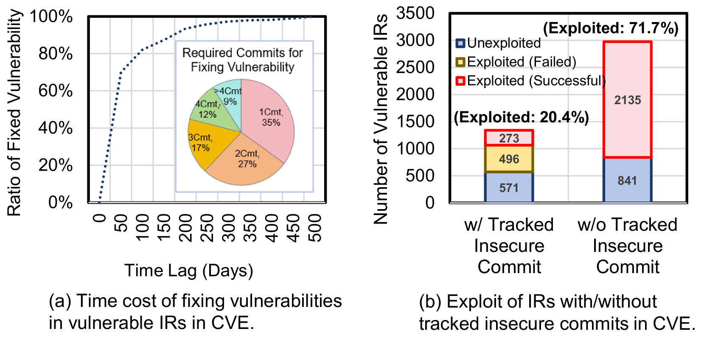
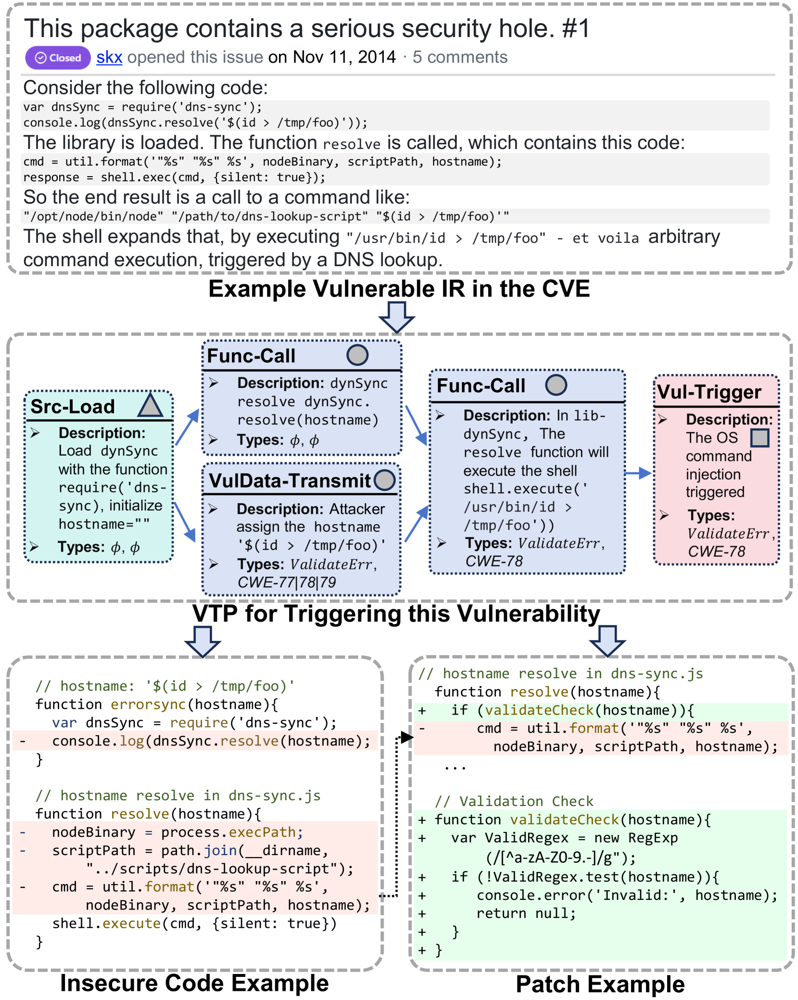
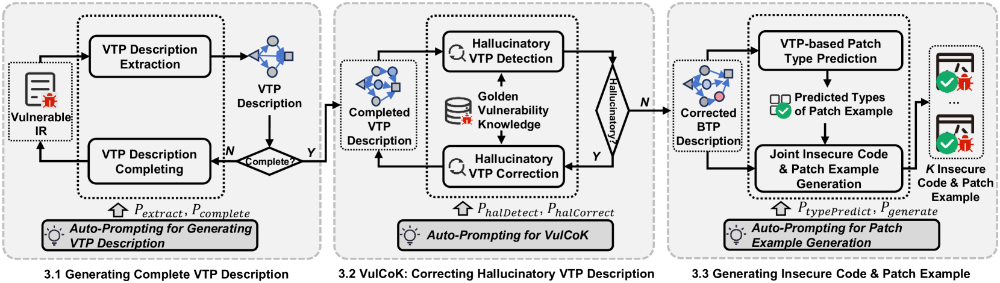
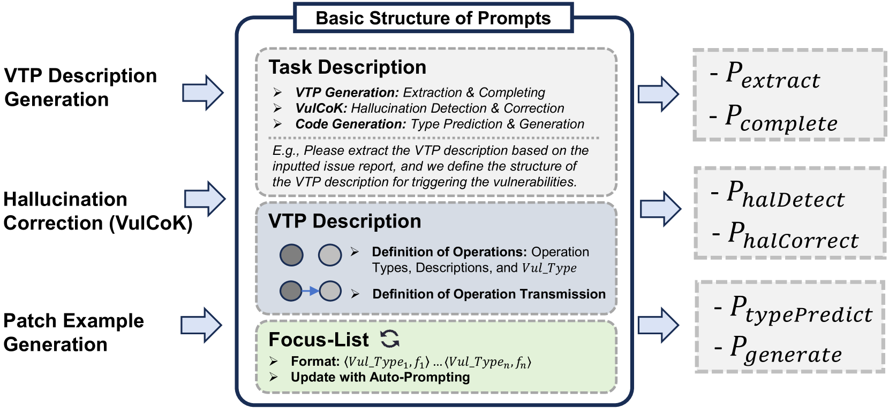
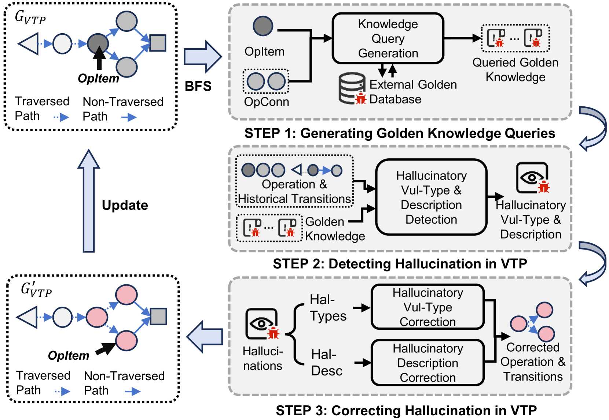
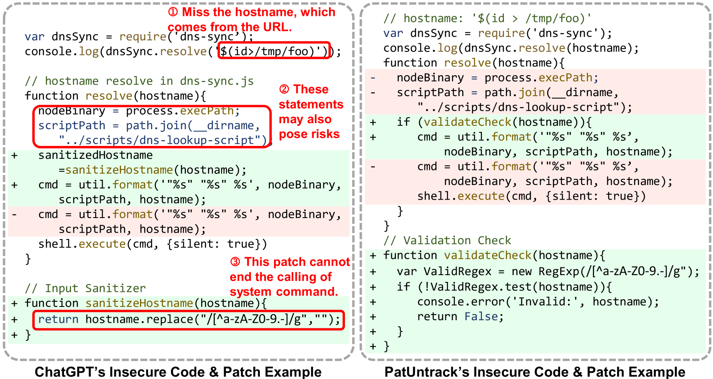
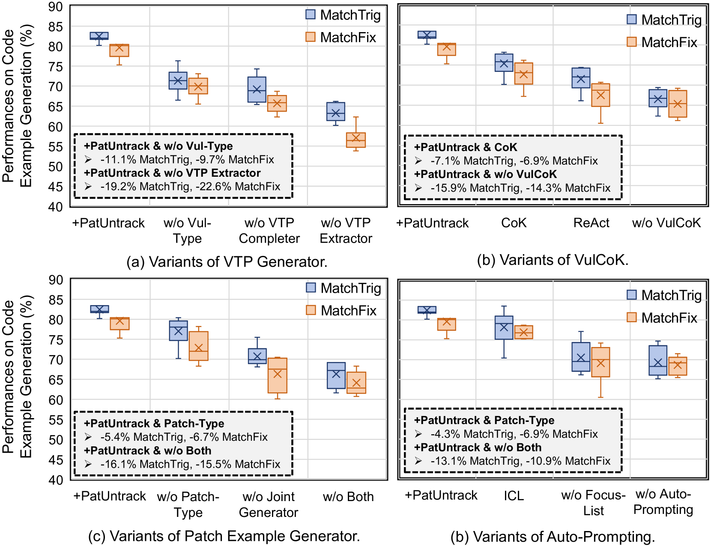
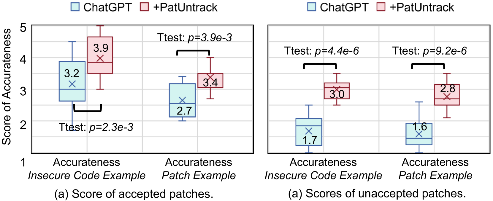
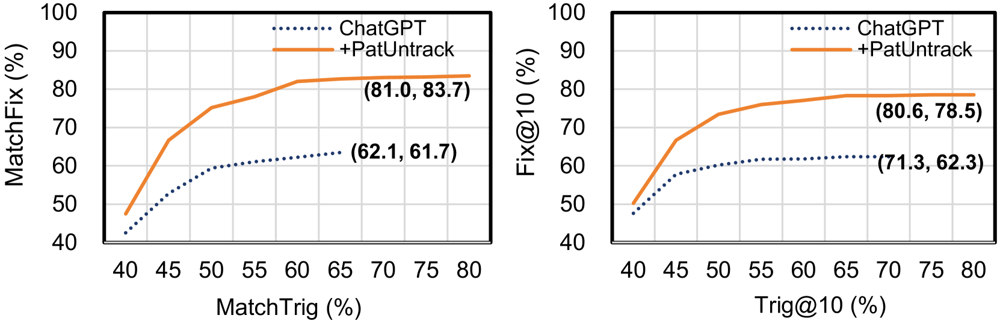

# PatUntrack：无需追踪不安全代码，自动生成问题报告的补丁示例

发布时间：2024年08月16日

`LLM应用` `软件开发` `网络安全`

> PatUntrack: Automated Generating Patch Examples for Issue Reports without Tracked Insecure Code

# 摘要

> 安全补丁对于提升软件项目的稳定性和健壮性至关重要。尽管官方期望在披露漏洞前进行修补，但这一过程复杂且对许多组织来说仍是一大挑战。为了修补漏洞，安全专家通常需要跟踪问题报告并分析相关的不安全代码。然而，由于相关代码可能未明确指定，专家们难以在存储库中追踪，从而限制了补丁生成的能力。为此，我们提出了PatUntrack，一种能够自动从问题报告中生成补丁示例的工具，无需追踪不安全代码。PatUntrack通过自动提示大型语言模型来分析漏洞，首先生成漏洞触发路径的完整描述，然后利用外部知识纠正描述中的错误，最终生成不安全代码及其补丁的示例。实验表明，PatUntrack在补丁生成方面表现卓越，平均提升了传统基线14.6%。此外，PatUntrack为新披露的76个漏洞生成的补丁示例得到了作者的认可，证实了其在实际应用中的价值。

> Security patches are essential for enhancing the stability and robustness of projects in the software community. While vulnerabilities are officially expected to be patched before being disclosed, patching vulnerabilities is complicated and remains a struggle for many organizations. To patch vulnerabilities, security practitioners typically track vulnerable issue reports (IRs), and analyze their relevant insecure code to generate potential patches. However, the relevant insecure code may not be explicitly specified and practitioners cannot track the insecure code in the repositories, thus limiting their ability to generate patches. In such cases, providing examples of insecure code and the corresponding patches would benefit the security developers to better locate and fix the insecure code. In this paper, we propose PatUntrack to automatically generating patch examples from IRs without tracked insecure code. It auto-prompts Large Language Models (LLMs) to make them applicable to analyze the vulnerabilities. It first generates the completed description of the Vulnerability-Triggering Path (VTP) from vulnerable IRs. Then, it corrects hallucinations in the VTP description with external golden knowledge. Finally, it generates Top-K pairs of Insecure Code and Patch Example based on the corrected VTP description. To evaluate the performance, we conducted experiments on 5,465 vulnerable IRs. The experimental results show that PatUntrack can obtain the highest performance and improve the traditional LLM baselines by +14.6% (Fix@10) on average in patch example generation. Furthermore, PatUntrack was applied to generate patch examples for 76 newly disclosed vulnerable IRs. 27 out of 37 replies from the authors of these IRs confirmed the usefulness of the patch examples generated by PatUntrack, indicating that they can benefit from these examples for patching the vulnerabilities.

[Arxiv](https://arxiv.org/abs/2408.08619)